### Classification of Transition Probability Matrix (TPM) between Health and Schizophrenia

The TPM is a matrix that contains the probabilitys of transition from one of the 16 states to another. These matrices are created from sequences of microstates. For detailed information about the process of obtaining TPM, please refer to the earlier report [EEG Microstate Sequences $→$ Transition Probability Matrix (TPM)](transition-probability-matrix.html).

##### 1. Introduction

The foundation of this analysis lies in the set of sequences \( S \), where each sequence \( s \in S \) is a chronologically ordered list of microstates. These sequences are categorized into two subsets: \( S_{\text{healthy}} \) for healthy individuals and \( S_{\text{schizo}} \) for individuals with schizophrenia. Each subset contains sequences that depict the progression of brain states over time.

##### 2. Prototype Probability Matrices

Transition Probability Matrices, \( P_{\text{healthy}} \) and \( P_{\text{schizo}} \), are constructed for both groups. These matrices are \( 16 \times 16 \), with each element \( p_{ij} \) representing the probability of transitioning from state \( s_i \) to state \( s_j \), excluding self-transitions \( p_{ii} \).
The construction of these matrices involves two key steps:

1. **Counting Transitions:** For each group, we count the transitions between states within their respective sequence sets. The count \( c_{ij}^G \) represents the number of times a transition from state \( s_i \) to state \( s_j \) occurs in group \( G \).

2. **Normalizing TPMs:** Each TPM is normalized such that the sum of the probabilities in each row equals 1. This normalization ensures that the TPM reflects the probability distribution of transitioning from one state to any other state.

Fig.1: Transition Probability Matrices for Healthy and Schizophrenia Groups

##### 3.1 Feature Engineering - Intuition

The goal of this analysis is to classify a sequence as either healthy or schizophrenic. To do this, we need to extract features from the TPMs that can be used to train a classifier. Since we are dealing with a small sample size, we want to extract features that are robust and can generalize well to unseen data. Also we want to extract features that are interpretable and can be used to gain insight into the differences between the two groups. 

The most strigthforward approach is to use the TPMs as features. However, this approach has one major drawbacks:

- **High Dimensionality:** The TPMs are \( 16 \times 16 \) matrices, which means that each matrix has 256 features. This high dimensionality can lead to overfitting and poor generalization. 
  
Since we have the prototype for each group, we can use the prototype to extract features from the TPMs. The idea is to use the prototype as a template to compare the TPMs to. We can then extract features that measure the similarity between the TPMs and the prototype. For every subject we will compare its TPM with the prototype TPMs for both groups. This will result in 2 sets of features for each subject. The features will be the similarity measures between the subject's TPM and the prototype TPMs. By doing this we will be capturing relative position of the subject's TPM with respect to the prototype TPMs, potentially enhancing the classifier's ability to distinguish between the two groups based on these relational features.

To mitigate the high dimensionality of the TPMs and extract meaningful, generalizable features, we employ several similarity measures that offer a comparison between a subject's TPM and the group prototypes. These measures yield robust features that encapsulate the relational positioning of a subject's brain state transitions with respect to the established norms of the healthy and schizophrenic groups.

##### 3.2 Feature Engineering - Similarity Measures
We use the following similarity measures to compare the TPMs to the prototypes:

1. **Euclidean Distance**: This measure computes the straight-line distance between two matrices, considering them as vectors in a high-dimensional space. It is used in the function `features_map_euclidean`, which calculates the Euclidean distance between the flattened prototype matrix and each subject's flattened matrix.

    \[ d(A, B) = \sqrt{\sum_{i=1}^{n} \sum_{j=1}^{n} (a_{ij} - b_{ij})^2} \]

2. **Cosine Similarity**: This metric assesses the cosine of the angle between two non-zero vectors, which in this context are the flattened matrices. The function `features_map_cosine` calculates this similarity, which is 1 minus the value returned by the `scipy.spatial.distance.cosine` function, as cosine similarity is typically defined as:

    \[ \text{cosine}(A, B) = \frac{\sum_{i=1}^{n} \sum_{j=1}^{n} a_{ij} b_{ij}}{\sqrt{\sum_{i=1}^{n} \sum_{j=1}^{n} a_{ij}^2} \cdot \sqrt{\sum_{i=1}^{n} \sum_{j=1}^{n} b_{ij}^2}} \]

3. **Correlation Coefficient**: Unlike a single correlation coefficient for the entire dataset, the `compute_correlation` function calculates the average of row-wise correlation coefficients between the two matrices, reflecting how each individual state's transition probabilities relate between the subject's TPM and the prototype.

    \[ \text{corr}(A, B) = \frac{1}{n} \sum_{i=1}^{n} \text{corrcoef}(A_i, B_i) \]

    where \( A_i \) and \( B_i \) are the \( i \)-th rows of matrices \( A \) and \( B \), respectively, and \( \text{corrcoef}(A_i, B_i) \) is the correlation coefficient between these rows. The `np.corrcoef` function is used to calculate the correlation coefficient \( \text{corrcoef}(A_i, B_i) \).

These similarity measures serve as robust features for machine learning models, designed to capture the relationship between individual brain state transitions and typical patterns seen in healthy or schizophrenic groups. By incorporating the row-wise correlation, the feature set respects the independence of state transitions, which can be crucial for interpreting the underlying neurophysiological processes.
  
##### 3.3 Feature Engineering - Feature Visualization

To gain insight into the features space for each measure, we visualize the features for each group using a 2D scatter plot. The plots are shown below:

- **Euclidean Distance**: 

<a href="images/classification/feature_scatter_euclid.png">
    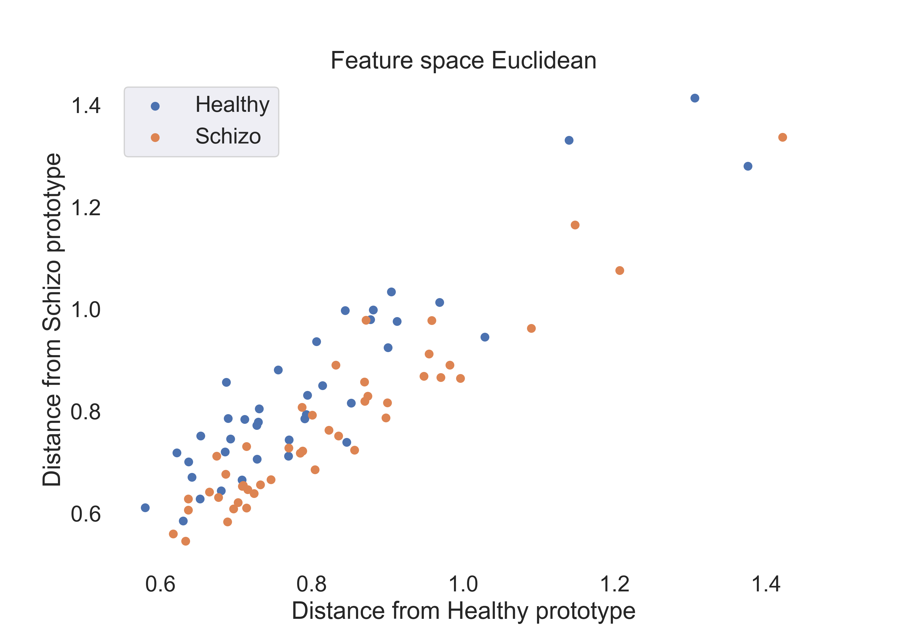
</a>

Fig.2: Scatter plot of the Euclidean distance features for the healthy and schizophrenic groups.

- **Cosine Similarity**:

<a href="images/classification/feature_scatter_cosine.png">
    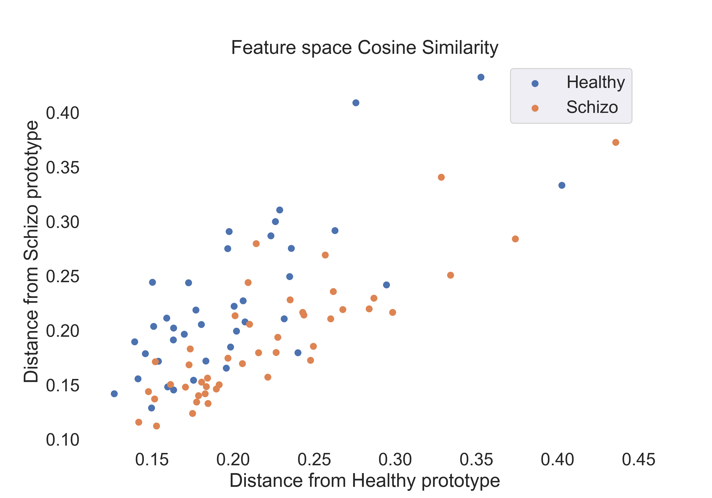

</a>

Fig.3: Scatter plot of the cosine similarity features for the healthy and schizophrenic groups.

- **Correlation Coefficient**:
  
<a href="images/classification/feature_scatter_corr.png">
    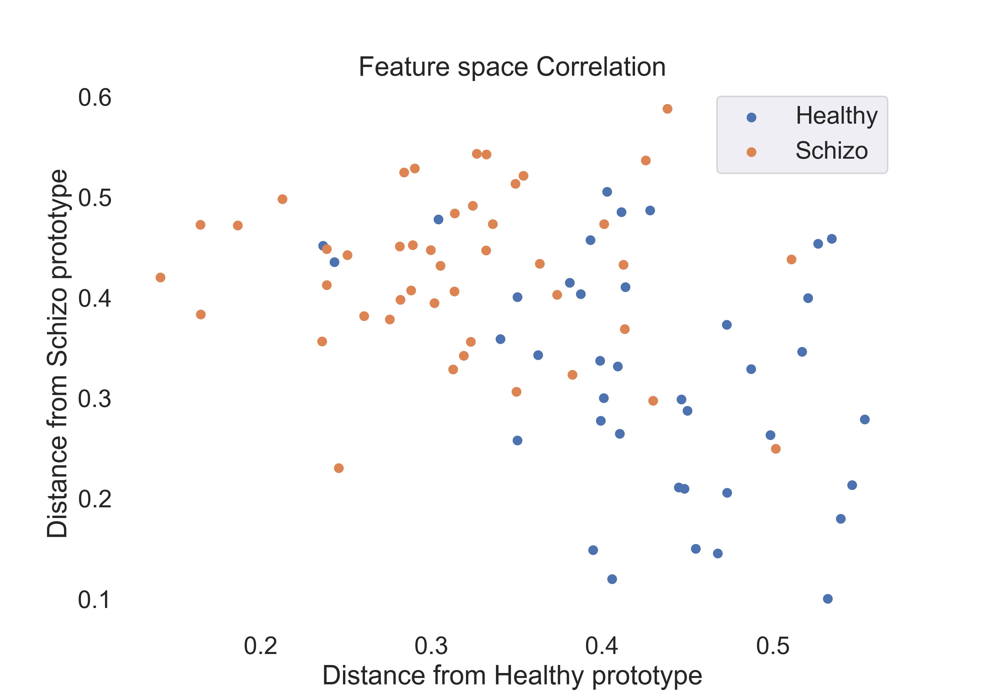
</a>

Fig.4: Scatter plot of the correlation coefficient features for the healthy and schizophrenic groups.

##### 4. Model Selection 

We use the following models to classify the subjects:

1. **Logistic Regression**: This model is used to classify the subjects using the features extracted from the TPMs. The model is trained using the features extracted from the training set and then used to predict the labels for the test set. The model is trained using the `sklearn.linear_model.LogisticRegression` function.

2. **Random Forest**: This model is used to classify the subjects using the features extracted from the TPMs. The model is trained using the features extracted from the training set and then used to predict the labels for the test set. The model is trained using the `sklearn.ensemble.RandomForestClassifier` function.

3. **Support Vector Machine**: This model is used to classify the subjects using the features extracted from the TPMs. The model is trained using the features extracted from the training set and then used to predict the labels for the test set. The model is trained using the `sklearn.svm.SVC` function.
Kernel used is `rbf` with default parameters.
For comparison, we also train the model using the `linear` kernel.

Metrics used to evaluate the models are:

- **Accuracy**: This metric is used to evaluate the performance of the models. The accuracy is calculated using the `sklearn.metrics.accuracy_score` function.

- **ROC curve/ AUC**: This metric is used to evaluate the performance of the models. The ROC curve is plotted using the `sklearn.metrics.roc_curve` function and the AUC is calculated using the `sklearn.metrics.auc` function.
We have slightly imbalanced dataset so this metric can be used to evaluate the performance of the models in a more precise way than accuracy.

Test set is 20% of the data and the rest is used for training.

Table descriptions:
- **Acc**: Accuracy score for the model. (Here single score is calculated on the test set.)
- **Roc AUC**: Roc AUC score for the model.  (Here single score is calculated on the test set.)
- **Cv-5**: Cross validation score for the model using 5 folds and accuracy as scoring metric.
- **Cv-5 AUC**: Cross validation score for the model using 5 folds and AUC as scoring metric.

---

**4.1** The following table shows the results for **$Euclidean$ $Distance$** features:

| Model | Acc | Roc AUC | Cv-5 | Cv-5 AUC |
| --- | --- | --- | --- | --- |
| Logistic Regression | 0.53 | **0.92** | 0.51 | 0.61 |
| SVM (linear) | 0.53 | **0.92** | 0.52 | 0.37 |
| SVM (rbf) | **0.76** | 0.85 | **0.70** | **0.79** |
| Random Forest | 0.47 | 0.60 | 0.60 | 0.65 |

The following figures show the ROC curves for the models (Cv-5 AUC - last column in table):

- **Logistic Regression**:

<a href="images/classification/roc_logistic_Euclid.png">
    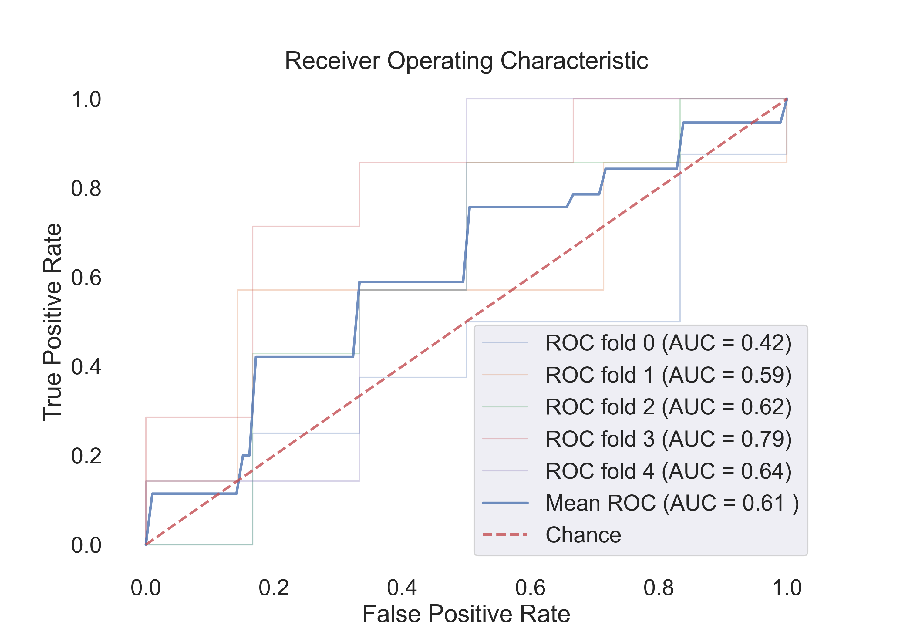
</a>

Fig.5: ROC curve for the Logistic Regression model.

- **SVM (rbf)**:

<a href="images/classification/roc_svm_rbf_Euclid.png">
    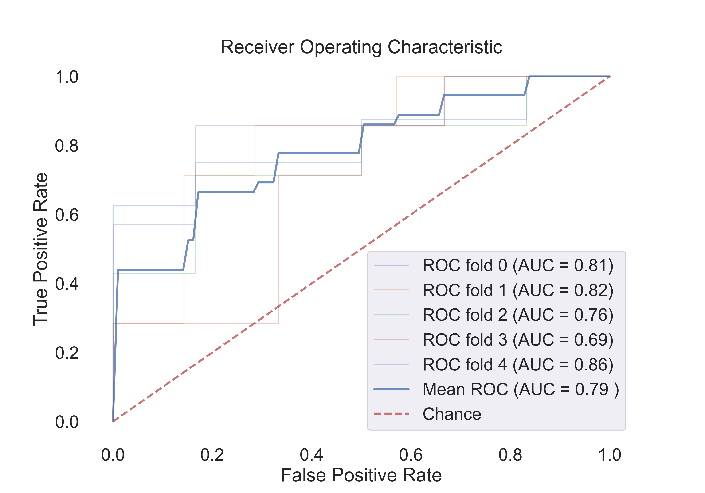

</a>

Fig.6: ROC curve for the SVM (rbf) model.

- **SVM (linear)**:

<a href="images/classification/roc_svm_linear_Euclid.png">
    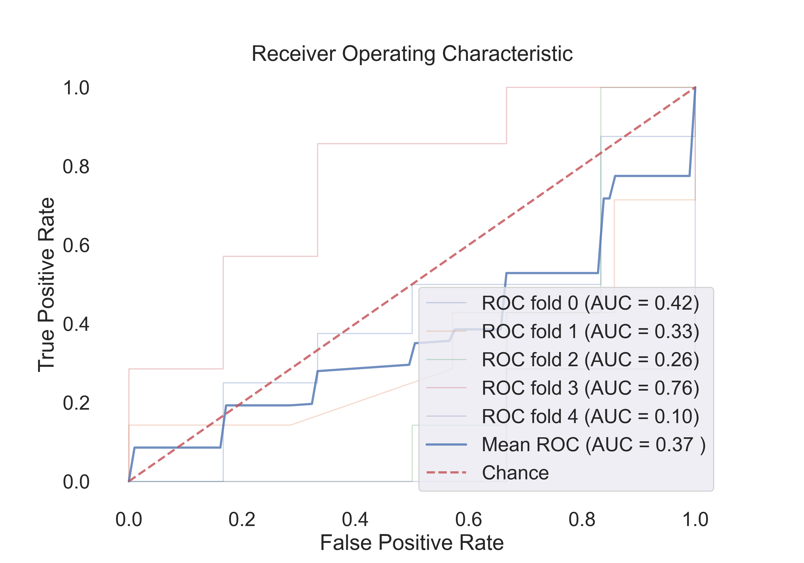
</a>

Fig.7: ROC curve for the SVM (linear) model.

- **Random Forest**:

<a href="images/classification/roc_random_forest_Euclid.png">
    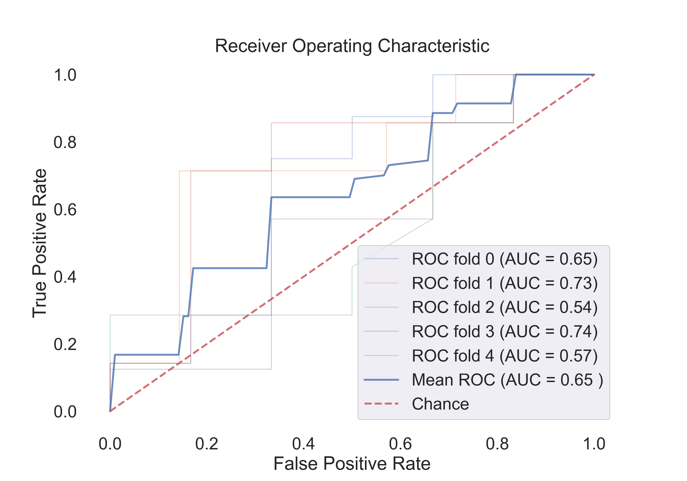
</a>

Fig.8: ROC curve for the Random Forest model.

---

**4.2** The following table shows the results for **$Cosine$ $Similarity$** features:

| Model | Acc | Roc AUC | Cv-5 | Cv-5 AUC |
| --- | --- | --- | --- | --- |
| Logistic Regression | 0.53 | **0.94** | 0.54 | 0.67 |
| SVM (linear) | 0.53 | **0.92** | 0.54 | 0.44 |
| SVM (rbf) | 0.71 | **0.90** | 0.71 | 0.79 |
| Random Forest | 0.53 | 0.60 | 0.61 | **0.72** |

The following figures show the ROC curves for the models (Cv-5 AUC - last column in table):

- **Logistic Regression**:

Fig.9: ROC curve for the Logistic Regression model.

- **SVM (rbf)**:

<a href="images/classification/roc_svm_rbf_Cosine.png">
    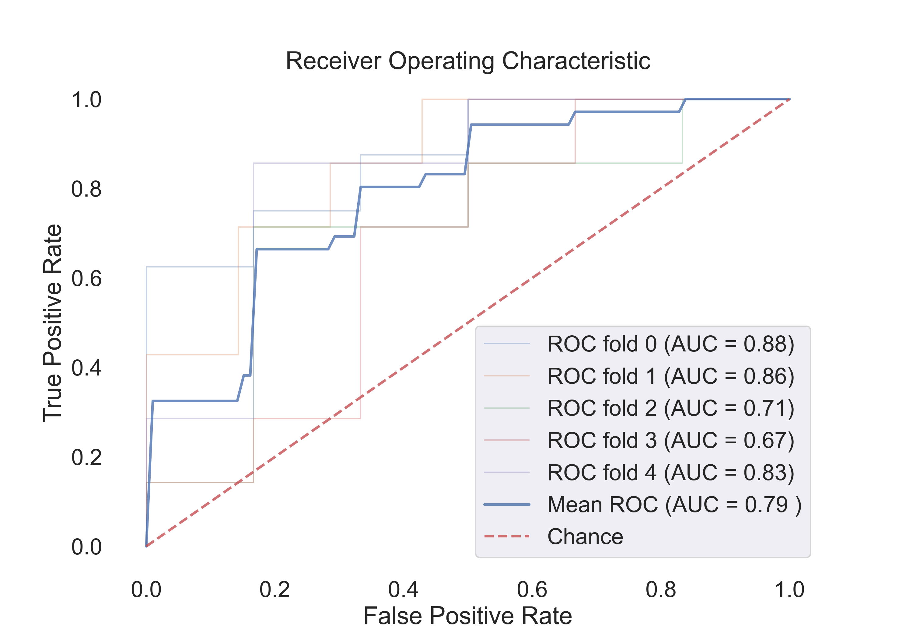

</a>

Fig.10: ROC curve for the SVM (rbf) model.

- **SVM (linear)**:

<a href="images/classification/roc_svm_linear_Cosine.png">
    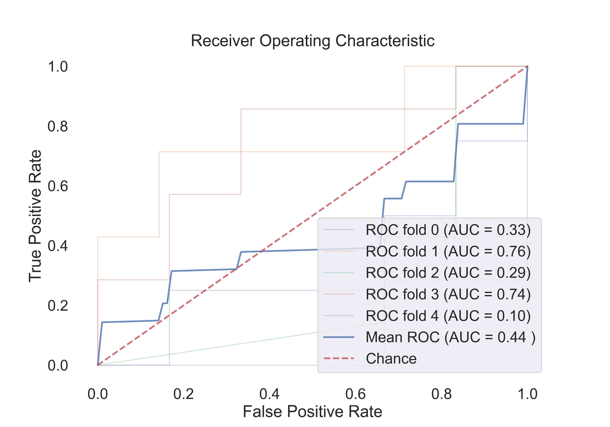
</a>

Fig.11: ROC curve for the SVM (linear) model.

- **Random Forest**:

<a href="images/classification/roc_random_forest_Cosine.png">
    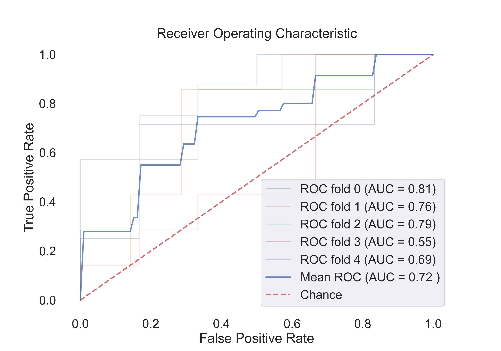
</a>

Fig.12: ROC curve for the Random Forest model.

---

**4.3** The following table shows the results for **$Correlation$ $Coefficient$** features:

| Model | Acc | Roc AUC | Cv-5 | Cv-5 AUC |
| --- | --- | --- | --- | --- |
| Logistic Regression | 0.65 | **0.90** | 0.79 | 0.85 |
| SVM (linear) | 0.71 | **0.92** | 0.73 | 0.85 |
| SVM (rbf) | 0.82 | **0.92** | 0.76 | 0.86 |
| Random Forest | 0.82 | **0.90** | 0.80 | 0.86 |

The following figures show the ROC curves for the models (Cv-5 AUC - last column in table):

- **Logistic Regression**:

<a href="images/classification/roc_logistic_Correlation.png">
    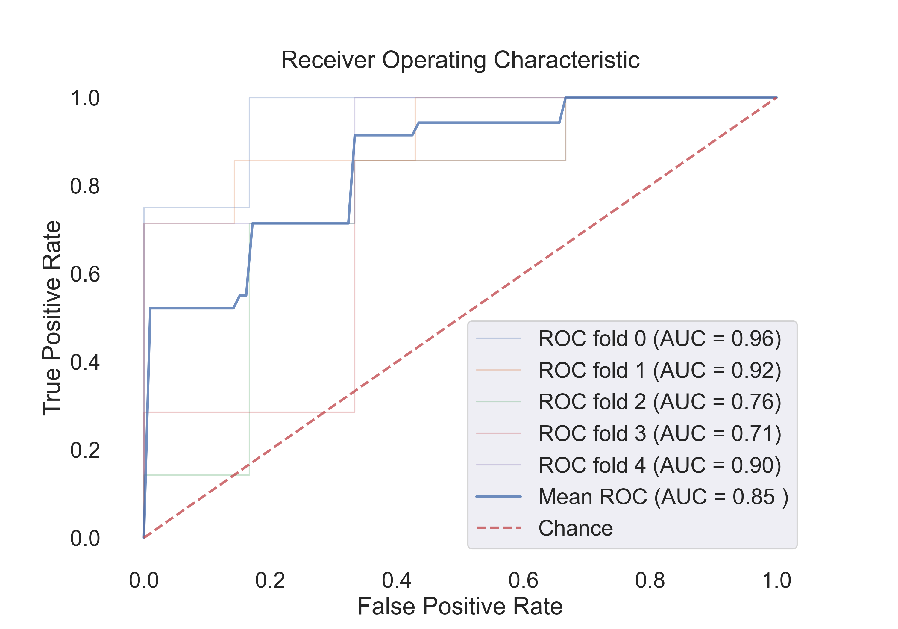
</a>

Fig.13: ROC curve for the Logistic Regression model.

- **SVM (rbf)**:

Fig.14: ROC curve for the SVM (rbf) model.

- **SVM (linear)**:

Fig.15: ROC curve for the SVM (linear) model.

- **Random Forest**:

<a href="images/classification/roc_random_forest_Correlation.png">
    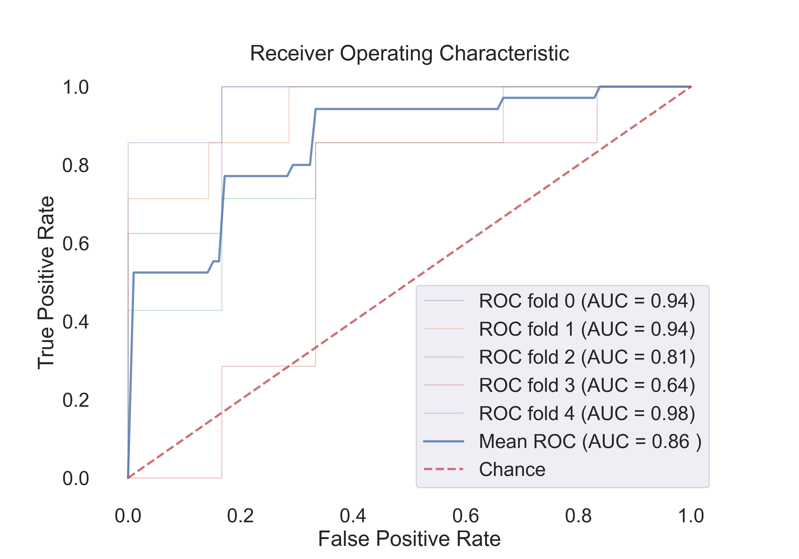
</a>

Fig.16: ROC curve for the Random Forest model.

---

##### 5. Final Thoughts and Conclusions

The classification of subjects into healthy or schizophrenic groups based on Transition Probability Matrices (TPMs) represents a significant results. This study has demonstrated the feasibility of using simple, yet effective, statistical and machine learning techniques to differentiate between the neurophysiological patterns characteristic of these two conditions.

Through the feature engineering process, we have successfully addressed the challenge of high dimensionality inherent in the TPMs by extracting robust and interpretable features. The similarity measures—Euclidean distance, cosine similarity, and correlation coefficient—have been instrumental in transforming the raw TPM data into a format amenable to machine learning algorithms. These features not only reduce the risk of overfitting but also enhance the interpretability of the models, providing valuable insights into the neurodynamics of healthy and schizophrenic subjects.

The visualization of features through scatter plots has offered a preliminary yet insightful look into the distribution and separation capabilities of the features extracted. It has laid the groundwork for understanding how well the features can distinguish between the two groups. In particular, the correlation coefficient features appear to be the most promising, as they show a clear separation between the two groups. And some of the subjects especially in the schizophrenic group are very close to the healthy group. This suggests that the correlation coefficient features can be used to identify subjects with schizophrenia who exhibit brain state transitions similar to those of healthy individuals.

Model selection included Logistic Regression, Random Forest, and Support Vector Machines with linear and radial basis function (rbf) kernels. The choice of these models was guided by their widespread use and proven track record in classification tasks. The evaluation of these models through metrics like accuracy and ROC AUC has provided a comprehensive view of their performance. In particular, the ROC AUC metric has been invaluable for assessing model efficacy in the context of a slightly imbalanced dataset.

The results indicate that the Support Vector Machine with an rbf kernel and features based on the correlation coefficient offers the most promising classification performance. However, the Random Forest model also shows comparable performance, suggesting that an ensemble of decision trees can capture the complex patterns in the data effectively.

It is imperative to note that while the current models perform satisfactorily, there is always room for improvement. Future work may include exploring more complex features and testing additional classifiers. Furthermore, extending the dataset and incorporating longitudinal data could enhance the robustness of the findings. It was also observed that reducing the TPMs by employing dimensionality reduction techniques like Principal Component Analysis (PCA) did not improve the classification performance. It was actually worse than the results obtained using present features. This suggests that the features extracted from the TPMs are already capturing the most important information and reducing the dimensionality further is not helping the models. (The PCA analysis is not included in this report.)

In conclusion, the use of TPMs for classification purposes holds promise not only as a diagnostic tool but also as a means to personalize treatment strategies for individuals with schizophrenia but also for other mental disorders. 