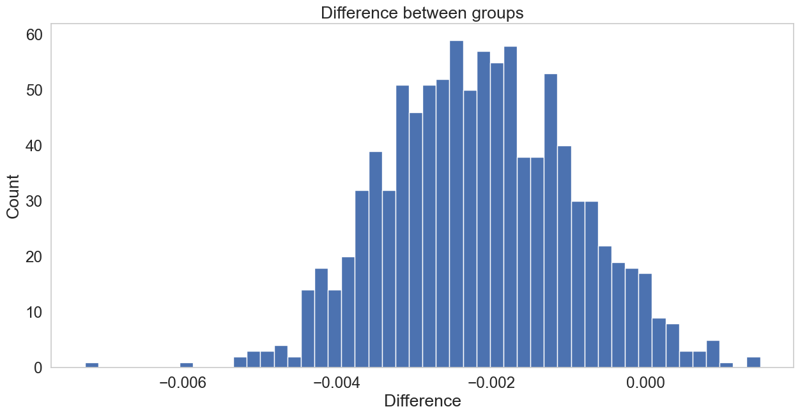
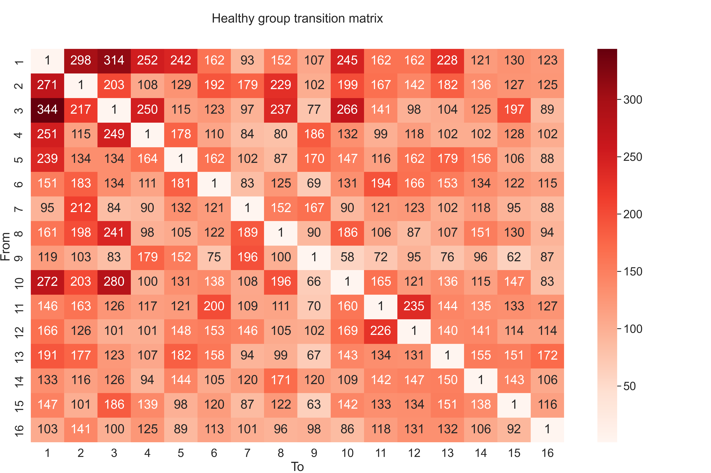
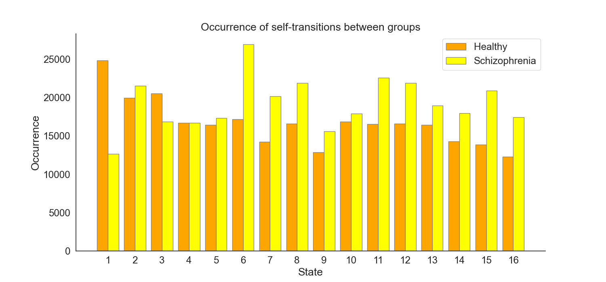
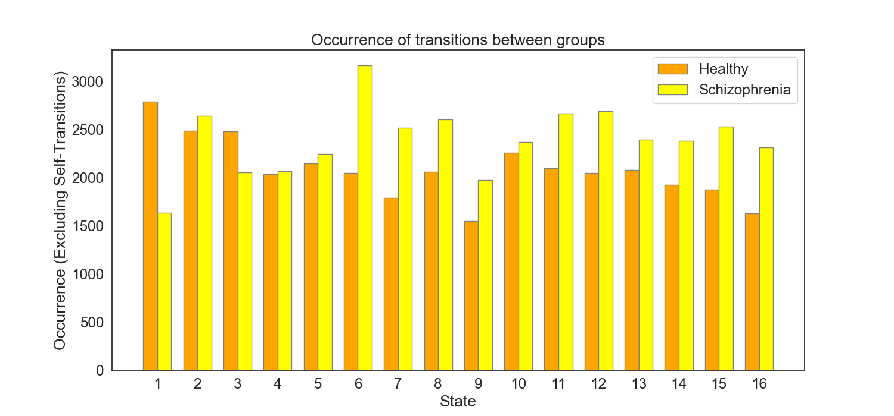

### Correlation Matrices of EEG Microstate Sequences in Healthy and Schizophrenic Individuals

Continuing our deep dive into the analysis of EEG microstate sequences, we now turn our attention to understanding the intricate correlations within and between healthy and schizophrenia groups. This approach involves creating and examining correlation matrices, providing valuable insights into the interconnectedness of different brain states. The histograms and statistical tests employed further enhance our grasp of the nuanced relationships in these groups.

#### Creating Correlation Matrices

The correlation matrices are generated by calculating the Pearson correlation coefficients between all pairs of sequences within each group. The process can be mathematically described as follows:

For the **healthy group**:
\[ \text{Corr}_{\text{healthy}} = \text{corrcoef}(\text{healthy\_seqs}) \]

For the **schizophrenia group**:
\[ \text{Corr}_{\text{schizo}} = \text{corrcoef}(\text{schizo\_seqs}) \]

where `corrcoef` is the numpy function that computes the correlation coefficients.

Since the diagonal elements of a correlation matrix always equal 1 (as a sequence is perfectly correlated with itself), these are set to 0 to focus on the relationships between different sequences.

The matrices are visualized as heatmaps, allowing us to observe patterns of correlation across the groups.

Fig.1 and Fig.2 Correlation matrices for healthy and schizophrenia groups, respectively. Entrie $i,j$ represents the correlation between subject sequence $i$ and subject sequence $j$ within the group.

#### Histograms of Correlations

To further dissect these relationships, histograms of the flattened correlation matrices are plotted. These histograms display the distribution of correlation coefficients, providing insights into the prevalence of various degrees of correlation within each group.

The histograms for each group are as follows:

\[ \text{Histogram}(\text{Corr}_{\text{healthy}}.\text{flatten}()) \]
\[ \text{Histogram}(\text{Corr}_{\text{schizo}}.\text{flatten}()) \]

Combined histogram plots the distributions of both groups together, allowing for a direct comparison

Fig.3 Histograms of correlations for healthy and schizophrenia groups.

#### Statistical Significance Analysis

To assess the statistical significance of the observed differences in correlations between the two groups, a bootstrap method is employed. This method involves repeatedly resampling the flattened correlation matrices and calculating the mean difference in correlations for each sample. The distribution of these differences is then plotted as a histogram.

\[ \text{Bootstrap Difference} = \frac{1}{n_{\text{bootstrap}}} \sum_{i=1}^{n_{\text{bootstrap}}} (\text{Mean}(\text{Resample}(\text{Corr}_{\text{healthy}})) - \text{Mean}(\text{Resample}(\text{Corr}_{\text{schizo}}))) \]

The p-value, derived from the bootstrap analysis, indicates the likelihood of observing such a difference under the null hypothesis (no significant difference between the groups).

The bootstrap histogram is as follows:  \[ \text{Histogram}(\text{Bootstrap Difference}) \] \[ \text{p-value} = 0.037 \]

Fig.4 Bootstrap histogram showcasing the differences in correlations.

Now, we can construct transition matrices for both the healthy and schizophrenia groups, providing a quantitative framework to examine the state transitions.

Let's assume that we have a set of sequences $S$ of states, where each sequence $s \in S$ is a list of states visited in order. $S_{\text{healthy}}$ and $S_{\text{schizo}}$ represent the sequences for the healthy and schizophrenia groups, respectively.

<!-- Transition Matrix -->
#### Transition Matrix $T$
The transition matrix $T$ is a square matrix where the entry $T_{ij}$ represents the number of transitions from state $i$ to state $j$. Given the set of sequences $S$, the transition matrix is constructed as follows:

1. Identify the set of unique states $U$ across all sequences in $S$.
2. Initialize a matrix $T$ with dimensions $|U| \times |U|$, where $|U|$ is the number of unique states, with all entries set to zero.
3. For each sequence $s \in S$, and for each consecutive pair of states $(s_k, s_{k+1})$ in $s$, increment the matrix entry $T_{s_k, s_{k+1}}$ by 1.

Mathematically, the construction can be written as:

$$ T_{ij} = \sum_{s \in S} \sum_{k=1}^{|s|-1} [s_k = i \land s_{k+1} = j] $$

where $[ \cdot ]$ is the Iverson bracket, which is 1 if the condition is true, and 0 otherwise.

Since the transition matrix is a square matrix, it can be visualized as a heatmap, where the rows represent the source states, and the columns represent the destination states.

Fig.5 Transition matrix $T_{healthy}$ for the healthy group. The rows represent the source states, and the columns represent the destination states. The entry $T_{ij}$ represents the number of transitions from state $i$ to state $j$. The diagonal entries are set to $1$, for visualization purposes.

Fig.6 Transition matrix $T_{schizo}$ for the schizophrenia group. The rows represent the source states, and the columns represent the destination states. The entry $T_{ij}$ represents the number of transitions from state $i$ to state $j$. The diagonal entries are set to $1$, for visualization purposes.

The analysis of transition matrices for the healthy and schizophrenia groups provides a comprehensive understanding of state transition dynamics in these populations. The matrices, visualized in Figures 1 and 2, offer a macroscopic view of how frequently each state transitions to another. Before we transform the transition matrices into a probability matrix lets delve deeper into the characteristics of these transitions.

#### Comparative Analysis of Transition Matrices
A notable aspect of the transition matrices is the ratio of self-transitions (transitions from a state to itself) to all transitions. The self-loops can be conceptualized as:

$$ T_{ii} = \sum_{s \in S} \sum_{k=1}^{|s|-1} [s_k = s_{k+1} = i] $$

where $[ \cdot ]$ is the Iverson bracket, which is 1 if the condition is true, and 0 otherwise. 
And the ratio between the number of self-loops and the total number of transitions as:

$$ \frac{\sum_{i=1}^{|U|} T_{ii}}{\sum_{i=1}^{|U|} \sum_{j=1}^{|U|} T_{ij}} $$

This ratio reflects the tendency of each group to remain in the same state rather than transition to different states. The computed ratios are as follows:

- **Healthy Group Self-Transition Ratio**: 0.8887
- **Schizophrenia Group Self-Transition Ratio**: 0.8892

These ratios indicate a high prevalence of self-transitions in both groups, suggesting a tendency towards state stability or persistence in both healthy and schizophrenia subjects.

To compare the number of transition between the healthy and schizophrenia groups, the Frobenius norm (we can think of it as a distance between two matrices) of the difference between their transition matrices is calculated as:

<!-- difrrence of T schizo and T healthy  wit frobenius norm -->
$$ \text{Distance} = \sqrt{\sum_{i=1}^{|U|} \sum_{j=1}^{|U|} (T_{ij}^{\text{schizo}} - T_{ij}^{\text{healthy}})^2} $$

This norm quantifies the overall dissimilarity between the two matrices.

---
#### Distribution of Self-Transitions

Self-transitions represent the counts of a state transitioning to itself, reflecting a sort of persistence or stability within that state.

For the **healthy group**, we define the self-transition for each state \( i \) as \( \text{SelfTrans}_{i, \text{healthy}} \), which is extracted from the diagonal of the transition matrix \( T_{\text{healthy}} \):

\[ \text{SelfTrans}_{i, \text{healthy}} = T_{ii}^{\text{healthy}} \]

Similarly, for the **schizophrenia group**, the self-transition for each state \( i \) are denoted as \( \text{SelfTrans}_{i, \text{schizo}} \), obtained from the diagonal of the transition matrix \( T_{\text{schizo}} \):

\[ \text{SelfTrans}_{i, \text{schizo}} = T_{ii}^{\text{schizo}} \]

These occurrences are essential for understanding the intrinsic dynamics of each group. A high self-transition counts suggests a tendency for the system to remain in the same state over time, which could be indicative of a stable or persistent pattern of brain activity. Conversely, lower self-transition counts imply a greater likelihood of transitioning to different states, suggesting more dynamic or variable brain activity.

$$ \text{Distance with Self-Transitions} = 22220 $$

Fig.7 Self-transition ocurrences in the healthy and schizophrenia groups. 

---
#### Distribution of Transitions

After examining self-transitions, we now explore the distribution of transitions between distinct states in both the healthy and schizophrenia groups. This excludes self-transitions and provides insight into the dynamic interplay of different states.

For the **healthy group**, let \( T_{\text{healthy}} \) be the transition matrix, where \( T_{ij}^{\text{healthy}} \) represents the counts from state \( i \) to state \( j \). The sum of transition counts for each state \( i \), excluding self-transitions, is calculated as follows:

\[ \text{SumTrans}_{i, \text{healthy}} = \sum_{j=1, j \neq i}^{|U|} T_{ij}^{\text{healthy}} \]

Similarly, for the **schizophrenia group**, let \( T_{\text{schizo}} \) be the transition matrix, where \( T_{ij}^{\text{schizo}} \) indicates the counts of transitioning from state \( i \) to state \( j \). The sum of transition counts for each state \( i \), excluding self-transitions, is given by:

\[ \text{SumTrans}_{i, \text{schizo}} = \sum_{j=1, j \neq i}^{|U|} T_{ij}^{\text{schizo}} \]

Here, \( |U| \) denotes the total number of unique states. The results of these calculations yield a vector for each group. Each element of these vectors corresponds to the cumulative counts of a state transitioning to all other states. This analysis offers a comprehensive view of how states are interconnected and interact with one another within each group.

$$ \text{Distance without Self-Transitions} = 922 $$

Fig.8 Transition ocurrences in the healthy and schizophrenia groups.

Dealing with self-loops in transition matrices, especially when analyzing sequences of states in contexts like EEG microstate analysis, requires careful consideration. Self-loops, representing transitions from a state to itself, can disproportionately influence the analysis. That from now we separate the self-loops from the transition matrices and analyze them separately. But first, let's transform the transition matrices into probability  matrices. → [EEG Microstate Sequences $→$ Transition Probability Matrix (TPM)](transition-probability-matrix.html)

<!-- Footer -->
---

###### Author: [Łukasz Furman](cracer.net@gmail.com)