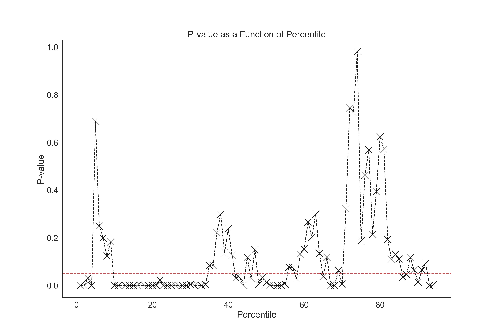
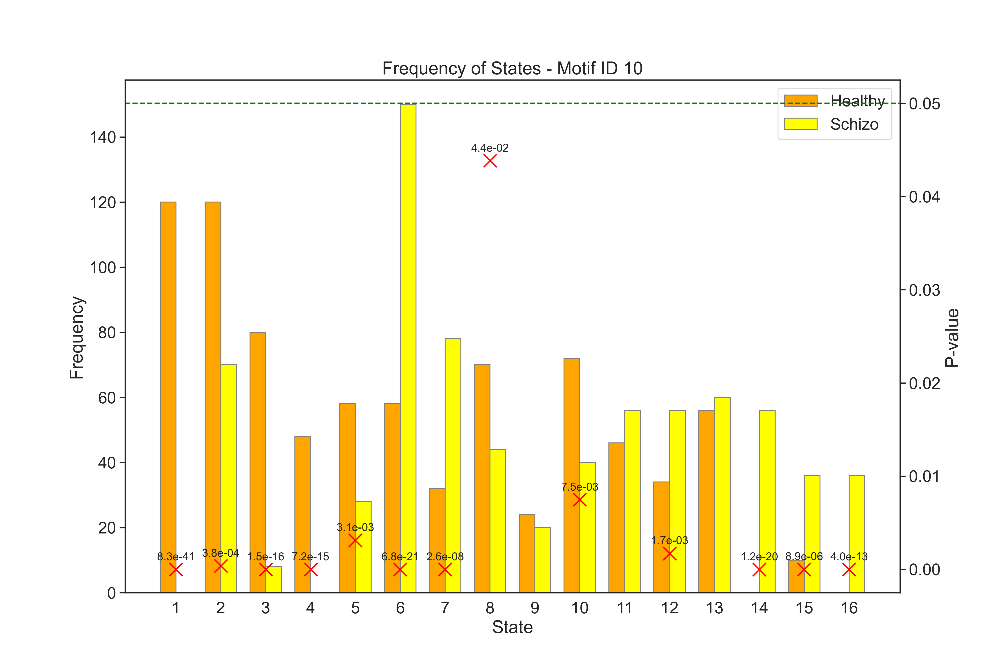
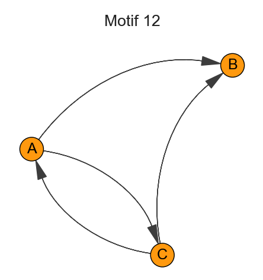
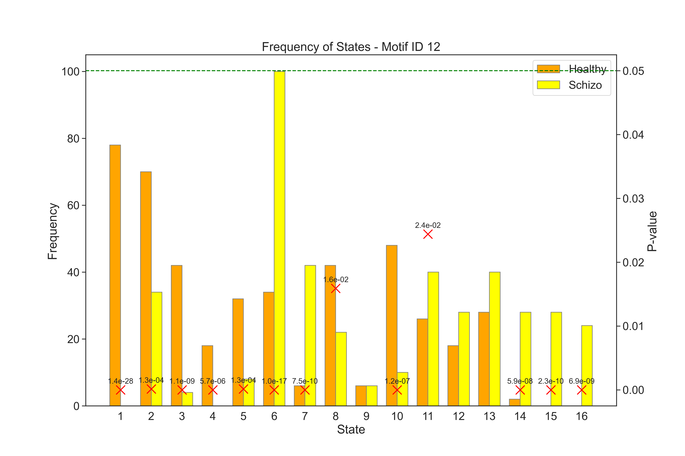

#### Introduction

In the realm of neuroscience, the analysis of electroencephalogram (EEG) signals stands as a crucial tool for understanding the intricate workings of the brain. Particularly in the study of psychiatric disorders like schizophrenia, EEG offers a window into the neural dynamics that underlie this complex condition. Recent advancements in EEG analysis have led to the identification of distinct brain microstates - brief, topographically organized patterns of brain activity that are believed to represent the fundamental building blocks of cognitive processes.

This study aims to deepen our understanding of schizophrenia by examining the sequential dynamics of these EEG-derived microstates in individuals diagnosed with schizophrenia compared to healthy controls. By constructing a dataset of sequences $S$, where each sequence represents the chronological order of microstates observed in EEG recordings, we embark on a detailed analytical journey. Our objective is twofold: firstly, to identify and quantify patterns in the transition of these microstates, and secondly, to uncover underlying network structures and motifs that may differentiate the neural processing in schizophrenia from that in a healthy brain.

To achieve this, we begin by constructing transition matrices for both the healthy and schizophrenia groups, providing a quantitative framework to examine the state transitions. This is followed by the creation of directed graphs that visually and mathematically represent the directional flow of these state transitions. Next the motif analysis - a method that enables us to identify recurring patterns within these complex networks, offering insights into the fundamental neural circuits that may be altered in schizophrenia.

Let's assume that we have a set of sequences $S$ of states, where each sequence $s \in S$ is a list of states visited in order. $S_{\text{healthy}}$ and $S_{\text{schizo}}$ represent the sequences for the healthy and schizophrenia groups, respectively.

<!-- Transition Matrix -->
#### Transition Matrix $T$
The transition matrix $T$ is a square matrix where the entry $T_{ij}$ represents the number of transitions from state $i$ to state $j$. Given the set of sequences $S$, the transition matrix is constructed as follows:

1. Identify the set of unique states $U$ across all sequences in $S$.
2. Initialize a matrix $T$ with dimensions $|U| \times |U|$, where $|U|$ is the number of unique states, with all entries set to zero.
3. For each sequence $s \in S$, and for each consecutive pair of states $(s_k, s_{k+1})$ in $s$, increment the matrix entry $T_{s_k, s_{k+1}}$ by 1.

Mathematically, the construction can be written as:

$$ T_{ij} = \sum_{s \in S} \sum_{k=1}^{|s|-1} [s_k = i \land s_{k+1} = j] $$

where $[ \cdot ]$ is the Iverson bracket, which is 1 if the condition is true, and 0 otherwise.

Fig.1 Transition matrix for the healthy group. The rows represent the source states, and the columns represent the destination states. The entry $T_{ij}$ represents the number of transitions from state $i$ to state $j$. Diagonal entries represent self-loops, i.e. transitions from a state to itself. The self-loops are not used in the analysis and not shown in the figure. That is, the diagonal entries are set to $1$.

Fig.2 Transition matrix for the schizophrenia group. The rows represent the source states, and the columns represent the destination states. The entry $T_{ij}$ represents the number of transitions from state $i$ to state $j$. Diagonal entries represent self-loops, i.e. transitions from a state to itself. The self-loops are not used in the analysis and not shown in the figure. That is, the diagonal entries are set to $1$.

---

<!-- Directed Graph -->
#### Directed Graph $G$
The directed graph $G = (V, E)$ can be derived from the transition matrix $T$. Here, $V$ is the set of vertices corresponding to the unique states, and $E$ is the set of edges corresponding to the transitions between states:

1. For each state $u \in U$, create a vertex in $V$.
2. For each non-zero entry $T_{ij}$ that is also above a certain percentile threshold $\theta$, create a directed edge from vertex $i$ to vertex $j$ in $E$.

The edge creation with the percentile threshold can be defined as:

$$ E = \{ (i, j) \ | \ T_{ij} > \theta \land i \neq j \} $$

where $\theta$ is the cutoff weight for pruning, typically determined by a percentile of the weight distribution of $T$:

$$ \theta = \text{percentile}(\{ T_{ij} \ | \ i \neq j \}, \text{λ}) $$
where, $\text{λ} \in [0, 100]$ is the percentile value.

The directed graphs for the healthy and schizophrenia groups are shown in Fig.3 and Fig.4, respectively. The nodes represent the unique states, and the edges represent the transitions between states. For visualisation purposes the edge weights are normalized by the maximum edge weight in the graph. Size of nodes is determined by the number of transitions from that state (i.e. the sum of the row in the transition matrix) - the *node degree*. The self-loops are not used in the analysis and not shown in the figures. The percentile threshold for pruning is set to $70$% for both groups (meaning that only **the top 30% of the weights are kept**).

---

<!-- Motifs -->
#### Motifs $M$
The motifs $M$ are the subgraphs of $G$ that are isomorphic to a set of predefined patterns. The patterns are defined by the number of nodes and edges, and the connectivity between the nodes.

Triad census, as defined by Davis and Leinhardt[1], categorizes every triple of vertices in a directed graph into one of 16 possible states based on their mutual, asymmetric, or absent connections. These states are described using "MAN labels" and are enumerated as:

- 0: No connections between any vertices $A, B, C$.
- 1: One directed edge $A→B$, third vertex $C$ unconnected.
- 2: Mutual connection between two vertices $A⇄B$, third vertex $C$ unconnected.
- 3: Out-star configuration $A←B→C$.
- 4: In-star configuration $A→B←C$.
- 5: One vertex has directed edges to the other two $A→B→C$.
- 6: One mutual connection and one directed edge pointing in $A⇄B←C$.
- 7: One mutual connection and one directed edge pointing away $A⇄B→C$.
- 8: One vertex has directed edges to the other two, which are also mutually connected $A→B←C, A→C$.
- 9: One vertex is pointed to by the other two, which are also mutually connected $A←B←C, A→C$.
- 10: All three vertices are mutually connected in a chain $A⇄B⇄C$.
- 11: Cycle configuration $A←B→C, A⇄C$.
- 12: All three vertices have two mutual connections and one asymmetric connection $A→B←C, A⇄C$.
- 13: One vertex has directed edges to the other two, and there is one mutual connection $A→B→C, A⇄C$.
- 14: All three vertices are connected with two mutual connections and one directed edge $A→B⇄C, A⇄C$.
- 15: Complete graph, all three vertices are mutually connected $A⇄B⇄C, A⇄C$.

Each of these states is counted and represented in a result vector, reflecting the distribution of triad types within the graph.

Fig.5 The 16 triad motifs. The nodes represent the unique states, and the edges represent the transitions between states. 

---
<!-- Motifs Distribution  -->
#### Motifs Distribution $f$
For a given motif size \( m \), let \( M \) be the set of all possible motifs of that size. The size of this set, denoted as \( |M| \), represents the total number of distinct motif patterns that can be formed with \( m \) nodes. The function \( \text{motifs\_randesu}(G, m) \)[2] returns a vector \( \mathbf{c} \), where \( c_i \) is the count of occurrences of motif \( i \) in graph \( G \).

The total count of motifs in the graph \( G \) of size \( m \) is given by the sum of the elements in \( \mathbf{c} \), where motifs that do not appear are counted as zero:

$$C_{\text{total}} = \sum_{i=1}^{|M|} c_i$$

The relative frequency \( f_i \) of each motif \( i \) occurring in \( G \) is the ratio of \( c_i \) to \( C_{\text{total}} \):

$$f_i = \frac{c_i}{C_{\text{total}}}$$

The vector \( \mathbf{f} = [f_1, f_2, \dots, f_{|M|}] \) represents the relative frequencies for the entire set of motifs in \( G \).

For the specific case of the healthy and schizophrenia groups, let \( G_{\text{healthy}} \) and \( G_{\text{schizo}} \) be the respective directed graphs constructed from their transition matrices with a pruning threshold applied at the 70th percentile.

The relative frequencies of motifs for each group are calculated as follows:

Healthy Group:
$$\mathbf{f}_{\text{healthy}} = \left[ \frac{c_{1,\text{healthy}}}{C_{\text{total,healthy}}}, \frac{c_{2,\text{healthy}}}{C_{\text{total,healthy}}}, \dots, \frac{c_{|M|,\text{healthy}}}{C_{\text{total,healthy}}} \right]$$

Schizophrenia Group:
$$\mathbf{f}_{\text{schizo}} = \left[ \frac{c_{1,\text{schizo}}}{C_{\text{total,schizo}}}, \frac{c_{2,\text{schizo}}}{C_{\text{total,schizo}}}, \dots, \frac{c_{|M|,\text{schizo}}}{C_{\text{total,schizo}}} \right]$$

Where \( C_{\text{total,healthy}} \) and \( C_{\text{total,schizo}} \) are the total counts of motifs for the healthy and schizophrenia groups, respectively.

This description formalizes the process of computing the distribution of motifs as relative frequencies over the set of all possible motifs of a given size in the graph.

The distribution of motifs for the healthy and schizophrenia groups are shown in Fig.6. The x-axis represents the motif index, and the y-axis represents the relative frequency of the motif in the graph.

<!-- line  separator -->
---

<!-- Motifs Significance -->
#### Motifs Significance 
###### 1. Chi-squared Test for Independence in motif distributions between the healthy and schizophrenia groups.

Fig.7 illustrates the p-values as a function of the percentile threshold. The x-axis represents the percentile threshold, and the y-axis represents the p-value. The p-value is calculated using the Chi-squared test, as provided by the `scipy.stats.chi2_contingency`[3] function. This test assesses whether the motif distribution of the healthy group is significantly different from that of the schizophrenia group.

For the analysis, we consider two groups: $H$ (healthy) and $S$ (schizophrenia), along with a set of motifs $M$. The contingency table for the Chi-squared test is constructed based on the actual observed counts of each motif $m$ in the groups $H$ and $S$. Let $c_{m,H}$ and $c_{m,S}$ represent these counts, respectively.

The contingency table $T$ for each motif $m \in M$ is constructed as follows:

$$T_m = \begin{bmatrix}
c_{m,H} & C_{H} - c_{m,H} \\
c_{m,S} & C_{S} - c_{m,S} \\
\end{bmatrix}$$

Where $C_{H}$ and $C_{S}$ are the total counts of motifs in the healthy and schizophrenia groups, respectively. Before applying the Chi-squared test, motifs with combined counts across both groups below a certain threshold $\tau$ are filtered out to ensure robust test results:

$$\{ c_{m,H}, c_{m,S} \mid c_{m,H} + c_{m,S} \geq \tau \}$$

The `chi2_contingency`[4] function computes the Chi-squared statistic, degrees of freedom (df), and p-value for the given contingency table. The degrees of freedom are automatically calculated based on the dimensions of the contingency table. The p-value indicates the likelihood of observing a Chi-squared statistic as extreme as the one computed, assuming the null hypothesis (no significant difference in motif distributions) is true.

A p-value lower than the chosen significance level (typically 0.05) suggests that the differences in motif distributions between the healthy and schizophrenia groups are statistically significant, leading to the rejection of the null hypothesis. This analysis provides insights into whether and how the motif distributions vary between the two groups under different percentile thresholds.

---

<!-- Fisher's Exact Test -->
###### 2. Fisher's Exact Test for Independence in motif distributions between the healthy and schizophrenia groups (for each motif separately). 

Fig.8 presents the results of applying Fisher's exact test to compare motif distributions between the healthy and schizophrenia groups for every motif in the set separately. The x-axis represents the motif index, and the y-axis represents the p-value. The p-value is calculated using Fisher's exact test, as provided by the `scipy.stats.fisher_exact` function. This test assesses whether the motif distribution of the healthy group is significantly different from that of the schizophrenia group. For each motif, Fisher's exact test is applied to a 2x2 contingency table $T_m$ - same as the one used for the Chi-squared test. 

Fisher's exact test is performed using the `scipy.stats.fisher_exact` function, which computes the p-value for the given contingency table. The p-value reflects the probability of observing a data distribution as extreme as or more extreme than the one observed under the null hypothesis.

The p-values for each motif are calculated and stored. They are then compared against a significance level, typically set to 0.05, to determine if the observed differences in motif distributions are statistically significant. A p-value lower than this threshold indicates a statistically significant difference in the distribution of that motif between the two groups.

#### Motifs Interpretation
The motifs are interpreted based on the following criteria:

- **Motifs with p-value < 0.05**: The motif distribution is significantly different between the healthy and schizophrenia groups.
- **Motifs with p-value > 0.05**: The motif distribution is not significantly different between the healthy and schizophrenia groups.
- **Motifs with p-value = 0**: The motif is not observed in one of the groups, and hence the test cannot be performed.
- **Motifs with p-value = 1**: The motif is observed in both groups, and hence the test cannot be performed.

From the results of the Chi-squared test and Fisher's exact test, we can identify the motifs that are significantly different between the healthy and schizophrenia groups. These motifs are then used to construct a subgraph of the original graph, which is then visualized to gain insights into the underlying network structure.

On that note, let's take a look at the motifs that are significantly different between the healthy and schizophrenia groups. We will examine the motifs with the lowest p-values. These are **Motif 5**, **Motif 10**, and **Motif 12**. For each of these motifs, we will look at the distribution of the state (microstates) counts for the healthy and schizophrenia groups from microstate 1 to microstate 16. Here, the contingency table is constructed for state counts instead of motif counts. The contingency table $T$ for each microstate $ms \in m$ is constructed as follows:

$$T_s = \begin{bmatrix}
c_{ms,H} & C_{H} - c_{ms,H} \\
c_{ms,S} & C_{S} - c_{ms,S} \\
\end{bmatrix}$$

Where $C_{H}$ and $C_{S}$ are the total counts of states in the healthy and schizophrenia groups. $c_{ms,H}$ and $c_{ms,S}$ are the counts of microstates $ms$ in the healthy and schizophrenia groups. The contingency table $T$ is then used to compute the p-value using Fisher's exact test, as done previously. No filtering is applied to the state counts before applying Fisher's exact test.

---

###### Analysis of Motif ID 5:

As depicted in Fig.9, Motif 5 offers a detailed perspective on specific subgraph patterns within the overarching graph $G$. This motif is particularly noteworthy for its varied configurations of microstates, revealing certain predominant transitions, between $A→B→C$. Motif 5, characterized by the pattern $A→B→C$, signifies a sequential transition from state $A$ to state $B$, followed by a transition from $B$ to $C$. This linear sequence can provide insights into the progression or evolution of states within the studied system.

In the context of the healthy vs. schizophrenia groups, the analysis of Motif 5 can shed light on the directionality and flow of transitions among specific microstates. It can reveal, for instance, whether certain states tend to precede or follow others consistently, suggesting a possible hierarchical or ordered relationship among these states.

Moreover, the frequency and distribution of Motif 5 instances across the two groups might indicate differing patterns of state transitions. In the healthy group, for instance, this motif could occur more frequently or in specific configurations that are less common in the schizophrenia group. Such differences might point to variations in cognitive or neurological processes between the groups.

Additionally, the analysis of Motif 5 can contribute to understanding the temporal dynamics within each group. For instance, if state $A$ frequently transitions to state $B$ and then to state $C$, it might indicate a predictable or stable sequence in one group, as opposed to a more varied or less predictable sequence in the other.
 

Fig.10 State distribution of Motif ID 5. The x-axis represents the microstate index, and the y-axis represents the state count. The p-value is computed using Fisher's exact test, as done previously. The green dashed line represents the significance level, which is set to 0.05. The red X markers represent the microstates that are significantly different between the healthy and schizophrenia groups in particular motif.

The following Tab.1 enumerates various instances of Motif 5 for $G_{\text{healthy}}$, showcasing the diverse combinations of state transitions:

| $A→B→C$ | $A→B→C$ | $A→B→C$ | $A→B→C$ |
|---|---|---|---|
| $1→2→3$ | $1→2→6$ | $1→2→7$ | $1→2→8$ |
| $1→2→10$ | $1→2→11$ | $1→2→13$ | $1→3→2$ |
| $1→3→4$ | $1→3→8$ | $1→3→10$ | $1→3→15$ |
| $1→4→3$ | $1→4→5$ | $1→4→9$ | $1→5→4$ |
| $1→5→6$ | $1→5→9$ | $1→5→12$ | $1→5→13$ |

The following Tab.2 enumerates various instances of Motif 5 for $G_{\text{schizo}}$, showcasing the diverse combinations of state transitions:

| $A→B→C$ | $A→B→C$ | $A→B→C$ | $A→B→C$ |
|---|---|---|---|
| $2→6→5$ | $2→6→7$ | $2→6→8$ | $2→6→10$ |
| $2→6→11$ | $2→6→12$ | $2→6→13$ | $2→6→14$ |
| $2→6→15$ | $2→6→16$ | $2→7→6$ | $2→7→8$ |
| $2→7→9$ | $2→7→11$ | $2→7→14$ | $2→8→3$ |
| $2→8→7$ | $2→8→9$ | $2→8→10$ | $2→8→15$ |

---
###### Analysis of Motif ID 10:

As depicted in Fig.11, Motif 10, characterized by the pattern $A⇄B⇄C$, represents a more complex interplay of states, where each state is bidirectionally connected to the others. This motif suggests a dynamic and interconnected system where transitions between states are not linear but cyclical and reciprocal. 

In examining Motif 10 within the context of healthy vs. schizophrenia groups, several key aspects can be highlighted:

1. **Cyclic Transitions and Feedback Loops**: The bidirectional connections in Motif 10 indicate the presence of feedback loops within the system. This could imply that the transitions between states are not merely sequential but involve a level of interaction where the states influence each other. In a neurological or cognitive context, such patterns could correspond to complex cognitive processes that involve feedback mechanisms, such as memory reinforcement, decision-making, or emotional regulation.

2. **System Stability and Resilience**: The presence and frequency of Motif 10 can offer insights into the stability and resilience of the system. In a healthy group, a higher occurrence of this motif might indicate a more robust and adaptable cognitive network capable of maintaining functional equilibrium despite various stimuli. Conversely, in the schizophrenia group, alterations in this motif's prevalence or structure could suggest disruptions in these cognitive networks, potentially leading to the symptomatic manifestations of the disorder.

3. **Potential Biomarkers**: The specific configurations and frequencies of Motif 10 could serve as potential biomarkers for distinguishing between healthy and schizophrenia groups. By comparing the occurrence and structure of this motif in both groups.

4. **Implications for Therapeutic Interventions**: Understanding the role and structure of Motif 10 in the cognitive processes of both groups can inform therapeutic strategies. For instance, interventions that aim to modify or stabilize certain state transitions could be developed based on how these transitions are represented within Motif 10.

5. **Predictive Modeling**: Motif 10 can be used in predictive models to understand the progression of cognitive states or the evolution of schizophrenia. By analyzing how this motif changes over time or in response to various factors.

Motif 10's analysis extends beyond identifying prevalent transitions to exploring the complex, reciprocal interactions between states. It opens avenues for understanding the intricate dynamics of cognitive processes, the pathophysiology of schizophrenia, and potential areas for therapeutic intervention.

Fig.12 State distribution of Motif ID 10. The x-axis represents the microstate index, and the y-axis represents the state count. The p-value is computed using Fisher's exact test, as done previously. The green dashed line represents the significance level, which is set to 0.05. The red X markers represent the microstates that are significantly different between the healthy and schizophrenia groups in particular motif.

The following Tab.3 enumerates various instances of Motif 10 for $G_{\text{healthy}}$, showcasing the diverse combinations of state transitions:

| $A⇄B⇄C$ | $A⇄B⇄C$ | $A⇄B⇄C$ | $A⇄B⇄C$ |
|---|---|---|---|
| $1⇄2⇄3$ | $1⇄2⇄6$ | $1⇄2⇄7$ | $1⇄2⇄8$ |
| $1⇄2⇄10$ | $1⇄2⇄11$ | $1⇄2⇄13$ | $1⇄3⇄2$ |
| $1⇄3⇄4$ | $1⇄3⇄8$ | $1⇄3⇄10$ | $1⇄3⇄15$ |
| $1⇄4⇄3$ | $1⇄4⇄5$ | $1⇄4⇄9$ | $1⇄5⇄4$ |
| $1⇄5⇄6$ | $1⇄5⇄9$ | $1⇄5⇄13$ | $1⇄8⇄2$ |
| $1⇄8⇄3$ | $1⇄8⇄7$ | $1⇄8⇄10$ | $1⇄10⇄2$ |

The following Tab.4 enumerates various instances of Motif 10 for $G_{\text{schizo}}$, showcasing the diverse combinations of state transitions:

| $A⇄B⇄C$ | $A⇄B⇄C$ | $A⇄B⇄C$ | $A⇄B⇄C$ |
|---|---|---|---|
| $2⇄6⇄5$ | $2⇄6⇄7$ | $2⇄6⇄10$ | $2⇄6⇄11$ |
| $2⇄6⇄12$ | $2⇄6⇄13$ | $2⇄6⇄14$ | $2⇄6⇄15$ |
| $2⇄6⇄16$ | $2⇄7⇄6$ | $2⇄7⇄8$ | $2⇄7⇄9$ |
| $2⇄7⇄11$ | $2⇄7⇄14$ | $2⇄8⇄3$ | $2⇄8⇄7$ |
| $2⇄8⇄9$ | $2⇄8⇄10$ | $2⇄11⇄6$ | $2⇄11⇄7$ |
| $2⇄11⇄12$ | $2⇄13⇄6$ | $2⇄13⇄14$ | $2⇄13⇄15$ |

---

###### Analysis of Motif ID 12:

Fig.13, Motif 12 offers a detailed perspective on specific subgraph patterns within the overarching graph $G$. This motif is particularly noteworthy for its varied configurations of microstates, revealing certain predominant transitions, especially between states $A⇄C$.
$A→B→C$ acts as a transient attractor. Since $A⇄C$, the system can transition to $C$ from $A$ or $B$.  
<!-- One vertex has directed edges to the other two, and there is one mutual connection $A→B→C, A⇄C$. -->

Fig.14 State distribution of Motif ID 12.

The Motif 12, characterized by the configuration $A→B←C, A⇄C$, encapsulates an intricate interplay of directional and reciprocal connections, illustrating the nuanced interrelationships within the graph $G$. This motif, with its unique structural arrangement, provides significant insights into the underlying dynamics of state transitions, particularly when comparing healthy and schizophrenia groups. Key observations include:

1. **Complex Decision-Making Pathways**: The presence of both directed and bidirectional links in Motif 12 suggests complex decision-making or information processing pathways within the system. The directed connections to state $B$ may represent converging pathways or decision points, while the reciprocal link between $A$ and $C$ indicates a feedback loop or ongoing interaction, which can be pivotal in adapting or adjusting responses based on changing conditions or inputs.

2. **Potential Biomarker for Disease States**: In the context of mental health, particularly schizophrenia, this motif could potentially serve as a biomarker. The specific patterns of interaction and their frequencies could be differentially represented in healthy versus schizophrenia groups, offering a window into the altered neural connectivity or cognitive processes characteristic of the disorder.

3. **Implications for Therapeutic Interventions**: Understanding the predominance and nature of such motifs in pathological states could inform therapeutic strategies. For instance, interventions might aim to modify certain connections within these motifs to more closely resemble those found in healthy states, thereby potentially alleviating some symptoms or cognitive deficits associated with schizophrenia.

The x-axis represents the microstate index, and the y-axis represents the state count. The p-value is computed using Fisher's exact test, as done previously. The green dashed line represents the significance level, which is set to 0.05. The red X markers represent the microstates that are significantly different between the healthy and schizophrenia groups in particular motif.

The following Tab.5 enumerates various instances of Motif 12 for $G_{\text{healthy}}$, showcasing the diverse combinations of state transitions:

| $A→B←C, A⇄C$ | $A→B←C, A⇄C$ | $A→B←C, A⇄C$ | $A→B←C, A⇄C$ |
|---|---|---|---|
| $1→2←3, 1⇄3$ | $1→2←8, 1⇄8$ | $1→2←10, 1⇄10$ | $1→2←13, 1⇄13$ |
| $1→3←2, 1⇄2$ | $1→3←4, 1⇄4$ | $1→3←8, 1⇄8$ | $1→3←10, 1⇄10$ |
| $1→4←3, 1⇄3$ | $1→4←5, 1⇄5$ | $1→5←4, 1⇄4$ | $1→5←13, 1⇄13$ |
| $1→6←2, 1⇄2$ | $1→6←5, 1⇄5$ | $1→6←12, 1⇄12$ | $1→6←13, 1⇄13$ |
| $1→8←2, 1⇄2$ | $1→8←3, 1⇄3$ | $1→8←10, 1⇄10$ | $1→10←2, 1⇄2$ |
| $1→10←3, 1⇄3$ | $1→10←8, 1⇄8$ | $1→10←12, 1⇄12$ | $1→11←2, 1⇄2$ |

The following Tab.6 enumerates various instances of Motif 12 for $G_{\text{schizo}}$, showcasing the diverse combinations of state transitions:

| $A→B←C, A⇄C$ | $A→B←C, A⇄C$ | $A→B←C, A⇄C$ | $A→B←C, A⇄C$ |
|---|---|---|---|
| $2→6←7, 2⇄7$ | $2→6←11, 2⇄11$ | $2→6←13, 2⇄13$ | $2→7←6, 2⇄6$ |
| $2→7←8, 2⇄8$ | $2→7←11, 2⇄11$ | $2→8←6, 2⇄6$ | $2→8←7, 2⇄7$ |
| $2→11←6, 2⇄6$ | $2→11←7, 2⇄7$ | $2→11←13, 2⇄13$ | $2→13←6, 2⇄6$ |
| $3→15←8, 3⇄8$ | $5→6←12, 5⇄12$ | $5→12←6, 5⇄6$ | $5→13←6, 5⇄6$ |
| $6→2←7, 6⇄7$ | $6→2←11, 6⇄11$ | $6→2←13, 6⇄13$ | $6→5←12, 6⇄12$ |
| $6→7←2, 6⇄2$ | $6→7←11, 6⇄11$ | $6→7←14, 6⇄14$ | $6→7←16, 6⇄16$ |

---

### Conclusion

This study's exploration into the neural dynamics of schizophrenia through EEG-derived microstates has shed light on the nuanced differences in brain activity patterns between individuals with schizophrenia and healthy controls. By analyzing the transitions and network motifs of these microstates, we have unraveled key aspects of the cognitive processes underlying this complex psychiatric disorder.

The transition matrices and directed graphs constructed from EEG sequences reveal distinct patterns in the flow of microstates, providing a quantitative and visual representation of these transitions. This approach has allowed us to identify specific motifs that are characteristic of either the healthy or schizophrenia groups, offering a deeper understanding of the differences in neural processing.

Analysis of motifs such as Motif 5, Motif 10, and Motif 12 has unveiled significant insights. Motif 5, characterized by a linear sequence of transitions, has shown prevalent patterns that may be indicative of stable cognitive processes in healthy individuals, which are altered in schizophrenia. Motif 10, with its cyclic and interconnected transitions, suggests a more dynamic interplay of microstates, potentially reflecting the complex cognitive processes that are disrupted in schizophrenia. Motif 12, embodying a blend of directed and reciprocal interactions, highlights the intricate network dynamics and potential disruptions in information processing pathways in schizophrenia.

The significant differences in motif distributions between the healthy and schizophrenia groups, as evidenced by the results of the Chi-squared and Fisher's exact tests, underscore the potential of these motifs as biomarkers for schizophrenia. These motifs not only provide a window into the altered neural connectivity but also offer avenues for developing targeted therapeutic interventions aimed at modifying specific pathways or connections within these motifs.

Furthermore, the diverse combinations of state transitions within each significant motif, as enumerated in the tables, illustrate the complex and varied nature of these patterns in both groups. This variability in motif configurations could be reflective of the individual differences in cognitive functioning and symptomatology observed in schizophrenia.

<!-- References -->

References:
  1. Davis, James A., and Carley, Kathleen M. "Structural balance, homophily, and the clustering of social affiliations." American journal of sociology 78.2 (1972): 361-384.
  2. [iGraph motif documentation](https://igraph.org/c/doc/igraph-Motifs.html#igraph_triad_census)
  3. [Chi-squared test for independence](https://docs.scipy.org/doc/scipy/reference/generated/scipy.stats.chi2_contingency.html)
  4. [Fisher's exact test for independence](https://docs.scipy.org/doc/scipy/reference/generated/scipy.stats.fisher_exact.html)

<!-- Appendix  -->
---
#### Appendix

- Full list of states for **Motif ID 5** for $G_{\text{healthy}}$:

| $A→B→C$ | $A→B→C$ | $A→B→C$ | $A→B→C$ |
|---|---|---|---|
| $1→2→3$ | $1→2→6$ | $1→2→7$ | $1→2→8$ |
| $1→2→10$ | $1→2→11$ | $1→2→13$ | $1→3→2$ |
| $1→3→4$ | $1→3→8$ | $1→3→10$ | $1→3→15$ |
| $1→4→3$ | $1→4→5$ | $1→4→9$ | $1→5→4$ |
| $1→5→6$ | $1→5→9$ | $1→5→12$ | $1→5→13$ |
| $1→5→14$ | $1→6→2$ | $1→6→5$ | $1→6→11$ |
| $1→6→12$ | $1→6→13$ | $1→8→2$ | $1→8→3$ |
| $1→8→7$ | $1→8→10$ | $1→10→2$ | $1→10→3$ |
| $1→10→8$ | $1→10→11$ | $1→11→2$ | $1→11→6$ |
| $1→11→10$ | $1→11→12$ | $1→12→6$ | $1→12→10$ |
| $1→12→11$ | $1→13→2$ | $1→13→5$ | $1→13→6$ |
| $1→13→14$ | $1→13→16$ | $2→1→3$ | $2→1→4$ |
| $2→1→5$ | $2→1→6$ | $2→1→8$ | $2→1→10$ |
| $2→1→11$ | $2→1→12$ | $2→1→13$ | $2→3→1$ |
| $2→3→4$ | $2→3→8$ | $2→3→10$ | $2→3→15$ |
| $2→6→5$ | $2→6→11$ | $2→6→12$ | $2→6→13$ |
| $2→7→8$ | $2→7→9$ | $2→8→1$ | $2→8→3$ |
| $2→8→7$ | $2→8→10$ | $2→10→1$ | $2→10→3$ |
| $2→10→8$ | $2→10→11$ | $2→11→6$ | $2→11→10$ |
| $2→11→12$ | $2→13→1$ | $2→13→5$ | $2→13→6$ |
| $2→13→14$ | $2→13→16$ | $3→1→2$ | $3→1→4$ |
| $3→1→5$ | $3→1→6$ | $3→1→8$ | $3→1→10$ |
| $3→1→11$ | $3→1→12$ | $3→1→13$ | $3→2→1$ |
| $3→2→6$ | $3→2→7$ | $3→2→8$ | $3→2→10$ |
| $3→2→11$ | $3→2→13$ | $3→4→1$ | $3→4→5$ |
| $3→4→9$ | $3→8→1$ | $3→8→2$ | $3→8→7$ |
| $3→8→10$ | $3→10→1$ | $3→10→2$ | $3→10→8$ |
| $3→10→11$ | $4→1→2$ | $4→1→3$ | $4→1→5$ |
| $4→1→6$ | $4→1→8$ | $4→1→10$ | $4→1→11$ |
| $4→1→12$ | $4→1→13$ | $4→3→1$ | $4→3→2$ |
| $4→3→8$ | $4→3→10$ | $4→3→15$ | $4→5→1$ |
| $4→5→6$ | $4→5→9$ | $4→5→12$ | $4→5→13$ |
| $4→5→14$ | $4→9→5$ | $4→9→7$ | $5→1→2$ |
| $5→1→3$ | $5→1→4$ | $5→1→6$ | $5→1→8$ |
| $5→1→10$ | $5→1→11$ | $5→1→12$ | $5→1→13$ |
| $5→4→1$ | $5→4→3$ | $5→4→9$ | $5→6→2$ |
| $5→6→11$ | $5→6→12$ | $5→6→13$ | $5→9→4$ |
| $5→9→7$ | $5→12→1$ | $5→12→6$ | $5→12→10$ |
| $5→12→11$ | $5→13→1$ | $5→13→2$ | $5→13→6$ |
| $5→13→14$ | $5→13→16$ | $5→14→8$ | $6→2→1$ |
| $6→2→3$ | $6→2→7$ | $6→2→8$ | $6→2→10$ |
| $6→2→11$ | $6→2→13$ | $6→5→1$ | $6→5→4$ |
| $6→5→9$ | $6→5→12$ | $6→5→13$ | $6→5→14$ |
| $6→11→2$ | $6→11→10$ | $6→11→12$ | $6→12→1$ |
| $6→12→10$ | $6→12→11$ | $6→13→1$ | $6→13→2$ |
| $6→13→5$ | $6→13→14$ | $6→13→16$ | $7→2→1$ |
| $7→2→3$ | $7→2→6$ | $7→2→8$ | $7→2→10$ |
| $7→2→11$ | $7→2→13$ | $7→8→1$ | $7→8→2$ |
| $7→8→3$ | $7→8→10$ | $7→9→4$ | $7→9→5$ |
| $8→1→2$ | $8→1→3$ | $8→1→4$ | $8→1→5$ |
| $8→1→6$ | $8→1→10$ | $8→1→11$ | $8→1→12$ |
| $8→1→13$ | $8→2→1$ | $8→2→3$ | $8→2→6$ |
| $8→2→7$ | $8→2→10$ | $8→2→11$ | $8→2→13$ |
| $8→3→1$ | $8→3→2$ | $8→3→4$ | $8→3→10$ |
| $8→3→15$ | $8→7→2$ | $8→7→9$ | $8→10→1$ |
| $8→10→2$ | $8→10→3$ | $8→10→11$ | $9→4→1$ |
| $9→4→3$ | $9→4→5$ | $9→5→1$ | $9→5→4$ |
| $9→5→6$ | $9→5→12$ | $9→5→13$ | $9→5→14$ |
| $9→7→2$ | $9→7→8$ | $10→1→2$ | $10→1→3$ |
| $10→1→4$ | $10→1→5$ | $10→1→6$ | $10→1→8$ |
| $10→1→11$ | $10→1→12$ | $10→1→13$ | $10→2→1$ |
| $10→2→3$ | $10→2→6$ | $10→2→7$ | $10→2→8$ |
| $10→2→11$ | $10→2→13$ | $10→3→1$ | $10→3→2$ |
| $10→3→4$ | $10→3→8$ | $10→3→15$ | $10→8→1$ |
| $10→8→2$ | $10→8→3$ | $10→8→7$ | $10→11→2$ |
| $10→11→6$ | $10→11→12$ | $11→2→1$ | $11→2→3$ |
| $11→2→6$ | $11→2→7$ | $11→2→8$ | $11→2→10$ |
| $11→2→13$ | $11→6→2$ | $11→6→5$ | $11→6→12$ |
| $11→6→13$ | $11→10→1$ | $11→10→2$ | $11→10→3$ |
| $11→10→8$ | $11→12→1$ | $11→12→6$ | $11→12→10$ |
| $12→1→2$ | $12→1→3$ | $12→1→4$ | $12→1→5$ |
| $12→1→6$ | $12→1→8$ | $12→1→10$ | $12→1→11$ |
| $12→1→13$ | $12→6→2$ | $12→6→5$ | $12→6→11$ |
| $12→6→13$ | $12→10→1$ | $12→10→2$ | $12→10→3$ |
| $12→10→8$ | $12→10→11$ | $12→11→2$ | $12→11→6$ |
| $12→11→10$ | $13→1→2$ | $13→1→3$ | $13→1→4$ |
| $13→1→5$ | $13→1→6$ | $13→1→8$ | $13→1→10$ |
| $13→1→11$ | $13→1→12$ | $13→2→1$ | $13→2→3$ |
| $13→2→6$ | $13→2→7$ | $13→2→8$ | $13→2→10$ |
| $13→2→11$ | $13→5→1$ | $13→5→4$ | $13→5→6$ |
| $13→5→9$ | $13→5→12$ | $13→5→14$ | $13→6→2$ |
| $13→6→5$ | $13→6→11$ | $13→6→12$ | $13→14→8$ |
| $14→8→1$ | $14→8→2$ | $14→8→3$ | $14→8→7$ |
| $14→8→10$ | $15→3→1$ | $15→3→2$ | $15→3→4$ |
| $15→3→8$ | $15→3→10$ |  |  |

- Full list of states for **Motif ID 5** for $G_{\text{schizo}}$:
  
| $A→B→C$ | $A→B→C$ | $A→B→C$ | $A→B→C$ |
|---|---|---|---|
| $2→6→5$ | $2→6→7$ | $2→6→8$ | $2→6→10$ |
| $2→6→11$ | $2→6→12$ | $2→6→13$ | $2→6→14$ |
| $2→6→15$ | $2→6→16$ | $2→7→6$ | $2→7→8$ |
| $2→7→9$ | $2→7→11$ | $2→7→14$ | $2→8→3$ |
| $2→8→7$ | $2→8→9$ | $2→8→10$ | $2→8→15$ |
| $2→11→6$ | $2→11→7$ | $2→11→12$ | $2→11→14$ |
| $2→11→16$ | $2→13→6$ | $2→13→11$ | $2→13→14$ |
| $2→13→15$ | $2→13→16$ | $3→4→15$ | $3→8→2$ |
| $3→8→7$ | $3→8→9$ | $3→8→10$ | $3→8→15$ |
| $3→15→6$ | $3→15→11$ | $3→15→13$ | $3→15→14$ |
| $3→15→16$ | $4→15→6$ | $4→15→11$ | $4→15→13$ |
| $4→15→14$ | $4→15→16$ | $5→6→2$ | $5→6→7$ |
| $5→6→8$ | $5→6→10$ | $5→6→11$ | $5→6→12$ |
| $5→6→13$ | $5→6→14$ | $5→6→15$ | $5→6→16$ |
| $5→12→6$ | $5→12→10$ | $5→12→11$ | $5→12→14$ |
| $5→13→2$ | $5→13→6$ | $5→13→11$ | $5→13→14$ |
| $5→13→15$ | $5→13→16$ | $6→2→7$ | $6→2→8$ |
| $6→2→11$ | $6→2→13$ | $6→5→12$ | $6→5→13$ |
| $6→7→2$ | $6→7→8$ | $6→7→9$ | $6→7→11$ |
| $6→7→14$ | $6→8→2$ | $6→8→3$ | $6→8→7$ |
| $6→8→9$ | $6→8→10$ | $6→8→15$ | $6→10→3$ |
| $6→10→8$ | $6→10→12$ | $6→11→2$ | $6→11→7$ |
| $6→11→12$ | $6→11→14$ | $6→11→16$ | $6→12→5$ |
| $6→12→10$ | $6→12→11$ | $6→12→14$ | $6→13→2$ |
| $6→13→11$ | $6→13→14$ | $6→13→15$ | $6→13→16$ |
| $6→14→7$ | $6→14→12$ | $6→14→13$ | $6→15→11$ |
| $6→15→13$ | $6→15→14$ | $6→15→16$ | $6→16→7$ |
| $6→16→12$ | $6→16→13$ | $6→16→15$ | $7→2→6$ |
| $7→2→8$ | $7→2→11$ | $7→2→13$ | $7→6→2$ |
| $7→6→5$ | $7→6→8$ | $7→6→10$ | $7→6→11$ |
| $7→6→12$ | $7→6→13$ | $7→6→14$ | $7→6→15$ |
| $7→6→16$ | $7→8→2$ | $7→8→3$ | $7→8→9$ |
| $7→8→10$ | $7→8→15$ | $7→9→8$ | $7→11→2$ |
| $7→11→6$ | $7→11→12$ | $7→11→14$ | $7→11→16$ |
| $7→14→6$ | $7→14→12$ | $7→14→13$ | $8→2→6$ |
| $8→2→7$ | $8→2→11$ | $8→2→13$ | $8→3→4$ |
| $8→3→15$ | $8→7→2$ | $8→7→6$ | $8→7→9$ |
| $8→7→11$ | $8→7→14$ | $8→9→7$ | $8→10→3$ |
| $8→10→6$ | $8→10→12$ | $8→15→6$ | $8→15→11$ |
| $8→15→13$ | $8→15→14$ | $8→15→16$ | $9→7→2$ |
| $9→7→6$ | $9→7→8$ | $9→7→11$ | $9→7→14$ |
| $9→8→2$ | $9→8→3$ | $9→8→7$ | $9→8→10$ |
| $9→8→15$ | $10→3→4$ | $10→3→8$ | $10→3→15$ |
| $10→6→2$ | $10→6→5$ | $10→6→7$ | $10→6→8$ |
| $10→6→11$ | $10→6→12$ | $10→6→13$ | $10→6→14$ |
| $10→6→15$ | $10→6→16$ | $10→8→2$ | $10→8→3$ |
| $10→8→7$ | $10→8→9$ | $10→8→15$ | $10→12→5$ |
| $10→12→6$ | $10→12→11$ | $10→12→14$ | $11→2→6$ |
| $11→2→7$ | $11→2→8$ | $11→2→13$ | $11→6→2$ |
| $11→6→5$ | $11→6→7$ | $11→6→8$ | $11→6→10$ |
| $11→6→12$ | $11→6→13$ | $11→6→14$ | $11→6→15$ |
| $11→6→16$ | $11→7→2$ | $11→7→6$ | $11→7→8$ |
| $11→7→9$ | $11→7→14$ | $11→12→5$ | $11→12→6$ |
| $11→12→10$ | $11→12→14$ | $11→14→6$ | $11→14→7$ |
| $11→14→12$ | $11→14→13$ | $11→16→6$ | $11→16→7$ |
| $11→16→12$ | $11→16→13$ | $11→16→15$ | $12→5→6$ |
| $12→5→13$ | $12→6→2$ | $12→6→5$ | $12→6→7$ |
| $12→6→8$ | $12→6→10$ | $12→6→11$ | $12→6→13$ |
| $12→6→14$ | $12→6→15$ | $12→6→16$ | $12→10→3$ |
| $12→10→6$ | $12→10→8$ | $12→11→2$ | $12→11→6$ |
| $12→11→7$ | $12→11→14$ | $12→11→16$ | $12→14→6$ |
| $12→14→7$ | $12→14→13$ | $13→2→6$ | $13→2→7$ |
| $13→2→8$ | $13→2→11$ | $13→6→2$ | $13→6→5$ |
| $13→6→7$ | $13→6→8$ | $13→6→10$ | $13→6→11$ |
| $13→6→12$ | $13→6→14$ | $13→6→15$ | $13→6→16$ |
| $13→11→2$ | $13→11→6$ | $13→11→7$ | $13→11→12$ |
| $13→11→14$ | $13→11→16$ | $13→14→6$ | $13→14→7$ |
| $13→14→12$ | $13→15→6$ | $13→15→11$ | $13→15→14$ |
| $13→15→16$ | $13→16→6$ | $13→16→7$ | $13→16→12$ |
| $13→16→15$ | $14→6→2$ | $14→6→5$ | $14→6→7$ |
| $14→6→8$ | $14→6→10$ | $14→6→11$ | $14→6→12$ |
| $14→6→13$ | $14→6→15$ | $14→6→16$ | $14→7→2$ |
| $14→7→6$ | $14→7→8$ | $14→7→9$ | $14→7→11$ |
| $14→12→5$ | $14→12→6$ | $14→12→10$ | $14→12→11$ |
| $14→13→2$ | $14→13→6$ | $14→13→11$ | $14→13→15$ |
| $14→13→16$ | $15→6→2$ | $15→6→5$ | $15→6→7$ |
| $15→6→8$ | $15→6→10$ | $15→6→11$ | $15→6→12$ |
| $15→6→13$ | $15→6→14$ | $15→6→16$ | $15→11→2$ |
| $15→11→6$ | $15→11→7$ | $15→11→12$ | $15→11→14$ |
| $15→11→16$ | $15→13→2$ | $15→13→6$ | $15→13→11$ |
| $15→13→14$ | $15→13→16$ | $15→14→6$ | $15→14→7$ |
| $15→14→12$ | $15→14→13$ | $15→16→6$ | $15→16→7$ |
| $15→16→12$ | $15→16→13$ | $16→6→2$ | $16→6→5$ |
| $16→6→7$ | $16→6→8$ | $16→6→10$ | $16→6→11$ |
| $16→6→12$ | $16→6→13$ | $16→6→14$ | $16→6→15$ |
| $16→7→2$ | $16→7→6$ | $16→7→8$ | $16→7→9$ |
| $16→7→11$ | $16→7→14$ | $16→12→5$ | $16→12→6$ |
| $16→12→10$ | $16→12→11$ | $16→12→14$ | $16→13→2$ |
| $16→13→6$ | $16→13→11$ | $16→13→14$ | $16→13→15$ |
| $16→15→6$ | $16→15→11$ | $16→15→13$ | $16→15→14$ |

--- 

- Full list of states for **Motif ID 10** for $G_{\text{healthy}}$:

| $A⇄B⇄C$ | $A⇄B⇄C$ | $A⇄B⇄C$ | $A⇄B⇄C$ |
|---|---|---|---|
| $1⇄2⇄3$ | $1⇄2⇄6$ | $1⇄2⇄7$ | $1⇄2⇄8$ |
| $1⇄2⇄10$ | $1⇄2⇄11$ | $1⇄2⇄13$ | $1⇄3⇄2$ |
| $1⇄3⇄4$ | $1⇄3⇄8$ | $1⇄3⇄10$ | $1⇄3⇄15$ |
| $1⇄4⇄3$ | $1⇄4⇄5$ | $1⇄4⇄9$ | $1⇄5⇄4$ |
| $1⇄5⇄6$ | $1⇄5⇄9$ | $1⇄5⇄13$ | $1⇄8⇄2$ |
| $1⇄8⇄3$ | $1⇄8⇄7$ | $1⇄8⇄10$ | $1⇄10⇄2$ |
| $1⇄10⇄3$ | $1⇄10⇄8$ | $1⇄10⇄11$ | $1⇄12⇄6$ |
| $1⇄12⇄11$ | $1⇄13⇄2$ | $1⇄13⇄5$ | $1⇄13⇄6$ |
| $2⇄1⇄3$ | $2⇄1⇄4$ | $2⇄1⇄5$ | $2⇄1⇄8$ |
| $2⇄1⇄10$ | $2⇄1⇄12$ | $2⇄1⇄13$ | $2⇄3⇄1$ |
| $2⇄3⇄4$ | $2⇄3⇄8$ | $2⇄3⇄10$ | $2⇄3⇄15$ |
| $2⇄6⇄5$ | $2⇄6⇄11$ | $2⇄6⇄12$ | $2⇄6⇄13$ |
| $2⇄7⇄8$ | $2⇄7⇄9$ | $2⇄8⇄1$ | $2⇄8⇄3$ |
| $2⇄8⇄7$ | $2⇄8⇄10$ | $2⇄10⇄1$ | $2⇄10⇄3$ |
| $2⇄10⇄8$ | $2⇄10⇄11$ | $2⇄11⇄6$ | $2⇄11⇄10$ |
| $2⇄11⇄12$ | $2⇄13⇄1$ | $2⇄13⇄5$ | $2⇄13⇄6$ |
| $3⇄1⇄2$ | $3⇄1⇄4$ | $3⇄1⇄5$ | $3⇄1⇄8$ |
| $3⇄1⇄10$ | $3⇄1⇄12$ | $3⇄1⇄13$ | $3⇄2⇄1$ |
| $3⇄2⇄6$ | $3⇄2⇄7$ | $3⇄2⇄8$ | $3⇄2⇄10$ |
| $3⇄2⇄11$ | $3⇄2⇄13$ | $3⇄4⇄1$ | $3⇄4⇄5$ |
| $3⇄4⇄9$ | $3⇄8⇄1$ | $3⇄8⇄2$ | $3⇄8⇄7$ |
| $3⇄8⇄10$ | $3⇄10⇄1$ | $3⇄10⇄2$ | $3⇄10⇄8$ |
| $3⇄10⇄11$ | $4⇄1⇄2$ | $4⇄1⇄3$ | $4⇄1⇄5$ |
| $4⇄1⇄8$ | $4⇄1⇄10$ | $4⇄1⇄12$ | $4⇄1⇄13$ |
| $4⇄3⇄1$ | $4⇄3⇄2$ | $4⇄3⇄8$ | $4⇄3⇄10$ |
| $4⇄3⇄15$ | $4⇄5⇄1$ | $4⇄5⇄6$ | $4⇄5⇄9$ |
| $4⇄5⇄13$ | $4⇄9⇄5$ | $4⇄9⇄7$ | $5⇄1⇄2$ |
| $5⇄1⇄3$ | $5⇄1⇄4$ | $5⇄1⇄8$ | $5⇄1⇄10$ |
| $5⇄1⇄12$ | $5⇄1⇄13$ | $5⇄4⇄1$ | $5⇄4⇄3$ |
| $5⇄4⇄9$ | $5⇄6⇄2$ | $5⇄6⇄11$ | $5⇄6⇄12$ |
| $5⇄6⇄13$ | $5⇄9⇄4$ | $5⇄9⇄7$ | $5⇄13⇄1$ |
| $5⇄13⇄2$ | $5⇄13⇄6$ | $6⇄2⇄1$ | $6⇄2⇄3$ |
| $6⇄2⇄7$ | $6⇄2⇄8$ | $6⇄2⇄10$ | $6⇄2⇄11$ |
| $6⇄2⇄13$ | $6⇄5⇄1$ | $6⇄5⇄4$ | $6⇄5⇄9$ |
| $6⇄5⇄13$ | $6⇄11⇄2$ | $6⇄11⇄10$ | $6⇄11⇄12$ |
| $6⇄12⇄1$ | $6⇄12⇄11$ | $6⇄13⇄1$ | $6⇄13⇄2$ |
| $6⇄13⇄5$ | $7⇄2⇄1$ | $7⇄2⇄3$ | $7⇄2⇄6$ |
| $7⇄2⇄8$ | $7⇄2⇄10$ | $7⇄2⇄11$ | $7⇄2⇄13$ |
| $7⇄8⇄1$ | $7⇄8⇄2$ | $7⇄8⇄3$ | $7⇄8⇄10$ |
| $7⇄9⇄4$ | $7⇄9⇄5$ | $8⇄1⇄2$ | $8⇄1⇄3$ |
| $8⇄1⇄4$ | $8⇄1⇄5$ | $8⇄1⇄10$ | $8⇄1⇄12$ |
| $8⇄1⇄13$ | $8⇄2⇄1$ | $8⇄2⇄3$ | $8⇄2⇄6$ |
| $8⇄2⇄7$ | $8⇄2⇄10$ | $8⇄2⇄11$ | $8⇄2⇄13$ |
| $8⇄3⇄1$ | $8⇄3⇄2$ | $8⇄3⇄4$ | $8⇄3⇄10$ |
| $8⇄3⇄15$ | $8⇄7⇄2$ | $8⇄7⇄9$ | $8⇄10⇄1$ |
| $8⇄10⇄2$ | $8⇄10⇄3$ | $8⇄10⇄11$ | $9⇄4⇄1$ |
| $9⇄4⇄3$ | $9⇄4⇄5$ | $9⇄5⇄1$ | $9⇄5⇄4$ |
| $9⇄5⇄6$ | $9⇄5⇄13$ | $9⇄7⇄2$ | $9⇄7⇄8$ |
| $10⇄1⇄2$ | $10⇄1⇄3$ | $10⇄1⇄4$ | $10⇄1⇄5$ |
| $10⇄1⇄8$ | $10⇄1⇄12$ | $10⇄1⇄13$ | $10⇄2⇄1$ |
| $10⇄2⇄3$ | $10⇄2⇄6$ | $10⇄2⇄7$ | $10⇄2⇄8$ |
| $10⇄2⇄11$ | $10⇄2⇄13$ | $10⇄3⇄1$ | $10⇄3⇄2$ |
| $10⇄3⇄4$ | $10⇄3⇄8$ | $10⇄3⇄15$ | $10⇄8⇄1$ |
| $10⇄8⇄2$ | $10⇄8⇄3$ | $10⇄8⇄7$ | $10⇄11⇄2$ |
| $10⇄11⇄6$ | $10⇄11⇄12$ | $11⇄2⇄1$ | $11⇄2⇄3$ |
| $11⇄2⇄6$ | $11⇄2⇄7$ | $11⇄2⇄8$ | $11⇄2⇄10$ |
| $11⇄2⇄13$ | $11⇄6⇄2$ | $11⇄6⇄5$ | $11⇄6⇄12$ |
| $11⇄6⇄13$ | $11⇄10⇄1$ | $11⇄10⇄2$ | $11⇄10⇄3$ |
| $11⇄10⇄8$ | $11⇄12⇄1$ | $11⇄12⇄6$ | $12⇄1⇄2$ |
| $12⇄1⇄3$ | $12⇄1⇄4$ | $12⇄1⇄5$ | $12⇄1⇄8$ |
| $12⇄1⇄10$ | $12⇄1⇄13$ | $12⇄6⇄2$ | $12⇄6⇄5$ |
| $12⇄6⇄11$ | $12⇄6⇄13$ | $12⇄11⇄2$ | $12⇄11⇄6$ |
| $12⇄11⇄10$ | $13⇄1⇄2$ | $13⇄1⇄3$ | $13⇄1⇄4$ |
| $13⇄1⇄5$ | $13⇄1⇄8$ | $13⇄1⇄10$ | $13⇄1⇄12$ |
| $13⇄2⇄1$ | $13⇄2⇄3$ | $13⇄2⇄6$ | $13⇄2⇄7$ |
| $13⇄2⇄8$ | $13⇄2⇄10$ | $13⇄2⇄11$ | $13⇄5⇄1$ |
| $13⇄5⇄4$ | $13⇄5⇄6$ | $13⇄5⇄9$ | $13⇄6⇄2$ |
| $13⇄6⇄5$ | $13⇄6⇄11$ | $13⇄6⇄12$ | $15⇄3⇄1$ |
| $15⇄3⇄2$ | $15⇄3⇄4$ | $15⇄3⇄8$ | $15⇄3⇄10$ |

- Full list of states for **Motif ID 10** for $G_{\text{schizo}}$:

| $A⇄B⇄C$ | $A⇄B⇄C$ | $A⇄B⇄C$ | $A⇄B⇄C$ |
|---|---|---|---|
| $2⇄6⇄5$ | $2⇄6⇄7$ | $2⇄6⇄10$ | $2⇄6⇄11$ |
| $2⇄6⇄12$ | $2⇄6⇄13$ | $2⇄6⇄14$ | $2⇄6⇄15$ |
| $2⇄6⇄16$ | $2⇄7⇄6$ | $2⇄7⇄8$ | $2⇄7⇄9$ |
| $2⇄7⇄11$ | $2⇄7⇄14$ | $2⇄8⇄3$ | $2⇄8⇄7$ |
| $2⇄8⇄9$ | $2⇄8⇄10$ | $2⇄11⇄6$ | $2⇄11⇄7$ |
| $2⇄11⇄12$ | $2⇄13⇄6$ | $2⇄13⇄14$ | $2⇄13⇄15$ |
| $2⇄13⇄16$ | $3⇄8⇄2$ | $3⇄8⇄7$ | $3⇄8⇄9$ |
| $3⇄8⇄10$ | $5⇄6⇄2$ | $5⇄6⇄7$ | $5⇄6⇄10$ |
| $5⇄6⇄11$ | $5⇄6⇄12$ | $5⇄6⇄13$ | $5⇄6⇄14$ |
| $5⇄6⇄15$ | $5⇄6⇄16$ | $5⇄12⇄6$ | $5⇄12⇄10$ |
| $5⇄12⇄11$ | $5⇄12⇄14$ | $6⇄2⇄7$ | $6⇄2⇄8$ |
| $6⇄2⇄11$ | $6⇄2⇄13$ | $6⇄5⇄12$ | $6⇄7⇄2$ |
| $6⇄7⇄8$ | $6⇄7⇄9$ | $6⇄7⇄11$ | $6⇄7⇄14$ |
| $6⇄10⇄8$ | $6⇄10⇄12$ | $6⇄11⇄2$ | $6⇄11⇄7$ |
| $6⇄11⇄12$ | $6⇄12⇄5$ | $6⇄12⇄10$ | $6⇄12⇄11$ |
| $6⇄12⇄14$ | $6⇄13⇄2$ | $6⇄13⇄14$ | $6⇄13⇄15$ |
| $6⇄13⇄16$ | $6⇄14⇄7$ | $6⇄14⇄12$ | $6⇄14⇄13$ |
| $6⇄15⇄13$ | $6⇄15⇄16$ | $6⇄16⇄13$ | $6⇄16⇄15$ |
| $7⇄2⇄6$ | $7⇄2⇄8$ | $7⇄2⇄11$ | $7⇄2⇄13$ |
| $7⇄6⇄2$ | $7⇄6⇄5$ | $7⇄6⇄10$ | $7⇄6⇄11$ |
| $7⇄6⇄12$ | $7⇄6⇄13$ | $7⇄6⇄14$ | $7⇄6⇄15$ |
| $7⇄6⇄16$ | $7⇄8⇄2$ | $7⇄8⇄3$ | $7⇄8⇄9$ |
| $7⇄8⇄10$ | $7⇄9⇄8$ | $7⇄11⇄2$ | $7⇄11⇄6$ |
| $7⇄11⇄12$ | $7⇄14⇄6$ | $7⇄14⇄12$ | $7⇄14⇄13$ |
| $8⇄2⇄6$ | $8⇄2⇄7$ | $8⇄2⇄11$ | $8⇄2⇄13$ |
| $8⇄7⇄2$ | $8⇄7⇄6$ | $8⇄7⇄9$ | $8⇄7⇄11$ |
| $8⇄7⇄14$ | $8⇄9⇄7$ | $8⇄10⇄6$ | $8⇄10⇄12$ |
| $9⇄7⇄2$ | $9⇄7⇄6$ | $9⇄7⇄8$ | $9⇄7⇄11$ |
| $9⇄7⇄14$ | $9⇄8⇄2$ | $9⇄8⇄3$ | $9⇄8⇄7$ |
| $9⇄8⇄10$ | $10⇄6⇄2$ | $10⇄6⇄5$ | $10⇄6⇄7$ |
| $10⇄6⇄11$ | $10⇄6⇄12$ | $10⇄6⇄13$ | $10⇄6⇄14$ |
| $10⇄6⇄15$ | $10⇄6⇄16$ | $10⇄8⇄2$ | $10⇄8⇄3$ |
| $10⇄8⇄7$ | $10⇄8⇄9$ | $10⇄12⇄5$ | $10⇄12⇄6$ |
| $10⇄12⇄11$ | $10⇄12⇄14$ | $11⇄2⇄6$ | $11⇄2⇄7$ |
| $11⇄2⇄8$ | $11⇄2⇄13$ | $11⇄6⇄2$ | $11⇄6⇄5$ |
| $11⇄6⇄7$ | $11⇄6⇄10$ | $11⇄6⇄12$ | $11⇄6⇄13$ |
| $11⇄6⇄14$ | $11⇄6⇄15$ | $11⇄6⇄16$ | $11⇄7⇄2$ |
| $11⇄7⇄6$ | $11⇄7⇄8$ | $11⇄7⇄9$ | $11⇄7⇄14$ |
| $11⇄12⇄5$ | $11⇄12⇄6$ | $11⇄12⇄10$ | $11⇄12⇄14$ |
| $12⇄5⇄6$ | $12⇄6⇄2$ | $12⇄6⇄5$ | $12⇄6⇄7$ |
| $12⇄6⇄10$ | $12⇄6⇄11$ | $12⇄6⇄13$ | $12⇄6⇄14$ |
| $12⇄6⇄15$ | $12⇄6⇄16$ | $12⇄10⇄6$ | $12⇄10⇄8$ |
| $12⇄11⇄2$ | $12⇄11⇄6$ | $12⇄11⇄7$ | $12⇄14⇄6$ |
| $12⇄14⇄7$ | $12⇄14⇄13$ | $13⇄2⇄6$ | $13⇄2⇄7$ |
| $13⇄2⇄8$ | $13⇄2⇄11$ | $13⇄6⇄2$ | $13⇄6⇄5$ |
| $13⇄6⇄7$ | $13⇄6⇄10$ | $13⇄6⇄11$ | $13⇄6⇄12$ |
| $13⇄6⇄14$ | $13⇄6⇄15$ | $13⇄6⇄16$ | $13⇄14⇄6$ |
| $13⇄14⇄7$ | $13⇄14⇄12$ | $13⇄15⇄6$ | $13⇄15⇄16$ |
| $13⇄16⇄6$ | $13⇄16⇄15$ | $14⇄6⇄2$ | $14⇄6⇄5$ |
| $14⇄6⇄7$ | $14⇄6⇄10$ | $14⇄6⇄11$ | $14⇄6⇄12$ |
| $14⇄6⇄13$ | $14⇄6⇄15$ | $14⇄6⇄16$ | $14⇄7⇄2$ |
| $14⇄7⇄6$ | $14⇄7⇄8$ | $14⇄7⇄9$ | $14⇄7⇄11$ |
| $14⇄12⇄5$ | $14⇄12⇄6$ | $14⇄12⇄10$ | $14⇄12⇄11$ |
| $14⇄13⇄2$ | $14⇄13⇄6$ | $14⇄13⇄15$ | $14⇄13⇄16$ |
| $15⇄6⇄2$ | $15⇄6⇄5$ | $15⇄6⇄7$ | $15⇄6⇄10$ |
| $15⇄6⇄11$ | $15⇄6⇄12$ | $15⇄6⇄13$ | $15⇄6⇄14$ |
| $15⇄6⇄16$ | $15⇄13⇄2$ | $15⇄13⇄6$ | $15⇄13⇄14$ |
| $15⇄13⇄16$ | $15⇄16⇄6$ | $15⇄16⇄13$ | $16⇄6⇄2$ |
| $16⇄6⇄5$ | $16⇄6⇄7$ | $16⇄6⇄10$ | $16⇄6⇄11$ |
| $16⇄6⇄12$ | $16⇄6⇄13$ | $16⇄6⇄14$ | $16⇄6⇄15$ |
| $16⇄13⇄2$ | $16⇄13⇄6$ | $16⇄13⇄14$ | $16⇄13⇄15$ |
| $16⇄15⇄6$ | $16⇄15⇄13$ |  |  |

---

- Full list of states for **Motif ID 12** for $G_{\text{healthy}}$:

| $A→B←C, A⇄C$ | $A→B←C, A⇄C$ | $A→B←C, A⇄C$ | $A→B←C, A⇄C$ |
|---|---|---|---|
| $1→2←3, 1⇄3$ | $1→2←8, 1⇄8$ | $1→2←10, 1⇄10$ | $1→2←13, 1⇄13$ |
| $1→3←2, 1⇄2$ | $1→3←4, 1⇄4$ | $1→3←8, 1⇄8$ | $1→3←10, 1⇄10$ |
| $1→4←3, 1⇄3$ | $1→4←5, 1⇄5$ | $1→5←4, 1⇄4$ | $1→5←13, 1⇄13$ |
| $1→6←2, 1⇄2$ | $1→6←5, 1⇄5$ | $1→6←12, 1⇄12$ | $1→6←13, 1⇄13$ |
| $1→8←2, 1⇄2$ | $1→8←3, 1⇄3$ | $1→8←10, 1⇄10$ | $1→10←2, 1⇄2$ |
| $1→10←3, 1⇄3$ | $1→10←8, 1⇄8$ | $1→10←12, 1⇄12$ | $1→11←2, 1⇄2$ |
| $1→11←10, 1⇄10$ | $1→11←12, 1⇄12$ | $1→12←5, 1⇄5$ | $1→13←2, 1⇄2$ |
| $1→13←5, 1⇄5$ | $2→1←3, 2⇄3$ | $2→1←8, 2⇄8$ | $2→1←10, 2⇄10$ |
| $2→1←13, 2⇄13$ | $2→3←1, 2⇄1$ | $2→3←8, 2⇄8$ | $2→3←10, 2⇄10$ |
| $2→6←1, 2⇄1$ | $2→6←11, 2⇄11$ | $2→6←13, 2⇄13$ | $2→7←8, 2⇄8$ |
| $2→8←1, 2⇄1$ | $2→8←3, 2⇄3$ | $2→8←7, 2⇄7$ | $2→8←10, 2⇄10$ |
| $2→10←1, 2⇄1$ | $2→10←3, 2⇄3$ | $2→10←8, 2⇄8$ | $2→10←11, 2⇄11$ |
| $2→11←1, 2⇄1$ | $2→11←6, 2⇄6$ | $2→11←10, 2⇄10$ | $2→13←1, 2⇄1$ |
| $2→13←6, 2⇄6$ | $3→1←2, 3⇄2$ | $3→1←4, 3⇄4$ | $3→1←8, 3⇄8$ |
| $3→1←10, 3⇄10$ | $3→2←1, 3⇄1$ | $3→2←8, 3⇄8$ | $3→2←10, 3⇄10$ |
| $3→4←1, 3⇄1$ | $3→8←1, 3⇄1$ | $3→8←2, 3⇄2$ | $3→8←10, 3⇄10$ |
| $3→10←1, 3⇄1$ | $3→10←2, 3⇄2$ | $3→10←8, 3⇄8$ | $4→1←3, 4⇄3$ |
| $4→1←5, 4⇄5$ | $4→3←1, 4⇄1$ | $4→5←1, 4⇄1$ | $4→5←9, 4⇄9$ |
| $4→9←5, 4⇄5$ | $5→1←4, 5⇄4$ | $5→1←13, 5⇄13$ | $5→4←1, 5⇄1$ |
| $5→4←9, 5⇄9$ | $5→6←1, 5⇄1$ | $5→6←13, 5⇄13$ | $5→9←4, 5⇄4$ |
| $5→12←1, 5⇄1$ | $5→12←6, 5⇄6$ | $5→13←1, 5⇄1$ | $5→13←6, 5⇄6$ |
| $5→14←13, 5⇄13$ | $6→2←11, 6⇄11$ | $6→2←13, 6⇄13$ | $6→5←13, 6⇄13$ |
| $6→11←2, 6⇄2$ | $6→11←12, 6⇄12$ | $6→12←5, 6⇄5$ | $6→12←11, 6⇄11$ |
| $6→13←2, 6⇄2$ | $6→13←5, 6⇄5$ | $7→2←8, 7⇄8$ | $7→8←2, 7⇄2$ |
| $8→1←2, 8⇄2$ | $8→1←3, 8⇄3$ | $8→1←10, 8⇄10$ | $8→2←1, 8⇄1$ |
| $8→2←3, 8⇄3$ | $8→2←7, 8⇄7$ | $8→2←10, 8⇄10$ | $8→3←1, 8⇄1$ |
| $8→3←2, 8⇄2$ | $8→3←10, 8⇄10$ | $8→7←2, 8⇄2$ | $8→10←1, 8⇄1$ |
| $8→10←2, 8⇄2$ | $8→10←3, 8⇄3$ | $9→4←5, 9⇄5$ | $9→5←4, 9⇄4$ |
| $10→1←2, 10⇄2$ | $10→1←3, 10⇄3$ | $10→1←8, 10⇄8$ | $10→2←1, 10⇄1$ |
| $10→2←3, 10⇄3$ | $10→2←8, 10⇄8$ | $10→2←11, 10⇄11$ | $10→3←1, 10⇄1$ |
| $10→3←2, 10⇄2$ | $10→3←8, 10⇄8$ | $10→8←1, 10⇄1$ | $10→8←2, 10⇄2$ |
| $10→8←3, 10⇄3$ | $10→11←1, 10⇄1$ | $10→11←2, 10⇄2$ | $11→2←6, 11⇄6$ |
| $11→2←10, 11⇄10$ | $11→6←2, 11⇄2$ | $11→6←12, 11⇄12$ | $11→10←2, 11⇄2$ |
| $11→10←12, 11⇄12$ | $11→12←6, 11⇄6$ | $12→6←1, 12⇄1$ | $12→6←11, 12⇄11$ |
| $12→10←1, 12⇄1$ | $12→10←11, 12⇄11$ | $12→11←1, 12⇄1$ | $12→11←6, 12⇄6$ |
| $13→1←2, 13⇄2$ | $13→1←5, 13⇄5$ | $13→2←1, 13⇄1$ | $13→2←6, 13⇄6$ |
| $13→5←1, 13⇄1$ | $13→5←6, 13⇄6$ | $13→6←1, 13⇄1$ | $13→6←2, 13⇄2$ |
| $13→6←5, 13⇄5$ | $13→14←5, 13⇄5$ |  |  |

- Full list of states for **Motif ID 12** for $G_{\text{schizo}}$:

| $A→B←C, A⇄C$ | $A→B←C, A⇄C$ | $A→B←C, A⇄C$ | $A→B←C, A⇄C$ |
|---|---|---|---|
| $2→6←7, 2⇄7$ | $2→6←11, 2⇄11$ | $2→6←13, 2⇄13$ | $2→7←6, 2⇄6$ |
| $2→7←8, 2⇄8$ | $2→7←11, 2⇄11$ | $2→8←6, 2⇄6$ | $2→8←7, 2⇄7$ |
| $2→11←6, 2⇄6$ | $2→11←7, 2⇄7$ | $2→11←13, 2⇄13$ | $2→13←6, 2⇄6$ |
| $3→15←8, 3⇄8$ | $5→6←12, 5⇄12$ | $5→12←6, 5⇄6$ | $5→13←6, 5⇄6$ |
| $6→2←7, 6⇄7$ | $6→2←11, 6⇄11$ | $6→2←13, 6⇄13$ | $6→5←12, 6⇄12$ |
| $6→7←2, 6⇄2$ | $6→7←11, 6⇄11$ | $6→7←14, 6⇄14$ | $6→7←16, 6⇄16$ |
| $6→8←2, 6⇄2$ | $6→8←7, 6⇄7$ | $6→8←10, 6⇄10$ | $6→10←12, 6⇄12$ |
| $6→11←2, 6⇄2$ | $6→11←7, 6⇄7$ | $6→11←12, 6⇄12$ | $6→11←13, 6⇄13$ |
| $6→11←15, 6⇄15$ | $6→12←5, 6⇄5$ | $6→12←10, 6⇄10$ | $6→12←11, 6⇄11$ |
| $6→12←14, 6⇄14$ | $6→12←16, 6⇄16$ | $6→13←2, 6⇄2$ | $6→13←5, 6⇄5$ |
| $6→13←14, 6⇄14$ | $6→13←15, 6⇄15$ | $6→13←16, 6⇄16$ | $6→14←7, 6⇄7$ |
| $6→14←11, 6⇄11$ | $6→14←12, 6⇄12$ | $6→14←13, 6⇄13$ | $6→14←15, 6⇄15$ |
| $6→15←13, 6⇄13$ | $6→15←16, 6⇄16$ | $6→16←11, 6⇄11$ | $6→16←13, 6⇄13$ |
| $6→16←15, 6⇄15$ | $7→2←6, 7⇄6$ | $7→2←8, 7⇄8$ | $7→2←11, 7⇄11$ |
| $7→6←2, 7⇄2$ | $7→6←11, 7⇄11$ | $7→6←14, 7⇄14$ | $7→8←2, 7⇄2$ |
| $7→8←6, 7⇄6$ | $7→8←9, 7⇄9$ | $7→9←8, 7⇄8$ | $7→11←2, 7⇄2$ |
| $7→11←6, 7⇄6$ | $7→14←6, 7⇄6$ | $7→14←11, 7⇄11$ | $8→2←7, 8⇄7$ |
| $8→3←10, 8⇄10$ | $8→7←2, 8⇄2$ | $8→7←9, 8⇄9$ | $8→9←7, 8⇄7$ |
| $8→15←3, 8⇄3$ | $9→7←8, 9⇄8$ | $9→8←7, 9⇄7$ | $10→3←8, 10⇄8$ |
| $10→6←12, 10⇄12$ | $10→8←6, 10⇄6$ | $10→12←6, 10⇄6$ | $11→2←6, 11⇄6$ |
| $11→2←7, 11⇄7$ | $11→6←2, 11⇄2$ | $11→6←7, 11⇄7$ | $11→6←12, 11⇄12$ |
| $11→7←2, 11⇄2$ | $11→7←6, 11⇄6$ | $11→12←6, 11⇄6$ | $11→14←6, 11⇄6$ |
| $11→14←7, 11⇄7$ | $11→14←12, 11⇄12$ | $11→16←6, 11⇄6$ | $12→5←6, 12⇄6$ |
| $12→6←5, 12⇄5$ | $12→6←10, 12⇄10$ | $12→6←11, 12⇄11$ | $12→6←14, 12⇄14$ |
| $12→10←6, 12⇄6$ | $12→11←6, 12⇄6$ | $12→14←6, 12⇄6$ | $12→14←11, 12⇄11$ |
| $13→2←6, 13⇄6$ | $13→6←2, 13⇄2$ | $13→6←14, 13⇄14$ | $13→6←15, 13⇄15$ |
| $13→6←16, 13⇄16$ | $13→11←2, 13⇄2$ | $13→11←6, 13⇄6$ | $13→11←15, 13⇄15$ |
| $13→14←6, 13⇄6$ | $13→14←15, 13⇄15$ | $13→15←6, 13⇄6$ | $13→15←16, 13⇄16$ |
| $13→16←6, 13⇄6$ | $13→16←15, 13⇄15$ | $14→6←7, 14⇄7$ | $14→6←12, 14⇄12$ |
| $14→6←13, 14⇄13$ | $14→7←6, 14⇄6$ | $14→12←6, 14⇄6$ | $14→13←6, 14⇄6$ |
| $15→6←13, 15⇄13$ | $15→6←16, 15⇄16$ | $15→11←6, 15⇄6$ | $15→11←13, 15⇄13$ |
| $15→13←6, 15⇄6$ | $15→13←16, 15⇄16$ | $15→14←6, 15⇄6$ | $15→14←13, 15⇄13$ |
| $15→16←6, 15⇄6$ | $15→16←13, 15⇄13$ | $16→6←13, 16⇄13$ | $16→6←15, 16⇄15$ |
| $16→7←6, 16⇄6$ | $16→12←6, 16⇄6$ | $16→13←6, 16⇄6$ | $16→13←15, 16⇄15$ |
| $16→15←6, 16⇄6$ | $16→15←13, 16⇄13$ |  |  |

<!-- Footer -->
---

###### Author: [Łukasz Furman](cracer.net@gmail.com)