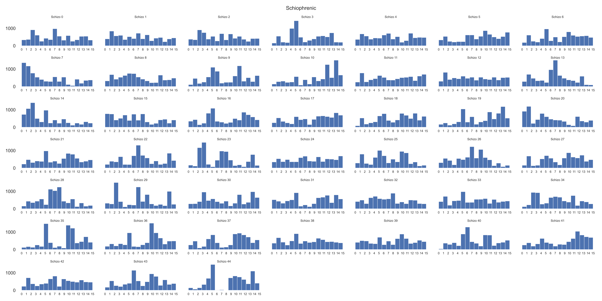
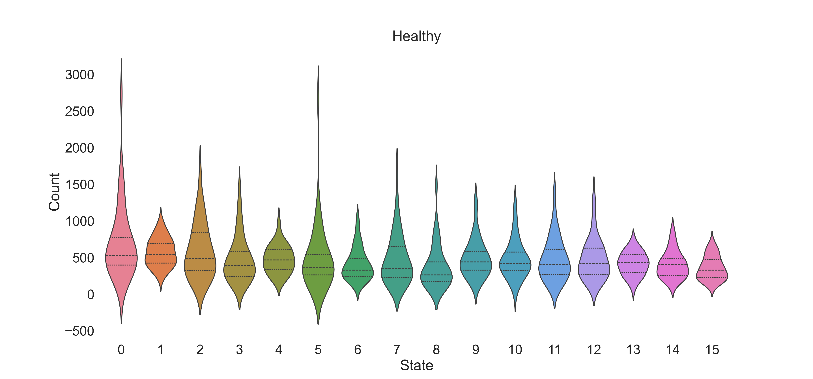
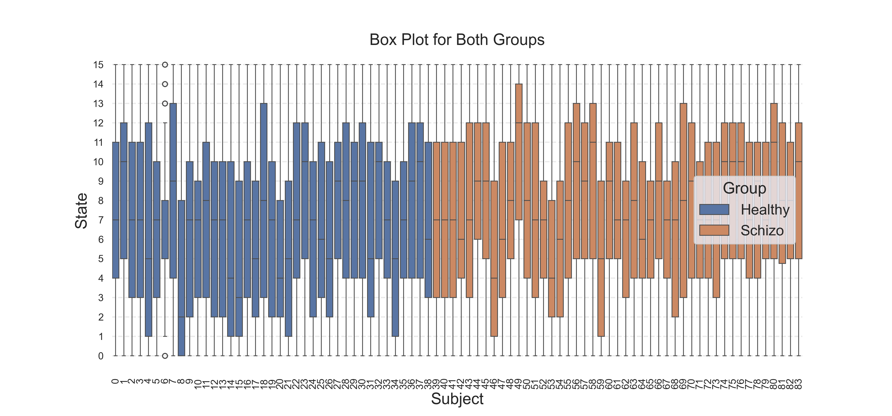
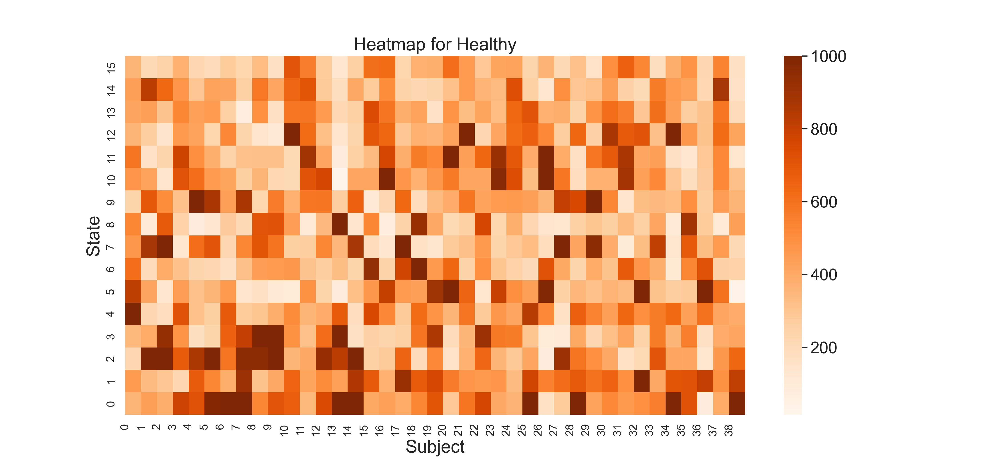

### EEG Microstate Sequences: A Visual Exploration of State Distributions

#### Introduction
This report delves into the statistical distributions and visualizations of EEG microstate sequences, comparing healthy and schizophrenia subjects. Employing a range of analytical and plotting techniques, including bar plots, violin plots, and heatmaps, we aim to uncover patterns and differences in the state distributions between the groups.

EEG microstate sequences offer a window into the brief periods where the brain's electrical activity is quasi-stable. Understanding the distributions of these states can provide insights into normal and pathological brain functions. This report is a extension of the work presented in  → [Correlation Matrices of EEG Microstate Sequences in Healthy and Schizophrenic Individuals](correlation-matrices.html), which explores the differences in EEG microstate sequences between healthy and schizophrenia subjects. We build upon this work by performing a visual analysis of the state distributions, offering a more granular look at the differences between the groups.

#### Data Preparation
We begin by loading the EEG microstate sequences for both healthy and schizophrenia subjects. We will focus on the `microstate_sequences` column, which contains the sequences for each subject. No further data preparation is required, as the sequences are already in the correct format for analysis. Note that in this report we do not use TPMs, as we are only interested in the state distributions - so there is no distinction for state transitions, probabilities, or self-transitions.

---

#### Histogram Visualization of State Frequencies in Individuals

In this section, we present a series of histograms to visualize the distribution of EEG microstate sequences for individuals. The histograms provide a clear, quantitative view of how frequently each state occurs within each individual's sequence. This approach aims to uncover any characteristic patterns or notable deviations in state occurrences among the both groups.

For each individual in the schizophrenia group, we construct a histogram that represents the frequency of each state occurring within their EEG sequences. The collection of histograms provides a panoramic view of state distributions across the group, facilitating a comparison between individuals and against typical patterns observed in healthy controls.

**State Distribution Visualization**: Individual state distributions are visualized using bar plots for a granular look at each subject's state frequencies.

Fig. 1: State distributions for healthy subjects.

Fig. 2: State distributions for schizophrenia subjects.

##### Data Transformation and Structure

- **State Counting**: For each sequence, we count the occurrences of each unique state. This counting results in a frequency distribution that serves as the basis for the histogram.
- **Histogram Construction**: We create a histogram for each individual, where the x-axis represents the possible states, and the y-axis represents the count of each state within the individual's sequence.
- **Multiple Panels**: The visualization is organized into multiple panels, one for each individual, allowing for an easy comparison across the schizophrenia group.
- **Histograms**: Each panel contains a histogram detailing the frequency of each state. The height of each bar corresponds to the number of times a particular state occurs within the individual's sequence.
- **Axes and Labels**:
    - The x-axis labels correspond to the different states, providing a clear indication of which state each bar represents.
    - The y-axis shows the count of occurrences for each state, allowing for an assessment of frequency and prevalence.
    - The title of each panel indicates the individual's identification within the schizophrenia group.

---

#### Violin Plots for Group Comparison

In this section, we explore the distribution of microstate counts within the EEG sequences of healthy individuals using violin plots. The aim is to provide a visual representation that captures the distribution and density of each state's occurrences across all subjects in the healthy group. This visualization helps in identifying the commonality and variability of state occurrences within the group.

**Violin Plots for Group Comparison**: Group-wide distributions are explored using violin plots, showcasing the spread and density of state occurrences.

Fig. 3: Violin plots for healthy subjects.

Fig. 4: Violin plots for schizophrenia subjects.

##### Data Transformation and Structure

**Data Preparation**: For each sequence in the both groups, we identify the unique states and count their occurrences within the sequence. This results in a distribution of counts for each state across all sequences.

**Violin Plot Construction**:
   - **Plotting Framework**: We use Seaborn's violin plot function to create the visualization.
   - **Data Structure**: The prepared data, an array of count distributions for each state, is used as the input for the violin plot.

##### Plot Description

- **X-axis (State)**: Represents the different states identified in the EEG sequences. Each violin corresponds to one state and shows the distribution of its counts across all sequences.
- **Y-axis (Count)**: Indicates the count of each state's occurrence within individual sequences.
- **Violins**: Each violin plot provides a detailed look at the distribution of counts for a specific state. The width of the violin at different counts indicates the frequency of sequences with that count, while the quartiles within give a summary of the distribution's shape.

The resulting violin plot offers a comprehensive view of how each state is distributed across the healthy individual sequences, highlighting the variability and density of each state's occurrence. This visual analysis is crucial for understanding the typical EEG microstate patterns in healthy individuals and can serve as a reference when comparing to other groups, such as those with schizophrenia.

---

#### Violin Plot Analysis of Brain State Distributions by Subject

This section of the report delves into an expansive visual analysis of the distribution of brain states for each subject, categorized by group (Schizophrenia vs. Healthy), using violin plots. This visualization aims to offer a detailed and comparative perspective on how individual subjects' EEG microstate sequences distribute across different brain states, potentially reflecting underlying patterns or deviations associated with each group.

Fig. 5: Violin plots for brain state distributions by subject.

##### Visualization Strategy

- **Violin Plots**: The use of violin plots provides a rich, detailed view of the distribution of brain states for each subject. These plots combine aspects of box plots and kernel density plots to show the spread and density of data.
- **Grouping and Color Coding**: Subjects are grouped by their respective health status (Schizophrenia or Healthy), with the plot hue corresponding to each group for easy differentiation.
- **Reference Lines**: Vertical dashed lines are drawn at each brain state marker to guide the eye and enhance readability, providing a clear demarcation between states.

##### Plot Description

- **X-axis (Brain State)**: The x-axis corresponds to the different brain states identified in the EEG sequences, providing a categorical base for the distribution plots.
- **Y-axis (Subject)**: The y-axis lists each subject, allowing for individual distribution plots to be aligned with the subject's identifier.
- **Violins**: Each violin plot represents the distribution of occurrences of a particular brain state for a given subject, with the width of the plot indicating the frequency of the state's occurrence. The inner "quartile" indicates the median and quartile ranges of the data, giving a sense of the central tendency and spread.
- **Enhancements**:
    - The background is set to white for a clean, unobtrusive view.
    - X and Y axes are clearly labeled with brain states and subject identifiers, respectively.

##### Interpretation

By examining the shape, spread, and orientation of the violins across all subjects and states, we can infer individual and group-level patterns in the distribution of brain states. This visualization helps identify unique or common distribution patterns that might correlate with group characteristics, offering insights into the neurological or behavioral dimensions of schizophrenia and healthy controls.

The same plot in vertical orientation is shown below for a different perspective.

Fig. 6: Violin plots for brain state distributions by subject (vertical orientation).

Box plot for comparison:

Fig. 7: Box plot for brain state distributions by subject.

This plots shows the same data as the violin plots, but in a different format. The box plot is a standard visualization for showing the distribution of data, with the box representing the quartiles and the whiskers showing the extent of the data. The violin plot is a more detailed version of the box plot, showing the distribution of data as a kernel density plot, with the width of the plot indicating the frequency of the data. The violin plot also shows the quartiles, giving a sense of the central tendency and spread of the data.

---

Here are descriptions for the heatmap visualization scripts from your EEG microstate sequence analysis, one for the healthy group and another for the schizophrenia group.

---

#### Heatmap Visualization of State Occurrences in Individuals

This section of the report presents a heatmap visualization to represent the frequency of each brain state across all subjects in the both groups. Heatmaps provide an intuitive color-coded representation of the data, making it easier to spot patterns, frequencies, and anomalies in the distribution of states.

**Heatmap Visualization**: The frequency of each state is visualized using a heatmap, providing a clear, color-coded representation of the distribution of states.

Fig. 8: Heatmap for healthy subjects.

Fig. 9: Heatmap for schizophrenia subjects.

##### Data Transformation and Structure

- **Data Grouping**: The EEG sequence data for the healthy group is aggregated by both state and subject using a group-by operation. This allows us to count the occurrences of each state for each subject, forming a matrix where rows correspond to states and columns correspond to subjects.
- **Heatmap Generation**: We employ seaborn's heatmap function to transform this matrix into a visual format. The color intensity in the heatmap corresponds to the frequency of each state, providing a clear visual representation of the distribution across subjects.

##### Visualization Description

- **Axes**:
    - The x-axis represents the subjects, each tick corresponding to a unique individual in the group.
    - The y-axis corresponds to the different brain states, listed in order.
- **Color Scheme**: The 'Oranges' colormap is used to represent frequency intensity, with darker shades indicating higher frequencies.
- **Labels**: The subjects and states are labeled along the x and y axes, respectively, with x-axis labels rotated for readability.

##### Interpretation

The heatmap allows for an immediate visual assessment of state frequency distribution across subjects in the both groups. Here we can identify common patterns, high-frequency states, or anomalies by examining the color gradients across the matrix.

---

#### Structured Data Compilation and Descriptive Analysis of EEG Microstate Sequences

This section highlights the methodical approach to organizing EEG microstate sequences into a structured data format, facilitating a comprehensive descriptive statistical analysis. By systematically categorizing the sequences into states, groups, and subjects, we establish a robust framework for in-depth analysis and visualization.

##### Data Organization Methodology

- **Data Loading**: EEG microstate sequences are loaded, assuming they are structured with identifiable fields for state sequences, group classification (healthy or schizophrenic), and subject identification.
- **Data Transformation**: The sequences are iterated through, with each state in each sequence being recorded along with its corresponding group and subject. This process results in a comprehensive list of states, groups, and subjects.
- **DataFrame Creation**: Utilizing pandas library for data manipulation, we compile the lists into a DataFrame. This DataFrame serves as an organized, tabular representation of the data, where each row corresponds to a state occurrence, and columns represent the state, group, and subject.

##### Descriptive Analysis

- **Grouping and Summary Statistics**: The DataFrame is grouped by state to provide a focused view of each state's distribution across subjects and groups. Summary statistics are then generated for each state, offering insights into count, frequency, and group prevalence.
- **Statistical Overview Table**: A table is produced showing key descriptive statistics for each state, including counts, unique values, and frequencies. This table provides a clear, concise summary of the data, allowing for quick reference and comparative analysis.

|   State |   ('Group', 'count') |   ('Group', 'unique') | ('Group', 'top')   |   ('Group', 'freq') |   ('Subject', 'count') |   ('Subject', 'unique') | ('Subject', 'top')   |   ('Subject', 'freq') |
|--------:|---------------------:|----------------------:|:-------------------|--------------------:|-----------------------:|------------------------:|:---------------------|----------------------:|
|       1 |                41905 |                     2 | Healthy            |               27622 |                  41905 |                      84 | Subject 9            |                  2734 |
|       2 |                46596 |                     2 | Schizo             |               24169 |                  46596 |                      84 | Subject 60           |                  1195 |
|       3 |                41939 |                     2 | Healthy            |               23027 |                  41939 |                      84 | Subject 10           |                  1670 |
|       4 |                37477 |                     2 | Schizo             |               18752 |                  37477 |                      84 | Subject 63           |                  1465 |
|       5 |                38151 |                     2 | Schizo             |               19573 |                  38151 |                      84 | Subject 1            |                   997 |
|       6 |                49384 |                     2 | Schizo             |               30133 |                  49384 |                      84 | Subject 7            |                  2678 |
|       7 |                38670 |                     2 | Schizo             |               22664 |                  38670 |                      84 | Subject 80           |                  1287 |
|       8 |                43211 |                     2 | Schizo             |               24534 |                  43211 |                      84 | Subject 34           |                  1657 |
|       9 |                31971 |                     2 | Schizo             |               17565 |                  31971 |                      84 | Subject 21           |                  1485 |
|      10 |                39383 |                     2 | Schizo             |               20286 |                  39383 |                      84 | Subject 36           |                  1271 |
|      11 |                43884 |                     2 | Schizo             |               25239 |                  43884 |                      84 | Subject 76           |                  1519 |
|      12 |                43272 |                     2 | Schizo             |               24617 |                  43272 |                      84 | Subject 33           |                  1386 |
|      13 |                39846 |                     2 | Schizo             |               21328 |                  39846 |                      84 | Subject 5            |                  1337 |
|      14 |                36546 |                     2 | Schizo             |               20332 |                  36546 |                      84 | Subject 81           |                   829 |
|      15 |                39205 |                     2 | Schizo             |               23441 |                  39205 |                      84 | Subject 50           |                  1569 |
|      16 |                33680 |                     2 | Schizo             |               19772 |                  33680 |                      84 | Subject 45           |                   772 |

##### Interpretation

The structured organization of the EEG microstate sequence data into a DataFrame allows for a detailed and nuanced understanding of the distribution of states across subjects and groups. The descriptive statistics offer a preliminary insight into the data's characteristics, such as the prevalence of certain states in one group versus another or the variability of state occurrences across subjects. This foundational analysis sets the stage for more advanced statistical tests and visualizations, providing a basis for further research and discovery.

#### Conclusion
This report provides a detailed exploration of EEG microstate sequence distributions, revealing distinctive patterns and differences between healthy individuals and those with schizophrenia. Employing a range of analytical and plotting techniques, including bar plots, violin plots, and heatmaps, we uncover patterns and differences in the state distributions between the groups. I hope that this report provides a more granular look at the differences between the groups, offering a deeper understanding of the state distributions and their implications for normal and pathological brain functions.

<!-- Footer -->
---

###### Author: [Łukasz Furman](cracer.net@gmail.com)
