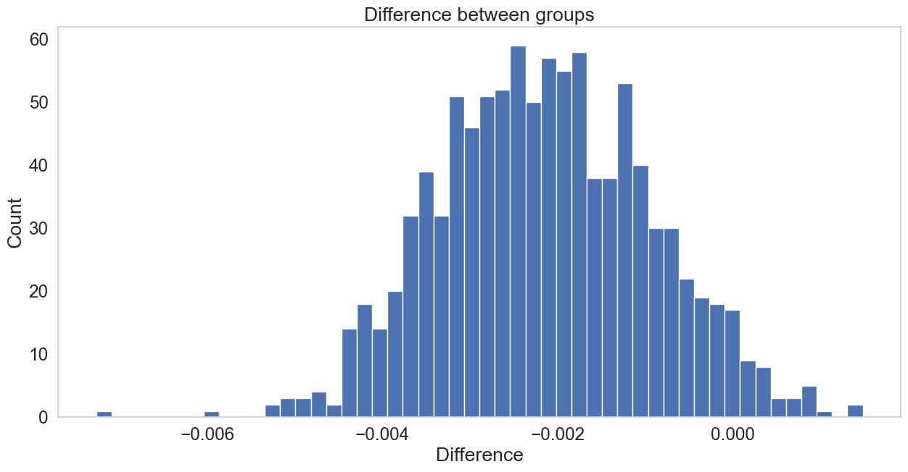
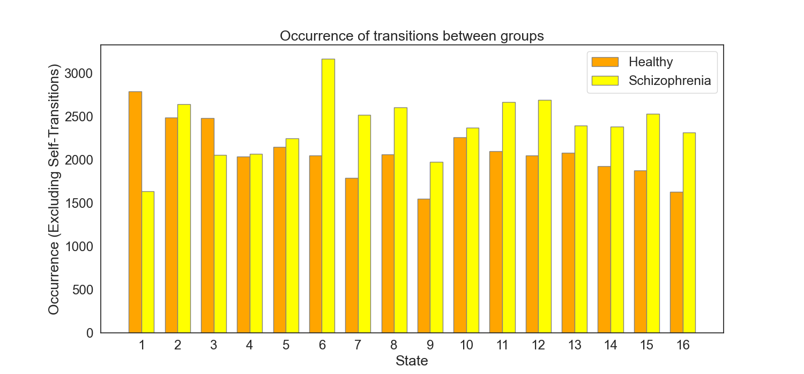

### Analysis of EEG Microstate Sequences in Healthy and Schizophrenic Individuals

Continuing our deep dive into the analysis of EEG microstate sequences, we now turn our attention to understanding the intricate correlations within and between healthy and schizophrenia groups. This approach involves creating and examining correlation matrices, providing valuable insights into the interconnectedness of different brain states. The histograms and statistical tests employed further enhance our grasp of the nuanced relationships in these groups.

#### Creating Correlation Matrices

The correlation matrices are generated by calculating the Pearson correlation coefficients between all pairs of sequences within each group. The process can be mathematically described as follows:

For the **healthy group**:
\[ \text{Corr}_{\text{healthy}} = \text{corrcoef}(\text{healthy\_seqs}) \]

For the **schizophrenia group**:
\[ \text{Corr}_{\text{schizo}} = \text{corrcoef}(\text{schizo\_seqs}) \]

where `corrcoef` is the numpy function that computes the correlation coefficients.

Since the diagonal elements of a correlation matrix always equal 1 (as a sequence is perfectly correlated with itself), these are set to 0 to focus on the relationships between different sequences.

The matrices are visualized as heatmaps, allowing us to observe patterns of correlation across the groups.

Fig.1 and Fig.2 Correlation matrices for healthy and schizophrenia groups, respectively. Entrie $i,j$ represents the correlation between subject sequence $i$ and subject sequence $j$ within the group.

#### Histograms of Correlations

To further dissect these relationships, histograms of the flattened correlation matrices are plotted. These histograms display the distribution of correlation coefficients, providing insights into the prevalence of various degrees of correlation within each group.

The histograms for each group are as follows:

\[ \text{Histogram}(\text{Corr}_{\text{healthy}}.\text{flatten}()) \]
\[ \text{Histogram}(\text{Corr}_{\text{schizo}}.\text{flatten}()) \]

Combined histogram plots the distributions of both groups together, allowing for a direct comparison

Fig.3 Histograms of correlations for healthy and schizophrenia groups.

#### Statistical Significance Analysis

To assess the statistical significance of the observed differences in correlations between the two groups, a bootstrap method is employed. This method involves repeatedly resampling the flattened correlation matrices and calculating the mean difference in correlations for each sample. The distribution of these differences is then plotted as a histogram.

\[ \text{Bootstrap Difference} = \frac{1}{n_{\text{bootstrap}}} \sum_{i=1}^{n_{\text{bootstrap}}} (\text{Mean}(\text{Resample}(\text{Corr}_{\text{healthy}})) - \text{Mean}(\text{Resample}(\text{Corr}_{\text{schizo}}))) \]

The p-value, derived from the bootstrap analysis, indicates the likelihood of observing such a difference under the null hypothesis (no significant difference between the groups).

The bootstrap histogram is as follows:  \[ \text{Histogram}(\text{Bootstrap Difference}) \] \[ \text{p-value} = 0.037 \]

Fig.4 Bootstrap histogram showcasing the differences in correlations.

Now, we can construct transition matrices for both the healthy and schizophrenia groups, providing a quantitative framework to examine the state transitions.

Let's assume that we have a set of sequences $S$ of states, where each sequence $s \in S$ is a list of states visited in order. $S_{\text{healthy}}$ and $S_{\text{schizo}}$ represent the sequences for the healthy and schizophrenia groups, respectively.

<!-- Transition Matrix -->
#### Transition Matrix $T$
The transition matrix $T$ is a square matrix where the entry $T_{ij}$ represents the number of transitions from state $i$ to state $j$. Given the set of sequences $S$, the transition matrix is constructed as follows:

1. Identify the set of unique states $U$ across all sequences in $S$.
2. Initialize a matrix $T$ with dimensions $|U| \times |U|$, where $|U|$ is the number of unique states, with all entries set to zero.
3. For each sequence $s \in S$, and for each consecutive pair of states $(s_k, s_{k+1})$ in $s$, increment the matrix entry $T_{s_k, s_{k+1}}$ by 1.

Mathematically, the construction can be written as:

$$ T_{ij} = \sum_{s \in S} \sum_{k=1}^{|s|-1} [s_k = i \land s_{k+1} = j] $$

where $[ \cdot ]$ is the Iverson bracket, which is 1 if the condition is true, and 0 otherwise.

Since the transition matrix is a square matrix, it can be visualized as a heatmap, where the rows represent the source states, and the columns represent the destination states.

Fig.5 Transition matrix $T_{healthy}$ for the healthy group. The rows represent the source states, and the columns represent the destination states. The entry $T_{ij}$ represents the number of transitions from state $i$ to state $j$. The diagonal entries are set to $1$, for visualization purposes.

Fig.6 Transition matrix $T_{schizo}$ for the schizophrenia group. The rows represent the source states, and the columns represent the destination states. The entry $T_{ij}$ represents the number of transitions from state $i$ to state $j$. The diagonal entries are set to $1$, for visualization purposes.

The analysis of transition matrices for the healthy and schizophrenia groups provides a comprehensive understanding of state transition dynamics in these populations. The matrices, visualized in Figures 1 and 2, offer a macroscopic view of how frequently each state transitions to another. Before we transform the transition matrices into a probability matrix lets delve deeper into the characteristics of these transitions.

#### Comparative Analysis of Transition Matrices
A notable aspect of the transition matrices is the ratio of self-transitions (transitions from a state to itself) to all transitions. The self-loops can be conceptualized as:

$$ T_{ii} = \sum_{s \in S} \sum_{k=1}^{|s|-1} [s_k = s_{k+1} = i] $$

where $[ \cdot ]$ is the Iverson bracket, which is 1 if the condition is true, and 0 otherwise. 
And the ratio between the number of self-loops and the total number of transitions as:

$$ \frac{\sum_{i=1}^{|U|} T_{ii}}{\sum_{i=1}^{|U|} \sum_{j=1}^{|U|} T_{ij}} $$

This ratio reflects the tendency of each group to remain in the same state rather than transition to different states. The computed ratios are as follows:

- **Healthy Group Self-Transition Ratio**: 0.8887
- **Schizophrenia Group Self-Transition Ratio**: 0.8892

These ratios indicate a high prevalence of self-transitions in both groups, suggesting a tendency towards state stability or persistence in both healthy and schizophrenia subjects.

To compare the number of transition between the healthy and schizophrenia groups, the Frobenius norm of the difference between their transition matrices is calculated as:

<!-- difrrence of T schizo and T healthy  wit frobenius norm -->
$$ \text{Frobenius Norm} = \sqrt{\sum_{i=1}^{|U|} \sum_{j=1}^{|U|} (T_{ij}^{\text{schizo}} - T_{ij}^{\text{healthy}})^2} $$

This norm quantifies the overall dissimilarity between the two matrices.

---
#### Distribution of Self-Transitions

Self-transitions represent the counts of a state transitioning to itself, reflecting a sort of persistence or stability within that state.

For the **healthy group**, we define the self-transition for each state \( i \) as \( \text{SelfTrans}_{i, \text{healthy}} \), which is extracted from the diagonal of the transition matrix \( T_{\text{healthy}} \):

\[ \text{SelfTrans}_{i, \text{healthy}} = T_{ii}^{\text{healthy}} \]

Similarly, for the **schizophrenia group**, the self-transition for each state \( i \) are denoted as \( \text{SelfTrans}_{i, \text{schizo}} \), obtained from the diagonal of the transition matrix \( T_{\text{schizo}} \):

\[ \text{SelfTrans}_{i, \text{schizo}} = T_{ii}^{\text{schizo}} \]

These occurrences are essential for understanding the intrinsic dynamics of each group. A high self-transition counts suggests a tendency for the system to remain in the same state over time, which could be indicative of a stable or persistent pattern of brain activity. Conversely, lower self-transition counts imply a greater likelihood of transitioning to different states, suggesting more dynamic or variable brain activity.

$$ \text{Frobenius Norm with Self-Transitions} = 22220 $$

Fig.7 Self-transition ocurrences in the healthy and schizophrenia groups. 

---
#### Distribution of Transitions

After examining self-transitions, we now explore the distribution of transitions between distinct states in both the healthy and schizophrenia groups. This excludes self-transitions and provides insight into the dynamic interplay of different states.

For the **healthy group**, let \( T_{\text{healthy}} \) be the transition matrix, where \( T_{ij}^{\text{healthy}} \) represents the counts from state \( i \) to state \( j \). The sum of transition counts for each state \( i \), excluding self-transitions, is calculated as follows:

\[ \text{SumTrans}_{i, \text{healthy}} = \sum_{j=1, j \neq i}^{|U|} T_{ij}^{\text{healthy}} \]

Similarly, for the **schizophrenia group**, let \( T_{\text{schizo}} \) be the transition matrix, where \( T_{ij}^{\text{schizo}} \) indicates the counts of transitioning from state \( i \) to state \( j \). The sum of transition counts for each state \( i \), excluding self-transitions, is given by:

\[ \text{SumTrans}_{i, \text{schizo}} = \sum_{j=1, j \neq i}^{|U|} T_{ij}^{\text{schizo}} \]

Here, \( |U| \) denotes the total number of unique states. The results of these calculations yield a vector for each group. Each element of these vectors corresponds to the cumulative counts of a state transitioning to all other states. This analysis offers a comprehensive view of how states are interconnected and interact with one another within each group.

$$ \text{Frobenius Norm without Self-Transitions} = 922 $$

Fig.8 Transition ocurrences in the healthy and schizophrenia groups.

Dealing with self-loops in transition matrices, especially when analyzing sequences of states in contexts like EEG microstate analysis, requires careful consideration. Self-loops, representing transitions from a state to itself, can disproportionately influence the analysis. That from now we separate the self-loops from the transition matrices and analyze them separately. But first, let's transform the transition matrices into probability matrices.

<!-- Transition Probability Matrix -->
#### Transition Probability Matrix $P$

To gain a more nuanced understanding of the transition dynamics, we transform the count-based transition matrices into probability matrices. This transformation provides a clearer picture of the likelihood of transitioning from one state to another.

For both the healthy and schizophrenia groups, we normalize the transition matrices by dividing each entry by the sum of its respective row. This process converts the raw counts into probabilities, where each row of the matrix sums to 1. The transformed matrices are denoted as \( P_{\text{healthy}} \) and \( P_{\text{schizo}} \) for the healthy and schizophrenia groups, respectively.

The transformation process is defined mathematically for each state \( i \) and transition \( j \) as follows:

For the **healthy group**:
\[ P_{ij}^{\text{healthy}} = \frac{T_{ij}^{\text{healthy}}}{\sum_{k=1}^{|U|} T_{ik}^{\text{healthy}}} \]

For the **schizophrenia group**:
\[ P_{ij}^{\text{schizo}} = \frac{T_{ij}^{\text{schizo}}}{\sum_{k=1}^{|U|} T_{ik}^{\text{schizo}}} \]

where \( |U| \) is the number of unique states, and \( T_{ij}^{\text{healthy}} \) and \( T_{ij}^{\text{schizo}} \) are the original transition counts from state \( i \) to \( j \) in the healthy and schizophrenia groups, respectively.

This probability-based approach allows for a more refined and accurate comparison between the two groups, highlighting differences in the likelihood of state transitions rather than merely their frequency.

In pursuit of uncovering the similarities and dissimilarities in state transition dynamics between healthy individuals and those with schizophrenia, advanced analytical methods are employed, such as correlation analysis and Frobenius norm calculations.

#### Correlation Analysis of Transition Dynamics

Correlation analysis is a statistical method that measures the strength and direction of a linear relationship between two variables. In the context of transition matrices, it's used to compare how similarly two groups transition between states. This is done by computing the Pearson correlation coefficient for each corresponding pair of states between the two groups and then averaging these coefficients to obtain an overall measure of similarity.

The correlation coefficient \( r \) for states \( i \) in the healthy group \( H \)and the schizophrenia group \( S \) is calculated as follows:

\[ r_i = \text{corr}(P_{i, H}, P_{i, S}) \]

where \( \text{corr} \) denotes the Pearson correlation function, and \( P_{i, H} \) and \( P_{i, S} \) represent the probability distributions of transitioning from state \( i \) to all other states for the healthy and schizophrenia groups, respectively.

The overall correlation across all states is then given by:

\[ r = \frac{1}{|U|} \sum_{i=1}^{|U|} r_i \]

where \( |U| \) is the total number of unique states.

A correlation coefficient of 1 indicates a perfect positive correlation, while a value of -1 signifies a perfect negative correlation. A coefficient of 0 indicates no correlation between the two groups.

#### Frobenius Norm for Comparative Analysis

The Frobenius norm is a measure used to quantify the difference between two matrices. It's particularly useful in this context as it provides a single value that captures the overall disparity in transition probabilities between the two groups, accounting for the entirety of the transition matrix.

For matrices \( P_{\text{healthy}} \) and \( P_{\text{schizo}} \), representing the transition probabilities of the healthy and schizophrenia groups respectively, the Frobenius norm is defined as:

\[ \text{Frobenius Norm} = \sqrt{\sum_{i=1}^{|U|} \sum_{j=1}^{|U|} (P_{ij}^{\text{schizo}} - P_{ij}^{\text{healthy}})^2} \]

where \( |U| \) is the total number of unique states.

A smaller Frobenius norm indicates a closer resemblance between the transition behaviors of the two groups, while a larger value signifies greater differences.

By calculating both the overall correlation and the Frobenius norm, researchers can gain a deeper understanding of the transition dynamics characteristic of each group, potentially unveiling unique patterns that could serve as biomarkers for schizophrenia.
<!-- Transition Probability Matrix - including self-transitions -->
#### Transition Probability Matrix - including self-transitions

Transition probability matrices are constructed by normalizing the transition matrices by dividing each entry by the sum of its respective row. This process converts the raw counts into probabilities, where each row of the matrix sums to 1. The transformed matrices are denoted as \( P_{\text{healthy}} \) and \( P_{\text{schizo}} \) for the healthy and schizophrenia groups, respectively.

The Frobenius norm and correlation coefficient are calculated for the transition probability matrices of the healthy and schizophrenia groups. The results are as follows:

$$ \text{Frobenius Norm} = 0.038 $$

$$ \text{Correlation Coefficient} = 0.99 $$

Fig.9 We can see that due to the high number of self-transitions, the transition probability matrices are dominated by the diagonal entries. This is reflected in the high correlation coefficient and low Frobenius norm, which indicate a high degree of similarity between the two groups. However, this is misleading, as the self-transitions are not indicative of the actual transition dynamics between states but rather the tendency of each group to remain in the same state. And this is of course informative as we saw on count distributions of self-transitions. But it is not what we are looking for. We are interested in the transitions between states. So let's remove the self-transitions from the transition matrices and see what happens.

<!-- Transition Probability Matrix - excluding self-transitions -->
#### Transition Probability Matrix - excluding self-transitions

Obtained  \( P_{\text{healthy}} \) and \( P_{\text{schizo}} \) for the healthy and schizophrenia groups, respectively without self-transitions.

The Frobenius norm and correlation coefficient are calculated for the transition probability matrices of the healthy and schizophrenia groups. The results are as follows:

$$ \text{Frobenius Norm} = 0.287 $$

$$ \text{Correlation Coefficient} = 0.75 $$

Fig.10 We can see that the Frobenius norm is much higher and the correlation coefficient is much lower. This is because the self-transitions are not influencing the analysis. The transition probability matrices are now dominated by the off-diagonal entries, which reflect the actual transition dynamics between states. This is what we are looking for. 

<!-- Transition Probability Matrix -> Directed Graph -->
#### Direct Graph

The transition from matrix representations of state sequences to visual graph structures offers an intuitive understanding of the complex dynamics within each group. By pruning and normalizing the matrices, we can construct directed graphs that reveal the most probable paths and highlight the interdependencies between states.

For the **healthy group**, the directed graph \( G_{\text{healthy}} \) is formed by connecting state \( i \) to state \( j \) if the probability \( P_{ij}^{\text{healthy}} \) exceeds a predetermined threshold. This threshold is set to capture the top 10% of transition probabilities, ensuring that only the most significant connections are visualized.

\[ G_{\text{healthy}} = \{ (i, j) \ | \ P_{ij}^{\text{healthy}} \geq \text{threshold} \} \]

Similarly, for the **schizophrenia group**, the directed graph \( G_{\text{schizo}} \) is established using the same principle.

\[ G_{\text{schizo}} = \{ (i, j) \ | \ P_{ij}^{\text{schizo}} \geq \text{threshold} \} \]

The vertices of these graphs correspond to the unique states, while the edges depict the transitions with probabilities surpassing the pruning threshold. These graphs provide a visual representation of the most likely transitions, as well as insights into the overall structure and connectivity of the state dynamics.

The Frobenius norm of the difference between the two graphs weight adjacency matrices is:

$$ \text{Frobenius Norm} = 0.61 $$

Fig.11 and Fig.12 illustrate the directed graphs for the healthy and schizophrenia groups, respectively. The vertices represent the unique states, while the edges depict the transitions with probabilities surpassing the pruning threshold. These graphs provide a visual representation of the most likely transitions, as well as insights into the overall structure and connectivity of the state dynamics. The position and color of the vertices is the same for both graphs as well labels for the vertices.  The thickness of the edges is proportional to the probability of the transition. The size of the node it its degree, i.e., the number of edges connected to it.

The analysis of these graphs can elucidate characteristics such as resilience, adaptability, and potential biomarkers within the EEG microstate sequences for each group. The directed graphs not only emphasize the significant transitions but also pave the way for identifying key differences in the neurological patterns associated with healthy and schizophrenic brains. We see now that performing analysis with self-transitions included in the transition matrices can lead to misleading results. 

<!-- Footer -->
---

###### Author: [Łukasz Furman](cracer.net@gmail.com)