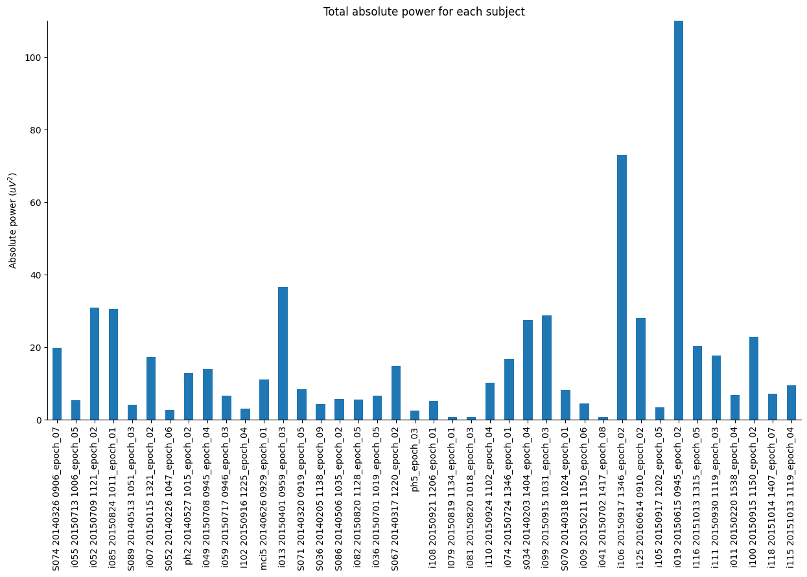
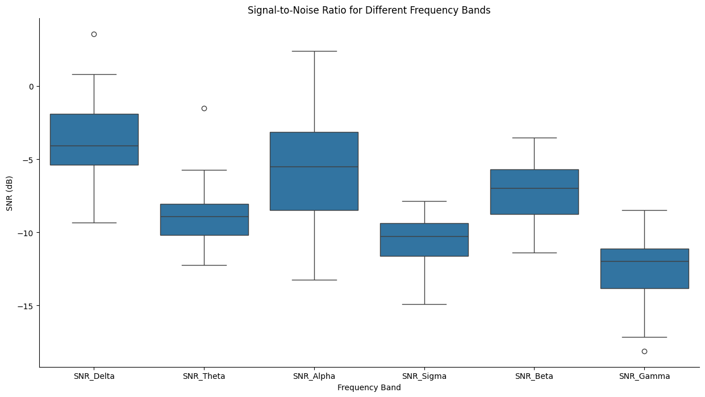

### Spectral Analysis of High-Density EEG Recordings in Mild Cognitive Impairment

#### Introduction
This section of the report presents a spectral analysis of resting-state high-density EEG recordings from participants with Mild Cognitive Impairment (MCI), part of a larger dataset involving Healthy Elders, People with Subjective and Mild Cognitive Impairment, and Alzheimer's Disease. The dataset, provided by Lazarou et al.[1], consists of recordings from various groups, with this analysis focusing exclusively on the MCI group.

The dataset is not publicly available, but can be requested from the authors. 

#### Participant Selection and Data Preprocessing
From the total pool of 79 MCI participants, 40 subjects were meticulously chosen based on the quality and properties of their EEG recordings, as outlined in the dataset description by the authors. Each subject's recording was manually inspected, and segments ranging from 1 to 6 (40-second intervals) were selected based on recording quality.

#### Experimental Design
The authors of the dataset provided a detailed description of the experimental design, that can be summarized as follows:
Subject were instructed to sit comfortably in a chair. They alternately open and close their eyes at the experimenter's request. Unfortunately, the exact timing of the eye opening and closing was not specified to one template, but rather left to the experimenter's discretion. The experiment lasted (clues from data) for ~9 minutes. 

<!-- The detailed description can be downloaded [here](https://zenodo.org/record/4316608/files/EEG%20Dataset%20Description.pdf?download=1). -->

##### Preprocessing Steps
- Independent Component Analysis (ICA) was employed to remove eye blinks and other artifacts.
- Bad channels were identified, marked, and interpolated using the nearest neighbors.
- A bandpass filter of 0.5 - 70 Hz was applied, in line with the dataset authors' pre-filtering.

These preprocessing steps ensured the extraction of high-quality data segments for further analysis.

#### Spectral Analysis Methodology
Spectral analysis was conducted to investigate the distribution of power across different frequency bands. The following frequency bands were analyzed: Delta, Theta, Alpha, Sigma, Beta, and Gamma. The analysis included:

- Calculation of relative band powers for each EEG recording.
- Generation of Power Spectral Density (PSD) plots and topographic maps.
- Visualization of bandpower distribution across subjects.
- Signal-to-Noise Ratio (SNR) calculation for each frequency band.

##### Tools and Libraries
- MNE-Python [2] library was extensively used for data processing and visualization.
- mne-icalabel [2] [3] was used for ICA-based artifact removal.
- YASA [4] [5] (Yet Another Spindle Algorithm) was employed for bandpower calculation.
- Matplotlib [6] and Seaborn [7] were used for data visualization.
- Pandas [8] was used for data manipulation.

#### Results

##### Relative Bandpowers Across Subjects
The analysis revealed distinct patterns in the distribution of power across different EEG frequency bands in subjects with MCI. 

- **Relative Bandpowers**: Stacked barplot for relative bandpowers for each subject - shows the variability in the distribution of power across frequency bands. 

<!-- - These are calculated as follows: 

$$
\frac{BP_{Delta} + BP_{Theta} + BP_{Alpha} + BP_{Sigma} + BP_{Beta} + BP_{Gamma}}{6}
$$

where $BP_{i}$ is the relative bandpower for the $i^{th}$ frequency band. -->

Fig.1: Relative bandpowers for each subject. The variability in the distribution of power across frequency bands is evident.

- **Total Power**: Total power for each subject - shows the variability in the quality of the EEG recordings.

Fig.2: Total power for each subject. 

This visualization offers insights into the variability and commonality in EEG spectral profiles among MCI subjects.

##### Signal-to-Noise Ratio Calculation Across EEG Frequency Bands

To understand the distribution of power across different EEG frequency bands, we calculated the Signal-to-Noise Ratio (SNR) for each EEG frequency band, wherein the power in all other bands is considered as noise. This method is predicated on the idea that each frequency band can be isolated to understand its individual contribution, relative to the combined activity of all other bands. The procedure involves two primary steps:

1. **Total Power Exclusion for Each Band**: For every frequency band of interest - namely Theta, Alpha, Beta, and Gamma - compute the total power by summing the power of all other bands. This sum is treated as the 'noise' component for the band under consideration.

2. **SNR Calculation**: The SNR for each band is then determined by dividing the power in the specific band (signal) by the total power of the other bands (noise), with the result expressed in decibels. This is done for each subject, providing a distinct SNR value for each frequency band. That is, the SNR for the e.g. Theta band is calculated as:

$$
SNR_{Theta} = 10 * log_{10}(\frac{Theta}{Alpha + Sigma + Beta + Gamma})
$$

To visually present these SNR values, we employ box plots for each frequency band, highlighting the variability and median SNR values across our subject pool:

Fig.3: SNR for each frequency band. Some outliers $(○)$ are visible in $Delta$, $Theta$, and $Gamma$ bands. 

Through this approach, is aim to provide a comprehensive view of the SNR across different frequency bands in the context of our EEG study. However, it is important to note that this interpretation of SNR, considering the contribution of all other bands as noise relative to a particular band of interest, deviates from traditional neurophysiological interpretations. This methodology is adopted to explore the unique patterns and characteristics of each frequency band in isolation, acknowledging that this might not conform to the conventional definitions of signal and noise in EEG analyses. This distinction is crucial for the correct interpretation of our results and is clearly communicated to avoid any potential misconceptions.

---

##### Individual Subject Analysis
For each selected segment of the EEG recordings, detailed spectral profiles were generated, including:

- **Relative Bandpowers**: Barplot showing relative bandpowers for each subject and segment. Frequency bands of interest: 
   - $Delta$ (0.5 - 4 Hz)
   - $Theta$ (4 - 8 Hz)
   - $Alpha$ (8 - 12 Hz)
   - $Sigma$ (12 - 16 Hz)
   - $Beta$ (16 - 30 Hz)
   - $Gamma$ (30 - 70 Hz)

- **Power Spectral Density**: Power Spectral Density plot for each subject and segment. The x-axis represents the frequency range, while the y-axis represents the power spectral density. The power spectral density was calculated using Welch's method, with a window size of 8.192 seconds. X-axis range is 0.5 - 49 Hz (log scale) - cropped to 49Hz upper range for visualization purposes.
- **Topographic Maps**: Topographic maps showing the distribution of power across the scalp for each subject and segment. The maps were normalized:

$$
\frac{PSD}{\sum_{i=1}^{n} PSD_i}
$$

where $PSD_i$ is the power spectral density for the $i^{th}$ frequency band. That is, the power spectral density for each frequency band was divided by the sum of the power spectral densities across all frequency bands. Colorbar values represent the normalized power spectral density.

Each figure captures the unique spectral characteristics of the EEG recording, providing a granular view of the neural activity in MCI. Below 40 figures are presented, one for each subject and segment:

##### Subject 1

Fig.4 ...

---

##### Subject 2

Fig.5 ...

---

##### Subject 3

Fig.6 ...

---

##### Subject 4

Fig.7 ...

---

##### Subject 5

Fig.8 ...

---

##### Subject 6

Fig.9 ...

---

##### Subject 7

Fig.10 ...

---

##### Subject 8

Fig.11 ...

---

##### Subject 9

Fig.12 ...

---

##### Subject 10

Fig.13 ...

---

##### Subject 11

Fig.14 ...

---

##### Subject 12

Fig.15 ...

---

##### Subject 13

Fig.16 ...

---

##### Subject 14

Fig.17 ...

---

##### Subject 15

Fig.18 ...

---

##### Subject 16

Fig.19 ...

---

##### Subject 17

Fig.20 ...

---

##### Subject 18

Fig.21 ...

---

##### Subject 19

Fig.22 ...

---

##### Subject 20

Fig.23 ...

---

##### Subject 21

Fig.24 ...

---

##### Subject 22

Fig.25 ...

---

##### Subject 23

Fig.26 ...

---

##### Subject 24

Fig.27 ...

---

##### Subject 25

Fig.28 ...

---

##### Subject 26

Fig.29 ...

---

##### Subject 27

Fig.30 ...

---

##### Subject 28

Fig.31 ...

---

##### Subject 29

Fig.32 ...

---

##### Subject 30

Fig.33 ...

---

##### Subject 31

Fig.34 ...

---

##### Subject 32

Fig.35 ...

---

##### Subject 33

Fig.36 ...

---

##### Subject 34

Fig.37 ...

---

##### Subject 35

Fig.38 ...

---

##### Subject 36

Fig.39 ...

---

##### Subject 37

Fig.40 ...

---

##### Subject 38

Fig.41 ...

---

##### Subject 39

Fig.42 ...

---

##### Subject 40

Fig.43 ...

---

#### Discussion
The spectral analysis of EEG recordings in subjects with Mild Cognitive Impairment (MCI) yields significant insights into the neurophysiological changes associated with cognitive deficits. The observed variability in frequency band powers among subjects may indicate underlying neuropathological alterations typical of MCI. Differences in Total Power (TP) across subjects could stem from variances in EEG recording quality and the duration of the recordings. Analysis at the individual level unveiled distinctive spectral patterns; some subjects exhibited pronounced Alpha peaks in the occipital region, while others displayed dominant Alpha activity in the frontal region.

This foundational analysis paves the way for subsequent studies to correlate these patterns with clinical symptoms and the progression of Alzheimer's Disease.

---

#### Conclusion
This report presents a thorough spectral analysis of EEG recordings from individuals with Mild Cognitive Impairment. The study primarily serves as a framework for future analyses within the dataset.

To acquire 40 seconds of high-quality hdEEG, several preprocessing steps were undertaken:
- Initially, all subjects were vetted according to the dataset description.
- Appropriate subjects underwent a second review, during which bad channels were identified.
- These bad channels were then interpolated.
- Subsequently, ICA was employed to mitigate eye blinks and other artifacts.
- A bandpass filter ranging from 0.5 to 70 Hz was applied.
- Segments of 40 seconds of high-quality hdEEG were meticulously selected and manually inspected.
- Segments that met the quality criteria were used for further analysis, while the rest underwent reprocessing. (This step was iteratively applied to some subjects.)

The meticulousness of this process is undeniable. However, the caliber of the data is paramount for analysis, justifying the effort expended. While one might consider automating these tasks, and indeed, certain standard quantitative analyses might lend themselves to automation, spectral analysis poses unique challenges. Artifacts such as eye blinks and muscle movements can closely mimic brain activity in lower frequency bands, and gamma activity might be confounded with artifacts from electrical power lines or muscle movements. While some steps can be automated, the final judgment often relies on manual inspection aided by visual data evaluation.

Certain libraries are available that facilitate the automatic selection of quality data; however, they are not infallible and are most often utilized for Event-Related Potentials (ERP) analysis. In ERP studies, epochs (consistent segments, typically short, e.g., 1-3 seconds) are analyzed, simplifying the task of selecting high-quality data. With numerous repetitions (trials) of the same stimulus event, it is common practice to exclude subpar epochs from further analysis rather than correcting them.

Thus, the selection of high-quality data for analysis is crucial, underscoring the importance of manual data inspection.

---
#### References

1. Ioulietta Lazarou, Kostas Georgiadis, Spiros Nikolopoulos, Vangelis Oikonomoui Ioannis Kompatsiaris, „Resting-State High-Density EEG using EGI GES 300 with 256 Channels of Healthy Elders, People with Subjective and Mild Cognitive Impairment and Alzheimer's Disease”, Brain Science MDPI, t. 10, nr 6. Zenodo, s. 392, grudz. 23, 2020. doi: 10.5281/zenodo.4316608.
2. Alexandre Gramfort, Martin Luessi, Eric Larson, Denis A. Engemann, Daniel Strohmeier, Christian Brodbeck, Roman Goj, Mainak Jas, Teon Brooks, Lauri Parkkonen, and Matti S. Hämäläinen. MEG and EEG data analysis with MNE-Python. Frontiers in Neuroscience, 7(267):1–13, 2013. doi:10.3389/fnins.2013.00267.
3. https://mne.tools/mne-icalabel/stable/index.html#
4. Vallat, Raphael, and Matthew P. Walker. "An open-source, high-performance tool for automated sleep staging." Elife 10 (2021). doi: https://doi.org/10.7554/eLife.70092 
5. https://github.com/raphaelvallat/yasa
6. Thomas A Caswell, „matplotlib/matplotlib: REL: v3.7.4”. Zenodo, lis. 18, 2023. doi: 10.5281/zenodo.10152802.
7. Waskom, M. L., (2021). seaborn: statistical data visualization. Journal of Open Source Software, 6(60), 3021, https://doi.org/10.21105/joss.03021.
8. The pandas development team, „pandas-dev/pandas: Pandas”. Zenodo, sty. 20, 2024. doi: 10.5281/zenodo.10537285.
---

<!-- Footer -->

###### Author: [Łukasz Furman](cracer.net@gmail.com)

