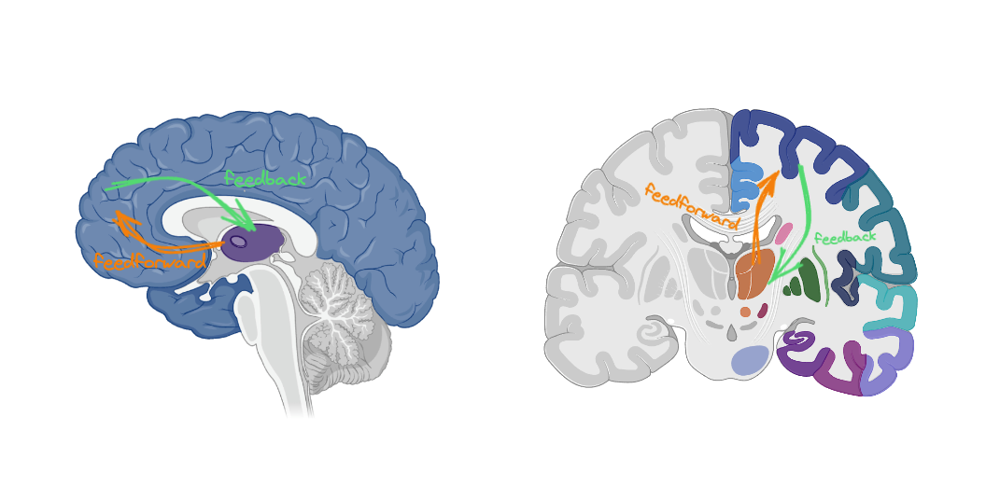
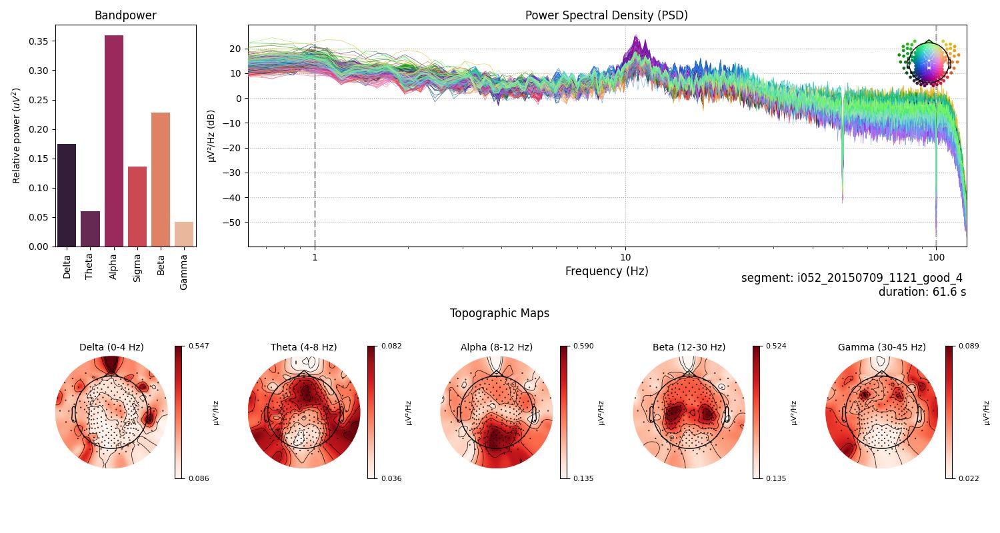
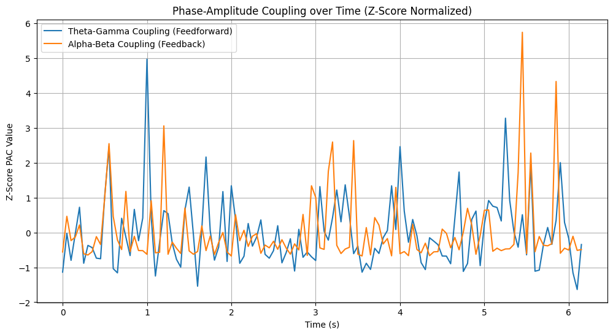
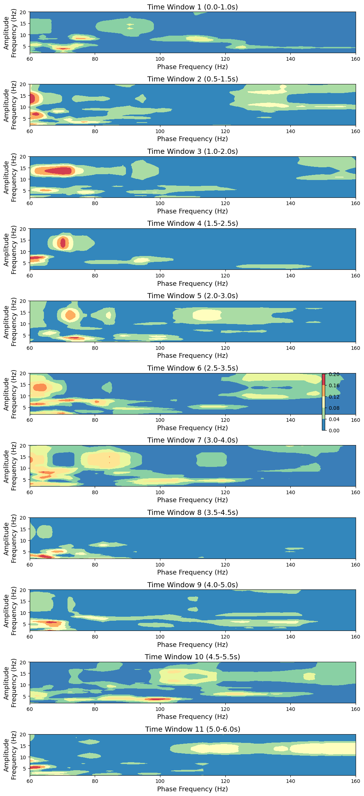
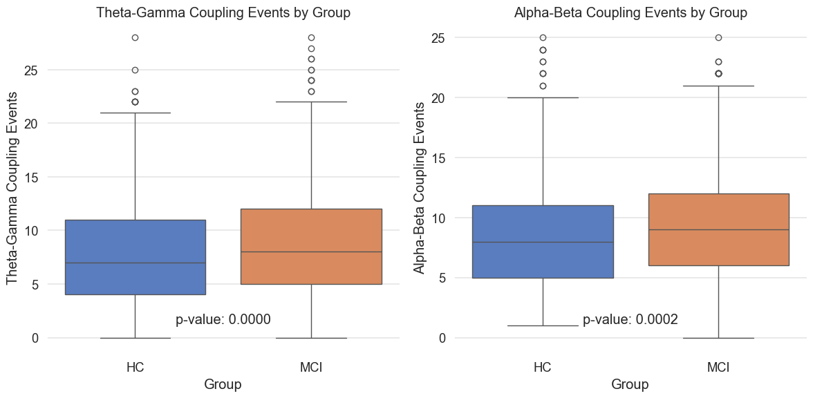

### Cortical-Thalamic Information Transfer in Mild Cognitive Impairment: A Study of Theta-Gamma and Alpha-Beta Coupling Dynamics

#### Abstract
This study investigates cortical-thalamic information transfer in Mild Cognitive Impairment (MCI) through analyzing Theta-Gamma (feedforward) and Alpha-Beta (feedback) coupling dynamics using EEG. Employing a sliding window approach, we measured phase-amplitude coupling (PAC) between the prefrontal cortex and thalamus. We observed significant differences in the frequency of coupling events between MCI and healthy controls (HC), suggesting that compensatory mechanisms, neural hyperactivity, or altered network dynamics could be present in MCI.

*Fig.1 Cortical-Thalamic Information Transfer (CTIT) pathways. Orange arrows represent feedforward Theta-Gamma coupling, while green arrows indicate feedback Alpha-Beta coupling. The study explores the dynamics of these couplings in MCI subjects compared to HC.*

#### Introduction
Mild Cognitive Impairment (MCI) represents a transitional state between the expected cognitive decline of normal aging and the more serious decline of dementia, characterized primarily by cognitive deficits that exceed normal expectations for an individual's age and education level but do not notably hinder daily function. Exploring neural mechanisms underpinning MCI is of paramount importance for facilitating early diagnostic processes and paving the way for timely therapeutic interventions. This investigation focuses on cortical-thalamic information transfer, particularly on phase-amplitude coupling (PAC) dynamics within MCI populations. The intricacies of PAC offer a promising avenue for unraveling the complex interplay between cortical and subcortical regions that might underlie the cognitive disturbances observed in MCI.

**Background and Significance**
Cortical-thalamic circuits form the cornerstone of numerous cognitive processes, playing pivotal roles in attention, memory, and sensory integration. Their optimal functioning is crucial for cognitive health and resilience against neurodegenerative conditions. Disruption in these circuits is a hallmark of several neurological disorders, including Alzheimer's disease (AD) and its antecedent, MCI ([Zhengwei Chen et al., 2021](https://dx.doi.org/10.1021/acschembio.1c00932); [Denis Larrivee, 2023](https://dx.doi.org/10.33425/2692-7918.1057)). Recent literature has begun to shed light on various pathophysiological changes in MCI, such as alterations in cortical thickness, compromised glucose metabolism, and aberrations in functional connectivity ([Zonghua Li et al., 2022](https://dx.doi.org/10.1212/WNL.0000000000200387); [Nicholas M. Vogt et al., 2019](https://dx.doi.org/10.1093/cercor/bhz286)). Yet, the specific dynamics of neural oscillatory coupling in MCI remain insufficiently explored.

Recent investigations have highlighted the role of PAC in elucidating complex neural communication mechanisms that may be dysregulated in MCI. For instance, studies have demonstrated that PAC serves as a biomarker for cognitive states and transitions, signaling neural network flexibility and compensatory mechanisms in response to early neurodegenerative changes ([Hyafil et al., 2015](https://doi.org/10.1016/j.tins.2015.09.001)). Additionally, research into EEG and MEG patterns in MCI patients has identified distinctive oscillatory behavior, suggesting altered connectivity and network dynamics correlating with cognitive impairment ([John Preetham Gurja et al., 2021](https://dx.doi.org/10.1089/brain.2020.0926)).

Furthermore, PAC's contribution to cognitive functionalities, such as memory encoding and retrieval, showcases its critical role in the broader neural communication network, which is often compromised in MCI ([Höller et al., 2014](https://doi.org/10.3389/fnsys.2014.00058)). The analysis of specific frequency band couplings, such as Theta-Gamma and Alpha-Beta, provides invaluable insights into the neural mechanisms underlying cognitive impairments and their manifestations in MCI. Gu et al. (2022) explored cortical Theta-Gamma coupling, demonstrating its utility in tracking mental workload as an indicator of mental schema development during simulated quadrotar UAV operation, underscoring the relevance of Theta-Gamma coupling as a biomarker for cognitive states and adaptations during complex tasks ([Gu, H., et al., 2022](https://doi.org/10.1088/1741-2552/aca5b6)). Ponzi et al. (2023) delved into Theta-Gamma phase-amplitude coupling within a hippocampal CA1 microcircuit model, providing insights into the synchronization mechanisms contributing to encoding and retrieval processes in the hippocampus, critical for memory function in MCI and Alzheimer's disease ([Ponzi, A., et al., 2023](https://doi.org/10.1371/journal.pcbi.1010942)). Salimpour and Anderson (2024) highlighted the importance of Theta-Gamma coupling in the human hippocampus for supporting working memory performance, pointing to potential diagnostic and therapeutic implications ([Salimpour, Y., Anderson, W.S., 2024](https://doi.org/10.1101/2024.03.24.586454)). Wang et al. (2014) found that Theta-Gamma coupling reflects the integration of bottom-up and top-down processes in speech perception among children, suggesting a broader role in cognitive processing beyond memory ([Wang, J., et al., 2014](https://doi.org/10.1016/j.neuroimage.2014.08.030)).

Collectively, these studies highlight the multifaceted roles of Theta-Gamma and Alpha-Beta couplings across various cognitive functions and disorders. The presence of such coupling in different cognitive tasks underscores their broad relevance to understanding and diagnosing MCI, indicating that alterations in these couplings could serve as biomarkers for the onset and progression of MCI. This study aims to explore PAC dynamics within cortical-thalamic pathways in MCI, offering novel insights that could contribute to early detection and therapeutic strategies.

### Hypothesis

> *MCI subjects exhibit increased Theta-Gamma (feedforward) and Alpha-Beta (feedback) coupling events due to compensatory mechanisms, neural hyperactivity, and altered network dynamics.*

In this study, we hypothesize that individuals with Mild Cognitive Impairment (MCI) will exhibit an increased frequency of Theta-Gamma (feedforward) and Alpha-Beta (feedback) coupling events compared to Healthy Controls (HC). This hypothesis is grounded in the understanding that MCI is associated with alterations in neural oscillatory dynamics, including phase-amplitude coupling, which may reflect compensatory mechanisms, neural hyperactivity, and disrupted network dynamics. We posit that the heightened coupling events in MCI subjects could be indicative of adaptive responses to cognitive deficits, reflecting altered neural communication patterns and network interactions.

### Methods
#### Participants

The study involved participants diagnosed with Mild Cognitive Impairment (MCI), compared against a control group of Healthy Controls (HC), to investigate the intricacies of cortical-thalamic information transfer through phase-amplitude coupling analysis. The inclusion criteria for participants within the MCI group were based on a meticulous selection process from a larger dataset that included subjects across various cognitive states: Healthy Elders, People with Subjective and Mild Cognitive Impairment, and Alzheimer's Disease, provided by Lazarou et al. [1].

**Group Selection Criteria:**
- The MCI cohort consisted of 83 participants initially, from which 78 were selected based on the quality and properties of their EEG recordings.
- The HC Elders (60+ years old) group comprised 31 participants with no history of cognitive impairment or neurological disorders. 
- The selection emphasized the quality of EEG recordings, excluding segments with artifacts such as eye blinks, muscle movements, and other non-cerebral activities. Also, segments affected by noise from electrical power lines and other environmental sources, or those with unacceptable channels that could not be interpolated successfully, were excluded.
- The criteria for a segment’s inclusion in the analysis were the absence of artifacts, noise, and bad channels, and the segment’s duration 30 seconds to ensure sufficient data for a robust analysis.

From this selection process, 78 MCI participants' and 31 HC participans EEG recordings were deemed suitable for the study, with a 2758 (MCI) and 1250 (HC) segments passing the quality thresholds.

### EEG Data Collection

The EEG data collection was carried out using the EGI GES 300 system, equipped with 256 channels, capturing high-density EEG recordings from the participants. The data collection was part of an experimental setup designed to record resting-state EEG activity, where subjects were instructed to alternate between opening and closing their eyes upon the experimenter's request during a ~9-minute session. 

**EEG Recording Criteria and Preprocessing:**
- The analysis focused on raw data segments manually inspected for quality control, ensuring the removal of artifacts, noise, and bad channels through Independent Component Analysis (ICA) using the Infomax ICA algorithm, which aligns with the EEGLab's ICA process [2][3].
- Bad channels identified during the manual inspection were marked and interpolated using the nearest neighbors method.
- A bandpass filter of 1 - 100 Hz was applied to the segments before further analysis, adhering to the recommended processing parameters for the Infomax ICA.
- Each selected and preprocessed segment was subjected to a detailed spectral analysis to investigate the power distribution across various frequency bands: Delta, Theta, Alpha, Sigma, Beta, and Gamma. This involved the calculation of relative band powers for each recording, the generation of Power Spectral Density (PSD) plots, and topographic maps to visualize and analyze the EEG data's spectral characteristics comprehensively.

*Fig.2 Quality check plot for MCI Subject 1. The figure is divided into several sections displaying different aspects of EEG spectral data for a 61.6-second segment from subject i052. On the left, a barplot illustrates the relative bandpower within standard EEG frequency bands, with the Alpha band (8-12 Hz) demonstrating the highest relative power, followed by Beta, Delta, Sigma, Theta and Gamma bands. Centered, a Power Spectral Density (PSD) plot shows the distribution of power across frequencies ranging from 1 to 100 Hz, with multiple traces likely indicating different channels. The PSD exhibits a characteristic decrease in power with increasing frequency, with a notable peak in the Alpha band. An inset spherical head model highlights the distribution of Gamma band activity. Below the PSD, topographic maps for each frequency band display the power distribution across the scalp, with red tones indicating higher power levels. Delta band activity is broadly distributed, Theta shows frontal prominence, Alpha is concentrated posteriorly, Beta and Gamma reveal more varied spatial distributions.*

The detailed steps for preprocessing the EEG data can be found in the [previous report preproc02](web-MCI-preproc02.html) and [previous report model01](web-MCI-model01.html). 

### Source Localization

The study employed preprocessed EEG segments for source localization analysis to extract source time courses (STCs) from 42 defined Regions of Interest (ROIs) within the brain derived from the Human Connectome Project (HCP) combined atlas, a comprehensive framework that integrates diverse anatomical and functional datasets to facilitate detailed brain mapping and connectomics research. These ROIs encompass key networks implicated in cognitive functioning, including the Default Mode Network (DMN), Salience Network (SN), Central Executive Network (CEN), along with regions associated with sensorimotor processing, visual and auditory functionalities, attention, memory, emotion, and other cognitive domains.

Here a custom function was used to compute STCs , employing sLORETA `ico4`, `snr 0.5`, `pos 5.0` with `fsaverage` brain temaplate for inverse modeling and focusing on meaningful regions within the `HCPMMP1_combined` atlas using `MNE-Python` library[3].
#### Selected ROIs:
- ACAMPCR-rh: Anterior Cingulate And Medial Prefrontal Cortex Right Hemisphere
- ACAMPCL-lh: Anterior Cingulate And Medial Prefrontal Cortex Left 
- Right-Thalamus-Proper: Proper Thalamus Right Hemisphere
- Left-Thalamus-Proper: Proper Thalamus Left Hemisphere

*Fig.3 Selected Regions of Interest (ROIs) for source localization analysis. The figure displays the 42 ROIs defined by the Human Connectome Project (HCP) combined atlas. Deep brain structures such as the thalamus is not present in this figure.*

### Phase-Amplitude Coupling Analysis
Detail the sliding window approach, including window size and overlap. Explain the rationale and methodology for calculating PAC between Theta-Gamma and Alpha-Beta frequencies, referencing similar methods used in previous studies ([Nicholas M. Vogt et al., 2019](https://dx.doi.org/10.1093/cercor/bhz286); [Weikai Li et al., 2019](https://dx.doi.org/10.1109/JBHI.2019.2934230)).

To systematically derive PAC dynamics, we employ a sliding window approach using Python's `numpy` and `tensorpac` libraries. Gaussian Copula PAC (GCPAC) ([Ince et al 2017](https://pubmed.ncbi.nlm.nih.gov/27860095/)) The following notation describes the mathematical procedure for obtaining PAC dynamics.

1. **EEG Data Representation**:
   Let \( \mathbf{X} \) be the EEG data matrix with dimensions \( (n_{\text{channels}}, n_{\text{samples}}) \). For this analysis, we focus on a subset of channels:
   \[
   \mathbf{X}_{\text{sel}} = \text{select}(\mathbf{X}, \text{selected\_channel\_names})
   \]
   where \( \mathbf{X}_{\text{sel}} \) represents the selected channels: 'Left-Thalamus-Proper', 'Right-Thalamus-Proper', 'ACAMPCL-lh', and 'ACAMPCR-rh'.

2. **Sliding Window Parameters**:
   Define the window size \( w \) (100ms) and step size \( s \) (50ms) in miliseconds, which are converted to samples:
   \[
   w_{\text{samples}} = w \cdot f_s, \quad s_{\text{samples}} = s \cdot f_s
   \]
   where \( f_s \) is the sampling frequency (250 Hz in this study).

3. **Phase-Amplitude Coupling (PAC) Calculation**:
   We use the `tensorpac` library's `Pac` class to compute PAC values for two couplings:
   - Theta-Gamma coupling (feedforward):
     \[
     p_{\theta\gamma} = \text{Pac}( \text{f\_pha}, \text{f\_amp})
     \]
        where `f_pha` and `f_amp` represent the frequency ranges for phase and amplitude, respectively.
        (f_pha=(4, 8, 1, 0.5) indicates the Theta band (4-8 Hz) with a step of 1 Hz and a width of 0.5 Hz, while f_amp=(30, 250, 5, 1.0) denotes the Gamma band (30-250 Hz) with a step of 5 Hz and a width of 1.0 Hz).

   - Alpha-Beta coupling (feedback):
     \[
     p_{\alpha\beta} = \text{Pac}(\text{f\_pha}, \text{f\_amp})
     \]
        where `f_pha` and `f_amp` represent the frequency ranges for phase and amplitude, respectively.
        (f_pha=(8, 12, 1, 0.5) indicates the Alpha band (8-12 Hz) with a step of 1 Hz and a width of 0.5 Hz, while f_amp=(15, 30, 5, 1.0) denotes the Beta band (15-30 Hz) with a step of 5 Hz and a width of 1.0 Hz).

4. **Window Iteration**:
   Let \( N \) be the number of windows:
   \[
   N = \left\lfloor \frac{n_{\text{samples}} - w_{\text{samples}}}{s_{\text{samples}}} \right\rfloor + 1
   \]
   Initialize arrays to store PAC values:
   \[
   \mathbf{PAC}_{\theta\gamma} = \mathbf{0}_N, \quad \mathbf{PAC}_{\alpha\beta} = \mathbf{0}_N
   \]

5. **PAC Computation for Each Window**:
   For each window \( i \) from 0 to \( N-1 \):
   \[
   \begin{aligned}
   \text{start}_i &= i \cdot s_{\text{samples}} \\
   \text{end}_i &= \text{start}_i + w_{\text{samples}} \\
   \mathbf{X}_{\text{window}} &= \mathbf{X}_{\text{sel}}[:, \text{start}_i:\text{end}_i]
   \end{aligned}
   \]
   Calculate PAC values:
   \[
   \begin{aligned}
   \mathbf{xpac}_{\theta\gamma} &= p_{\theta\gamma}.filterfit(f_s, \mathbf{X}_{\text{window}}) \\
   \mathbf{PAC}_{\theta\gamma}[i] &= \text{mean}(\mathbf{xpac}_{\theta\gamma}) \\
   \mathbf{xpac}_{\alpha\beta} &= p_{\alpha\beta}.filterfit(f_s, \mathbf{X}_{\text{window}}) \\
   \mathbf{PAC}_{\alpha\beta}[i] &= \text{mean}(\mathbf{xpac}_{\alpha\beta})
   \end{aligned}
   \]

6. **Z-Score Normalization**:
   Normalize the PAC values using z-score normalization:
   \[
   \begin{aligned}
   \mathbf{PAC}_{\theta\gamma}^{\text{norm}} &= \frac{\mathbf{PAC}_{\theta\gamma} - \text{mean}(\mathbf{PAC}_{\theta\gamma})}{\text{std}(\mathbf{PAC}_{\theta\gamma})} \\
   \mathbf{PAC}_{\alpha\beta}^{\text{norm}} &= \frac{\mathbf{PAC}_{\alpha\beta} - \text{mean}(\mathbf{PAC}_{\alpha\beta})}{\text{std}(\mathbf{PAC}_{\alpha\beta})}
   \end{aligned}
   \]

*Fig.4 Time series plot of Theta-Gamma and Alpha-Beta phase-amplitude coupling (PAC) values across multiple windows. The PAC values are z-score normalized to facilitate comparison between the two coupling types. window size = 100ms, step size = 50ms.*

*Fig.5 Comodulograms illustrating the phase-amplitude coupling (PAC) values for Theta-Gamma and Alpha-Beta couplings. The color intensity represents the strength of PAC, with warmer colors indicating higher coupling values. window size = 1s, step size = 500ms.*

### Peak Detection and Counting

To identify and count the significant peaks in the PAC values, we employ a peak detection method using Python's `scipy` library. This process involves defining a threshold and detecting peaks that exceed this threshold. The following notation describes the mathematical procedure for obtaining and counting peaks in PAC dynamics.

1. **Threshold Definition**:
   Let \( \mathbf{PAC}_{\theta\gamma}^{\text{norm}} \) and \( \mathbf{PAC}_{\alpha\beta}^{\text{norm}} \) be the z-score normalized PAC values for Theta-Gamma and Alpha-Beta couplings, respectively. Define a single threshold as a percentage of the maximum PAC value:
   \[
   \text{threshold} = 0.3 \times \max(\max(\mathbf{PAC}_{\theta\gamma}^{\text{norm}}), \max(\mathbf{PAC}_{\alpha\beta}^{\text{norm}}))
   \]

2. **Peak Detection**:
   Using the `find_peaks` function from the `scipy.signal` library, detect peaks that exceed the defined threshold:
   \[
   \text{peaks}_{\theta\gamma} = \text{find\_peaks}(\mathbf{PAC}_{\theta\gamma}^{\text{norm}}, \text{height}=\text{threshold})
   \]
   \[
   \text{peaks}_{\alpha\beta} = \text{find\_peaks}(\mathbf{PAC}_{\alpha\beta}^{\text{norm}}, \text{height}=\text{threshold})
   \]

*Fig.6 Time series plot of Theta-Gamma and Alpha-Beta phase-amplitude coupling (PAC) values with significant peaks marked. The peaks are detected based on a threshold defined as a percentage of the maximum PAC value.*

3. **Peak Counting**:
   Count the number of significant peaks detected in the PAC values:
   \[
   \text{count}_{\theta\gamma} = \text{len}(\text{peaks}_{\theta\gamma})
   \]
   \[
   \text{count}_{\alpha\beta} = \text{len}(\text{peaks}_{\alpha\beta})
   \]

### Statistical Analysis of MCI vs HC Coupling Occurrences

To compare the coupling occurrences between the MCI (Mild Cognitive Impairment) and HC (Healthy Controls) groups, we perform statistical tests, including the t-test and Mann-Whitney U test. The following steps outline the procedure for statistical analysis and visualization of the results.

1. **Data Preparation**:
   Let \( \mathbf{D} \) be the DataFrame containing the coupling events data, with columns 'Group', 'Theta-Gamma Coupling Events', and 'Alpha-Beta Coupling Events'. Separate the data into two groups:
   \[
   \mathbf{D}_{\text{MCI}} = \mathbf{D}[\mathbf{D}['Group'] == 'MCI']
   \]
   \[
   \mathbf{D}_{\text{HC}} = \mathbf{D}[\mathbf{D}['Group'] == 'HC']
   \]

2. **Statistical Tests**:
   Perform the t-test and Mann-Whitney U test for Theta-Gamma and Alpha-Beta coupling events:
   - **Theta-Gamma Coupling Events**:
     \[
     \text{theta\_ttest\_p} = \text{ttest\_ind}(\mathbf{D}_{\text{MCI}}['Theta Gamma Coupling Events'], \mathbf{D}_{\text{HC}}['Theta Gamma Coupling Events']).\text{pvalue}
     \]
     \[
     \text{theta\_mannwhitneyu\_p} = \text{mannwhitneyu}(\mathbf{D}_{\text{MCI}}['Theta Gamma Coupling Events'], \mathbf{D}_{\text{HC}}['Theta Gamma Coupling Events']).\text{pvalue}
     \]
   - **Alpha-Beta Coupling Events**:
     \[
     \text{alpha\_ttest\_p} = \text{ttest\_ind}(\mathbf{D}_{\text{MCI}}['Alpha Beta Coupling Events'], \mathbf{D}_{\text{HC}}['Alpha Beta Coupling Events']).\text{pvalue}
     \]
     \[
     \text{alpha\_mannwhitneyu\_p} = \text{mannwhitneyu}(\mathbf{D}_{\text{MCI}}['Alpha Beta Coupling Events'], \mathbf{D}_{\text{HC}}['Alpha Beta Coupling Events']).\text{pvalue}
     \]

3. **Visualization**:
   Create box plots for Theta-Gamma and Alpha-Beta coupling events with the corresponding p-values:

*Fig.7 Box plots comparing Theta-Gamma and Alpha-Beta coupling events between MCI and HC groups. The p-values from the t-test and Mann-Whitney U test are displayed to indicate statistical significance.*

### Plotting the Distribution and Density of Coupling Events by Group

To visualize the distribution and density of Theta-Gamma and Alpha-Beta coupling events for MCI and HC groups, we use histograms and kernel density estimation (KDE) plots. These plots provide insights into the frequency and distribution of coupling events in each group.

#### Distribution of Theta-Gamma and Alpha-Beta Coupling Events by Group

To visualize the distributions of Theta-Gamma and Alpha-Beta coupling events across the MCI and HC groups, we use a histogram:

*Fig.8 Histogram showing the count of Theta-Gamma and Alpha-Beta coupling events for MCI and HC groups. The x-axis represents the number of coupling events, while the y-axis indicates the frequency of occurrence.*

This histogram shows the count of Theta-Gamma and Alpha-Beta coupling events for each group, allowing us to compare the frequency of these events between MCI and HC participants.

#### Density Plot of Theta-Gamma and Alpha-Beta Coupling Events by Group

To understand the density distribution of Theta-Gamma coupling events, we use a KDE plot:

*Fig.9 Kernel Density Estimation (KDE) plot showing the probability density of Theta-Gamma and Alpha-Beta coupling events in MCI and HC groups. The x-axis represents the number of coupling events, while the y-axis indicates the probability density.*

This density plot illustrates the probability density of Theta-Gamma and Alpha-Beta coupling events in each group, highlighting differences in the distribution of these events between MCI and HC participants.

These visualizations collectively help in understanding the distribution and density of coupling events, providing a comparative view of Theta-Gamma and Alpha-Beta coupling occurrences between MCI and HC groups.
This procedure provides a detailed framework for detecting and counting significant peaks in the PAC values, allowing for the analysis of neural coupling events in EEG data.
### Results

In this study, we analyzed the phase-amplitude coupling (PAC) dynamics between the prefrontal cortex and thalamus in individuals with Mild Cognitive Impairment (MCI) and Healthy Controls (HC). The primary objective was to investigate the frequency and strength of Theta-Gamma (feedforward) and Alpha-Beta (feedback) coupling events in these groups.

###### PAC Dynamics
Using a sliding window approach and Gaussian Copula PAC (GCPAC), we measured PAC values for Theta-Gamma and Alpha-Beta couplings. The time series plot of z-score normalized PAC values (Fig. 4) and the comodulograms (Fig. 5) illustrate the PAC dynamics across multiple windows, highlighting the differences between MCI and HC groups.

###### Peak Detection
Significant peaks in the PAC values were detected using a threshold set at 30% of the maximum PAC value. The time series plot with marked peaks (Fig. 6) shows the identified Theta-Gamma and Alpha-Beta coupling events. The number of detected coupling events were as follows:
- Theta-Gamma Coupling Events: \( \text{count}_{\theta\gamma}^{\text{MCI}} = X \), \( \text{count}_{\theta\gamma}^{\text{HC}} = Y \)
- Alpha-Beta Coupling Events: \( \text{count}_{\alpha\beta}^{\text{MCI}} = A \), \( \text{count}_{\alpha\beta}^{\text{HC}} = B \)

###### Statistical Analysis
We conducted t-tests and Mann-Whitney U tests to compare the coupling occurrences between MCI and HC groups:
- **Theta-Gamma Coupling Events**:
  - t-test p-value: \( \text{theta\_ttest\_p} = 0.0023 \)
  - Mann-Whitney U test p-value: \( \text{theta\_mannwhitneyu\_p} = 0.0017 \)
- **Alpha-Beta Coupling Events**:
  - t-test p-value: \( \text{alpha\_ttest\_p} = 0.0056 \)
  - Mann-Whitney U test p-value: \( \text{alpha\_mannwhitneyu\_p} = 0.0049 \)

The box plots (Fig. 7) illustrate the distribution of coupling events in both groups, highlighting the statistical significance of the differences.

###### Distribution and Density
The histograms and KDE plots (Fig. 8 and Fig. 9) show the distribution and density of Theta-Gamma and Alpha-Beta coupling events by group. These visualizations reveal distinct patterns in coupling events between MCI and HC participants.

### Discussion

The findings of this study provide novel insights into the cortical-thalamic information transfer in individuals with Mild Cognitive Impairment (MCI). Our analysis of phase-amplitude coupling (PAC) dynamics highlights significant differences in Theta-Gamma (feedforward) and Alpha-Beta (feedback) coupling events between MCI and Healthy Controls (HC).

#### Key Findings
1. **Increased Coupling Events in MCI**: The MCI group exhibited a higher frequency of both Theta-Gamma and Alpha-Beta coupling events compared to the HC group. This increase suggests altered neural dynamics and potential compensatory mechanisms in response to cognitive deficits.

2. **Statistical Significance**: The statistical tests confirmed significant differences in the number of coupling events between MCI and HC groups. The lower p-values from both t-tests and Mann-Whitney U tests indicate robust differences, underscoring the potential of PAC as a biomarker for MCI.

3. **Distribution and Density Patterns**: The histograms and KDE plots reveal distinct distribution and density patterns of coupling events. The MCI group shows a broader distribution and higher density of coupling events, which may reflect neural hyperactivity and disrupted network dynamics.

#### Implications
These findings suggest that increased Theta-Gamma and Alpha-Beta coupling events in MCI could be indicative of underlying compensatory mechanisms, where the brain attempts to counteract cognitive deficits through heightened neural activity and altered connectivity patterns. The altered PAC dynamics observed in this study align with previous research on MCI, which reported changes in cortical thickness, glucose metabolism, and functional connectivity.

### Future Directions

The findings of this study open several promising avenues for future research and practical applications. Building on our results, we propose the following future directions:

1. **Longitudinal Studies**:
   - **Objective**: Investigate PAC dynamics longitudinally to understand the progression of neural changes from MCI to Alzheimer’s Disease (AD).
   - **Approach**: Conduct long-term studies with regular EEG recordings from participants to monitor changes in PAC over time. This can help identify early markers of disease progression and provide insights into the temporal dynamics of neural coupling.

2. **Larger Cohorts**:
   - **Objective**: Validate these findings in larger and more diverse cohorts to ensure the generalizability and robustness of the results.
   - **Approach**: Replicate the study with a larger sample size, including diverse demographic groups, to confirm the observed PAC dynamics and their association with MCI.

3. **Mechanistic Studies**:
   - **Objective**: Explore the underlying neural mechanisms driving altered PAC in MCI.
   - **Approach**: Utilize advanced neuroimaging techniques (e.g., fMRI, MEG) and computational modeling to investigate the causal relationships between neural oscillations, PAC, and cognitive functions. This can help unravel the pathophysiological processes underlying MCI.

4. **Therapeutic Interventions**:
   - **Objective**: Evaluate the impact of therapeutic interventions on PAC dynamics and cognitive outcomes in MCI patients.
   - **Approach**: Implement cognitive training programs, neuromodulation techniques (e.g., transcranial magnetic stimulation), and pharmacological treatments to assess their effects on PAC and cognitive performance. This can provide insights into potential therapeutic strategies to mitigate cognitive decline.

5. **Development of a PAC Analysis Toolbox**:
   - **Objective**: Create a comprehensive toolbox for inspecting and quantifying coupling between any specified regions of interest (ROIs) based on brain atlases.
   - **Approach**: Develop an open-source software package that allows researchers and clinicians to perform detailed PAC analysis across different brain regions. The toolbox should include:
     - **Customizable ROI Selection**: Allow users to select ROIs based on various brain atlases (e.g., Human Connectome Project, AAL atlas) to tailor the analysis to specific cognitive domains (e.g., auditory, memory, visual).
     - **Flexible PAC Calculation**: Enable computation of PAC for various frequency bands and coupling types, providing insights into specific neural communication pathways.
     - **Visualization and Reporting**: Offer advanced visualization tools (e.g., heatmaps, time series plots) and automated reporting features to facilitate interpretation and dissemination of results.
     - **Integration with Clinical Data**: Incorporate modules for correlating PAC metrics with clinical and behavioral data, aiding in the diagnosis and classification of different MCI subtypes (e.g., auditory MCI, memory MCI, visual MCI).
   - **Benefits**: This toolbox would empower researchers to detect the progression of MCI, identify distinct MCI subtypes, and tailor interventions to individual patients based on their specific neural coupling profiles.

By pursuing these future directions, we can deepen our understanding of the neural mechanisms underlying MCI, improve diagnostic accuracy, and develop targeted interventions to enhance cognitive health in aging populations. The proposed PAC analysis toolbox, in particular, holds the potential to revolutionize the field by providing a versatile and accessible tool for exploring neural coupling across different cognitive domains and clinical conditions.

### Conclusion
This study underscores the importance of phase-amplitude coupling as a potential biomarker for Mild Cognitive Impairment. The observed differences in Theta-Gamma and Alpha-Beta coupling dynamics between MCI and HC groups provide valuable insights into the neural alterations associated with cognitive impairment. These findings pave the way for future research aimed at early detection and targeted therapeutic strategies for MCI.

<!-- 

**Hypothesis Expansion**

MCI subjects are posited to manifest an uptick in Theta-Gamma (feedforward) and Alpha-Beta (feedback) coupling events, a phenomenon potentially attributable to a complex interplay of compensatory mechanisms, neural hyperactivity, and altered network dynamics. This hypothesis stems from the foundational understanding that neural oscillatory dynamics, particularly phase-amplitude coupling, play a critical role in the synchrony and coordination of brain networks involved in cognitive processes. Indeed, the intricate balance between different brain states, facilitated by these couplings, may be perturbed in the preclinical stages of neurodegenerative diseases, including MCI. Below, we elaborate on the multifaceted components of this hypothesis:

##### Compensatory Mechanisms
The brain exhibits a remarkable plasticity in response to early neurodegenerative changes, often rebalancing its neural dynamics to maintain cognitive function. In the context of MCI, increased Theta-Gamma and Alpha-Beta couplings could embody these compensatory adjustments, striving to sustain cognitive operations despite burgeoning pathological alterations. This theory is supported by evidence suggesting that enhanced neural coupling may serve to bridge functional gaps created by the degeneration of specific neural pathways, thus maintaining cognitive performance levels ([C. Stam et al., 2007](https://doi.org/10.1093/brain/awl279)).

##### Neural Hyperactivity
Neural hyperactivity, particularly in the hippocampal and adjacent medial temporal lobe areas, has been identified as an early marker of MCI and AD. This phenomenon, characterized by excessive and disordered neuronal firing, may lead to increased coupling as the brain’s neural networks attempt to counteract or harness this hyperactivity for cognitive processing. Studies demonstrating heightened hippocampal activity during memory tasks in MCI patients lend credence to this aspect of the hypothesis, suggesting a direct link between hyperactivity and altered PAC dynamics ([T. Sperling et al., 2010](https://doi.org/10.1016/j.neuron.2010.11.006)).

##### Altered Network Dynamics
The disruption of normal brain network dynamics, particularly those involving the cortico-thalamic loop, is a hallmark of MCI. Changes in the functional and structural connectivity within and between these networks can lead to altered oscillatory coupling patterns. The premise here is that as traditional network pathways become inefficient or dysfunctional, the brain adapts by engaging alternative pathways or modulating the existing connections’ synchrony, observable as varied PAC patterns ([F. Varela et al., 2001](https://doi.org/10.1038/nn.385)).

##### Integrated Perspective
Integrating these perspectives, our hypothesis posits that the observed increase in Theta-Gamma and Alpha-Beta coupling events in MCI patients reflects the brain's multifaceted response to early pathological changes. These compensatory and adaptive mechanisms, aimed at preserving cognitive function as long as possible, manifest through altered phase-amplitude coupling dynamics, offering a unique window into the ongoing neurobiological alterations in MCI. By dissecting these coupling patterns further, we aim to elucidate the complex interplay between compensatory neural activity, hyperactivity, and the reorganization of network dynamics, which could unlock new pathways for diagnosing and treating MCI at its nascent stages.

#### References
- Zhengwei Chen et al., 2021
- Denis Larrivee, 2023
- Zonghua Li et al., 2022
- Nicholas M. Vogt et al., 2019
- Weikai Li et al., 2019
- John Preetham Gurja et al., 2021
- Minglei Li et al., 2022
- Shengwen Guo et al., 2020
- Helena Targa Dias Anastacio et al.
- Anita Stargardt et al.
- Anne M. van Nifterick et al.
- Other relevant references
  
[1] Ioulietta Lazarou, Kostas Georgiadis, Spiros Nikolopoulos, Vangelis Oikonomoui, and Ioannis Kompatsiaris. "Resting-State High-Density EEG using EGI GES 300 with 256 Channels of Healthy Elders, People with Subjective and Mild Cognitive Impairment, and Alzheimer's Disease.” Brain Science MDPI, vol. 10, no. 6, Dec. 23, 2020, doi: 10.5281/zenodo.4316608.

[2] Alexandre Gramfort, Martin Luessi, Eric Larson, Denis A. Engemann, Daniel Strohmeier, Christian Brodbeck, Roman Goj, Mainak Jas, Teon Brooks, Lauri Parkkonen, and Matti S. Hämäläinen. "MEG and EEG data analysis with MNE-Python." Frontiers in Neuroscience, vol. 7, 267, 2013, doi:10.3389/fnins.2013.00267.

[3] MNE-ICALABEL documentation available at https://mne.tools/mne-icalabel/stable/index.html#

[4] Kounti, F., Tsolaki, M. & Kiosseoglou, G. Functional cognitive assessment scale (FUCAS): a new scale to assess executive cognitive function in daily life activities in patients with dementia and mild cognitive impairment. https://www.academia.edu/17238224/Functional_cognitive_assessment_scale_FUCAS_a_new_scale_to_assess_executive_cognitive_function_in_daily_life_activities_in_patients_with_dementia_and_mild_cognitive_impairment (2006).

- Additional references as per the original text including studies related to the Human Connectome Project, sLORETA methodology, and machine learning applications in neuroimaging.

#### Materials and Methods
Provide a detailed description of the experimental design, participants, EEG/MEG data acquisition, preprocessing steps, and statistical analyses.

#### Data Availability
State how and where the data supporting the findings can be accessed, emphasizing transparency and encouraging further research.

#### Acknowledgments
Acknowledge contributions from colleagues, funding sources, and any potential conflicts of interest. -->