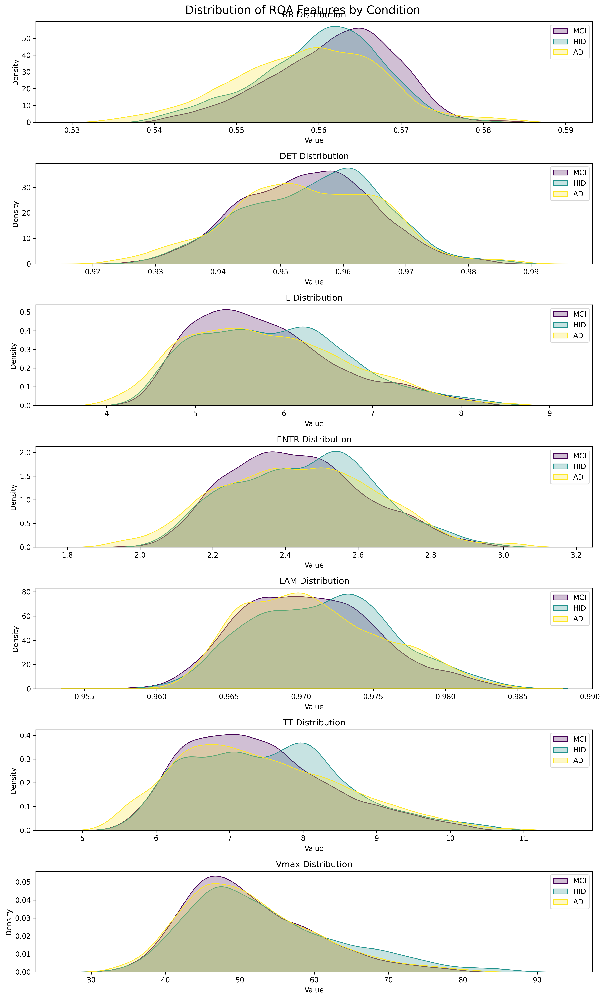
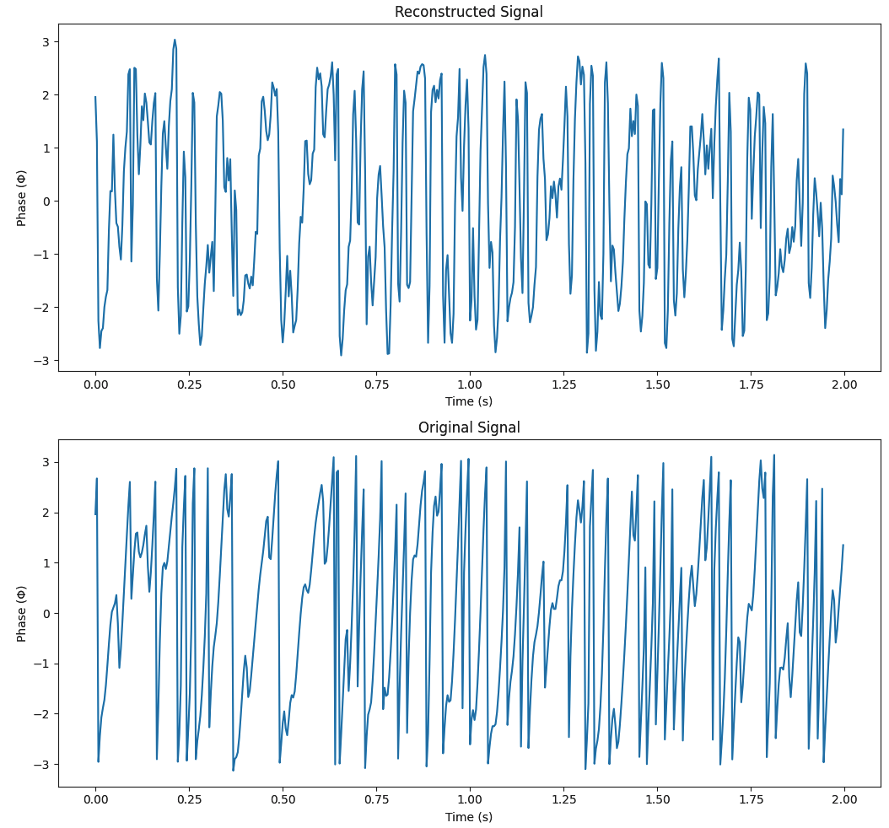
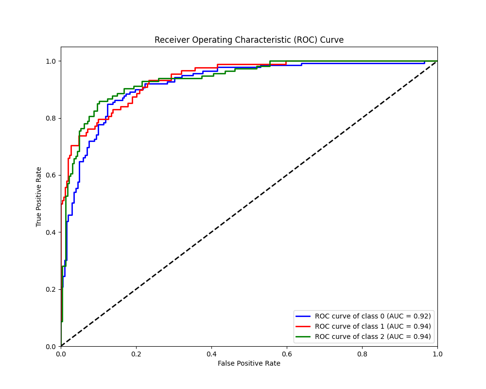
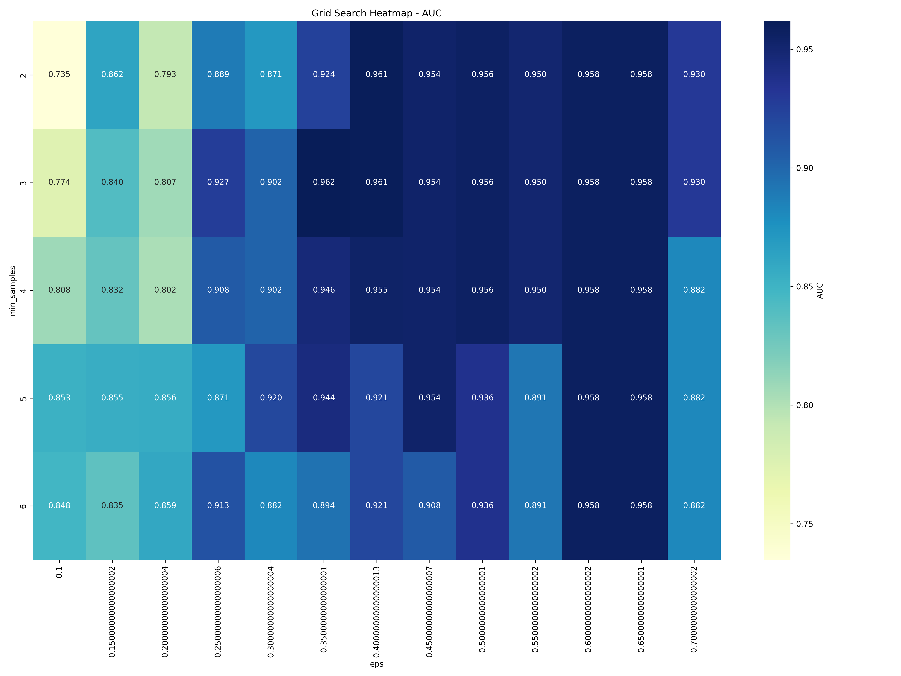
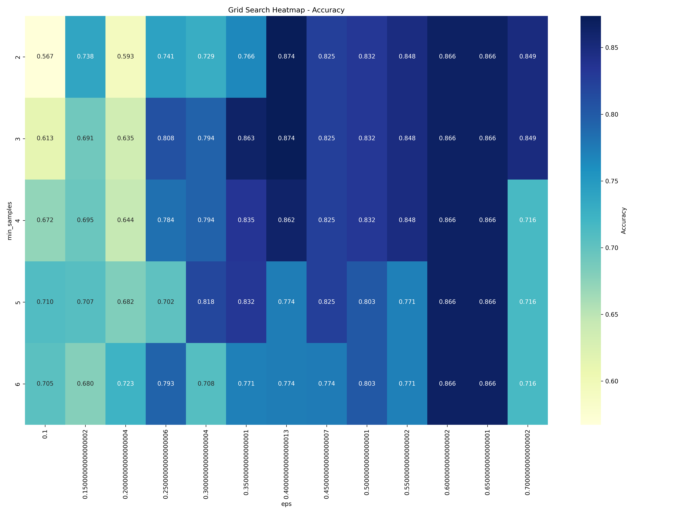

# Highlighting Temporal Patterns in Resting-State EEG Using Autoencoder Latent Spaces and Multivariate Angular Distance Analysis

## Abstract

Analyzing resting-state electroencephalogram (EEG) data presents significant challenges due to the absence of explicit events and high susceptibility to noise, making it difficult to identify informative signal segments. This study proposes a method that leverages an autoencoder architecture to learn latent representations from multichannel EEG phase data. By constructing angular distance matrices from the latent space and applying dimensionality reduction techniques such as UMAP, temporal patterns indicative of different cognitive states are highlighted. Advanced statistical analyses, including Recurrence Quantification Analysis (RQA) feature computation, classification using XGBoost with Group Shuffle Split, and clustering with DBSCAN, are integrated to provide a comprehensive understanding of the underlying neural dynamics. This approach addresses the complexities inherent in traditional RQA by providing a data-driven embedding without extensive hyperparameter tuning. It facilitates informed decisions on segment selection for analysis and offers insights into the underlying neural dynamics in resting-state EEG interpretation.

## 1. Introduction

Resting-state EEG is a valuable tool for investigating the intrinsic functional architecture of the brain. However, analyzing resting-state EEG signals is complicated by the lack of task-related events and high susceptibility to noise and artifacts. Traditional methods often struggle to determine which segments of the signal are most informative, potentially leading to biases or omission of critical information.

Recurrence Quantification Analysis (RQA) provides a framework for analyzing the dynamical properties of time-series data by constructing recurrence matrices that reveal patterns of recurrence in the system's phase space. A significant challenge in RQA is determining appropriate embeddings for constructing these matrices. Time-delay embeddings, for instance, introduce hyperparameters such as time delay $\tau$ and embedding dimension $m$, which require careful selection. The optimal values for these parameters are often unknown, especially for complex, high-dimensional systems like multichannel EEG, where the attractor's structure in phase space is not well-defined.

Alternative embedding methods, such as those based on short-time Fourier transform (STFT) spectrograms, also introduce parameters that influence temporal resolution and frequency content, potentially affecting the analysis. The choice of embedding thus becomes a critical factor that can introduce biases and affect the interpretability of the results.

Autoencoders offer a potential solution by learning data-driven embeddings that capture essential features of EEG signals. Despite concerns about the "black box" nature of such models, autoencoders can serve as tools to guide analysis, allowing for the selection of informative signal segments that can be further examined using standard EEG analysis methods.

The hypothesis explored in this study is that the latent space learned by an autoencoder can capture essential features of EEG data, and constructing angular distance matrices from this latent space can highlight temporal patterns indicative of different cognitive states. This approach aims to reduce reliance on hyperparameter-dependent embeddings in traditional RQA and to provide a method for informed segment selection in resting-state EEG analysis.

## 2. Methods

### 2.1 Participants

The detailed steps for preprocessing the EEG data can be found in the [previous report preproc02](web-MCI-preproc02.html) and [previous report model01](web-MCI-model01.html). 

### 2.2 Data Acquisition and Preprocessing

EEG data were recorded from $N$ subjects, each comprising $C$ channels and $T$ time points. The raw EEG signals $\mathbf{X} = \{\mathbf{x}^{(i)}\}_{i=1}^N$, where $\mathbf{x}^{(i)} \in \mathbb{R}^{C \times T}$, underwent the following preprocessing steps:

1. **Bandpass Filtering**: A bandpass filter was applied to remove low-frequency drifts and high-frequency noise:

   $$\mathbf{x}^{(i)}_{\text{filtered}} = \text{Bandpass}(\mathbf{x}^{(i)})$$

2. **Laplacian Referencing**: To enhance spatial resolution and minimize volume conduction effects, a surface Laplacian transformation was applied:

   $$\tilde{\mathbf{x}}^{(i)} = \text{Laplacian}( \mathbf{x}^{(i)}_{\text{filtered}} )$$

3. **Phase Extraction**: The instantaneous phase information was extracted using the Hilbert transform, capturing the timing of neural oscillations:

   $$\phi^{(i)} = \arg( \text{Hilbert}( \tilde{\mathbf{x}}^{(i)} ) ), \quad \phi^{(i)} \in [-\pi, \pi]^{C \times T}$$

4. **Segmentation**: The continuous phase data were segmented into fixed-duration chunks of 5 seconds to capture temporal dynamics while managing computational load.

### 2.3 Autoencoder Architecture

An autoencoder with an encoder-decoder structure was designed to learn compressed, data-driven embeddings of the multichannel EEG phase data.

**Figure 1.** Model Architecture

#### Encoder

The encoder compresses the high-dimensional input $\phi^{(i)}$ into a lower-dimensional latent space:

1. **Convolutional Layers**: Spatial features across all electrodes were captured:

   $$\mathbf{h}_{\text{conv}}^{(i)} = f_{\text{conv}}( \phi^{(i)} ), \quad \mathbf{h}_{\text{conv}}^{(i)} \in \mathbb{R}^{F \times T}$$

   where $F$ denotes the number of feature maps.

2. **Long Short-Term Memory (LSTM) Layer**: Temporal dependencies in the data were modeled:

   $$\mathbf{h}_{\text{lstm}}^{(i)} = f_{\text{lstm}}( \mathbf{h}_{\text{conv}}^{(i)} ), \quad \mathbf{h}_{\text{lstm}}^{(i)} \in \mathbb{R}^{T' \times H}$$

   where $H$ is the hidden size of the LSTM layer, and $T'$ represents the length of the encoded sequence, which may differ from $T$ due to downsampling or other transformations within the network.

The latent space $\mathbf{h}_{\text{lstm}}^{(i)}$ serves as a data-driven embedding that does not require explicit hyperparameter selection for time delays or embedding dimensions, unlike traditional methods.

#### Decoder

The decoder reconstructs the input data from the latent representation:

1. **LSTM Layer**:

   $$\hat{\mathbf{h}}_{\text{lstm}}^{(i)} = f_{\text{lstm\_dec}}( \mathbf{h}_{\text{lstm}}^{(i)} )$$

2. **Deconvolutional Layers**:

   $$\hat{\phi}^{(i)} = f_{\text{deconv}}( \hat{\mathbf{h}}_{\text{lstm}}^{(i)} ), \quad \hat{\phi}^{(i)} \in [-\pi, \pi]^{C \times T}$$

#### Training Objective

The autoencoder was trained to minimize the reconstruction loss between the input and the reconstructed output:

$$\mathcal{L}_{\text{recon}} = \frac{1}{N} \sum_{i=1}^N \left\| \phi^{(i)} - \hat{\phi}^{(i)} \right\|_2^2$$

### 2.4 Angular Distance Matrix and Recurrence Matrix Construction

Before performing Recurrence Quantification Analysis, angular distance matrices were constructed from the latent space representations to capture temporal patterns.

1. **Angular Distance Matrix**: For each latent representation $\mathbf{h}_{\text{lstm}}^{(i)}$, an angular distance matrix $D^{(i)}$ was computed:

   $$D^{(i)}_{jk} = \cos^{-1}\left( \frac{ \mathbf{h}_{\text{lstm}}^{(i)}(j) \cdot \mathbf{h}_{\text{lstm}}^{(i)}(k) }{ \|\mathbf{h}_{\text{lstm}}^{(i)}(j)\| \|\mathbf{h}_{\text{lstm}}^{(i)}(k)\| } \right)$$

2. **Thresholding for Recurrence Matrix**: To obtain a binary recurrence matrix, the 85th percentile of the angular distance distribution was computed:

   $$\varepsilon = \text{Percentile}( D^{(i)}, 85 )$$

   The recurrence matrix $R^{(i)}$ was then defined as:

   $$R^{(i)}_{jk} = \begin{cases} 1 & \text{if } D^{(i)}_{jk} \leq \varepsilon \\ 0 & \text{otherwise} \end{cases}$$

   This process preserves the 15% of the most significant recurrences, highlighting the most relevant temporal patterns while reducing noise.

### 2.5 Recurrence Quantification Analysis (RQA) Feature Computation

Recurrence Quantification Analysis was performed on the recurrence matrices to quantify the dynamical properties of the EEG signals.

1. **Feature Extraction**: From each recurrence matrix $R^{(i)}$, the following RQA features were extracted:

   - **RR**: Recurrence Rate
   - **DET**: Determinism
   - **L**: Average diagonal line length
   - **Lmax**: Maximum diagonal line length
   - **ENTR**: Entropy of diagonal lines
   - **LAM**: Laminarity
   - **TT**: Trapping Time
   - **Vmax**: Maximum vertical line length

These features provide a quantitative description of the temporal dynamics within the EEG signals.

### 2.6 Latent Representation and UMAP Projection

To visualize the data and perform clustering for segment selection, the latent representations were projected using UMAP.

1. **Feedforward Pass**: A feedforward pass was performed using the trained autoencoder to obtain the latent representations $\mathbf{h}_{\text{lstm}}^{(i)}$ for all data segments.

2. **UMAP Projection**: The high-dimensional latent vectors were projected into a three-dimensional space using UMAP for visualization:

   $$\mathbf{u}^{(i)} = \text{UMAP}( \mathbf{h}_{\text{lstm}}^{(i)} )$$

### 2.7 Clustering and Segment Selection

Clustering was applied to the UMAP-projected data to identify and select signal segments that are specific to particular conditions.

1. **Clustering Algorithm**: DBSCAN was utilized on the UMAP-projected data to identify clusters:

   - **Unfiltered UMAP Projection**: The UMAP projection represents the latent vectors in a 3D space without any filtering.

2. **Filtered Clustering**: Segments that overlapped with multiple conditions were excluded, resulting in a filtered dataset containing only the segments of interest.

### 2.8 Classification Procedures

Classification tasks were performed to evaluate the discriminative power of the RQA features extracted from the filtered data.

1. **Data Preparation**:

   - **Feature Selection**: RQA features ['RR', 'DET', 'L', 'Lmax', 'ENTR', 'LAM', 'TT', 'Vmax'] were selected as input variables.
   - **Label Encoding**: Categorical condition labels were encoded into numerical values.
   - **Scaling**: Features were standardized using `StandardScaler`.

2. **Group Shuffle Split**:

   - Ensured that all samples from a single subject were confined to either the training or testing set, preventing data leakage.

3. **Model Training and Evaluation**:

   - **Algorithm**: XGBoost
   - **Metrics**: Accuracy, F1 Score, and Area Under the Curve (AUC) were computed.
   - **ROC Curve**: Plotted to visualize model performance.

## 3. Results

### 3.1 Clustering Analysis

#### Unfiltered UMAP Projection

Clustering on the full dataset revealed distinct groupings corresponding to various cognitive states.

**Figure 2.** UMAP Projection and Clustering Results - Unfiltered Data

#### Filtered UMAP Projection

After excluding clusters with mixed conditions, the filtered UMAP projection highlighted the segments of interest for further analysis.

**Figure 3.** UMAP Projection and Clustering Results - Filtered Data with parameters: min_samples=4, eps=0.14

### 3.2 Angular Distance and Recurrence Matrices

The angular distance matrices revealed significant temporal patterns in the latent space representations.

**Figure 4.** Angular Distance Matrix

The binary recurrence matrix was constructed by thresholding at the 85th percentile, preserving 15% of the data.

More examples of angular distance matrices can be found in the [wandb project](https://api.wandb.ai/links/lfurman_108/vsi8j4we).

### 3.3 RQA Feature Statistics

Statistical analysis of the extracted RQA features provided insights into the signal dynamics across different conditions.

**Figure 5.** RQA Feature Statistics - Ridgeline Plot

### 3.4 Autoencoder Training Performance

The autoencoder was trained on samples of two seconds in length. The model converged well without signs of overfitting, as indicated by the low reconstruction loss, which fell below 0.08.

**Figure 6.** Reconstruction of Phase Data - Loss

### 3.5 Classification Performance

Classification was performed on the RQA features extracted from the filtered dataset.

- **XGBoost**:
  - **Accuracy**: 0.80
  - **F1 Score**: 0.80
  - **AUC**: 0.93

**Figure 7.** Receiver Operating Characteristic (ROC) Curve for XGBoost Classifier

The XGBoost classifier demonstrated strong performance, indicating that the RQA features effectively discriminate between different cognitive states.

**Figure 8.** Grid Search Results for XGBoost Classifier AUC

**Figure 9.** Grid Search Results for XGBoost Classifier Accuracy

## 4. Discussion

Analyzing resting-state EEG data is fraught with challenges, particularly in constructing appropriate embeddings for recurrence quantification analysis. Traditional methods, such as time-delay embeddings, require the selection of hyperparameters like time delay $\tau$ and embedding dimension $m$, which can significantly influence results. The lack of consensus on optimal embedding parameters for multichannel EEG data introduces variability and potential biases into the analysis.

The approach presented addresses these challenges by utilizing an autoencoder to learn a data-driven embedding from EEG phase data. This method reduces dependence on hyperparameter selection inherent in traditional embeddings, as the autoencoder inherently captures essential features of the data through training.

By constructing angular distance matrices from the latent representations and applying thresholding at the 85th percentile, we preserved the most significant temporal patterns while reducing noise. This thresholding resulted in binary recurrence matrices suitable for RQA feature computation.

Recurrence Quantification Analysis provided a comprehensive profile of the signal dynamics. The RQA features extracted from the filtered segments, selected through clustering on the UMAP projections, exhibited strong discriminative power in classification tasks. The XGBoost classifier achieved an AUC of 0.93, demonstrating the effectiveness of the approach.

Clustering analysis using DBSCAN on UMAP-projected latent vectors identified distinct groupings corresponding to different conditions. By excluding clusters with mixed conditions, we ensured that the features employed for classification were condition-specific, enhancing the robustness of the analysis.

When examining the grid search results, we observed numerous configurations yielding high area under the curve (AUC) and accuracy scores. However, it is crucial to remember that each grid search is performed for specific parameters, and the best scores are obtained for certain DBSCAN parameters. There is a trade-off, as some clusters may be too large, resulting in fewer samples and potentially limiting the model's ability to generalize. Despite this, the performance remains strong, but the generalizability may be compromised.

Future steps could involve designing a more user-friendly interface for performing these analyses, including tests and sanity checks to ensure the preservation of the same number of subjects. It may also be beneficial to identify and handle outliers, such as subjects with conditions that deviate significantly from the norm. These enhancements could improve the robustness and applicability of the methodology.

Overall, the integration of autoencoder-based embeddings, angular distance matrices, thresholding techniques, RQA feature extraction, robust classification, and clustering analysis provides a multifaceted approach to uncovering temporal patterns in resting-state EEG data.

## 5. Conclusion

This study presents a methodology that integrates autoencoders with multivariate angular distance analysis and advanced statistical techniques to highlight temporal patterns in resting-state EEG data. By leveraging the autoencoder's ability to learn data-driven embeddings and constructing thresholded recurrence matrices, the approach addresses challenges associated with traditional embedding methods in RQA, reducing reliance on hyperparameter selection and potential biases.

Clustering on UMAP-projected latent representations allowed for the selection of specific signal segments corresponding to distinct conditions. Classification analyses utilizing XGBoost validated the discriminative power of the extracted RQA features, achieving an AUC of 0.93.

**Important Considerations**:

- The autoencoder serves as a tool to guide analysis and enhance interpretability through standard EEG methods.
- Thresholding at the 85th percentile effectively highlights significant temporal patterns while reducing noise.
- Clustering and filtering ensure that only relevant segments are included in further analysis, improving classification performance.

---

Code repository: [github.com/furmanlukasz/MatrixAutoEncoder](https://github.com/furmanlukasz/MatrixAutoEncoder)

---

**Note**: This article is developed as part of a methodology concept by Łukasz Furman, utilizing the Data Lab LLM Agent process. It integrates insights and knowledge from various sources, including O1 Preview, LLAMA3, and Cloude Sonet 3.5. Additionally, it incorporates generated text formatting and structuring processes to enhance clarity and coherence. ✨
