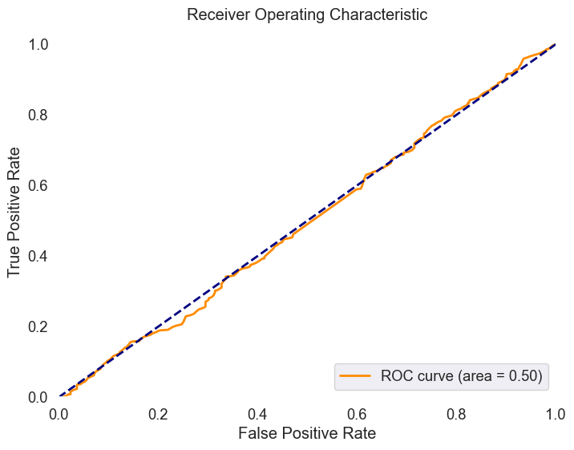
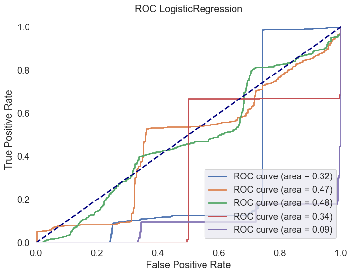
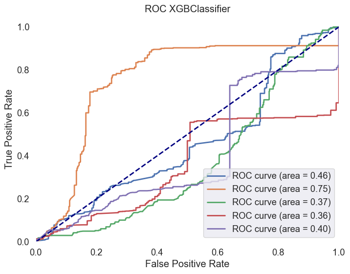

### Prediction of Mild Cognitive Impairment Severity Using EEG Data and Neuropsychological Scores

**Edit**: After several reviews I found data leakage in the code. The data was not correctly split into training and testing sets. That is some features from one subject and different time segments were used in both training and testing sets, which is wrong. The code was corrected and the report was updated. The results are different, but the conclusions are the same. The data leakage was fixed and the results are more reliable.

### Introduction
Behavioral and cognitive changes in older adults can be indicative of Mild Cognitive Impairment (MCI), a condition that may progress to Alzheimer's disease or other forms of dementia. The early detection and classification of MCI severity are crucial for timely intervention and treatment. This report explores the use of resting-state high-density EEG data to predict MCI severity based on neuropsychological scores. To set the stage for this kind of analysis is good to check how the first-order statistics are able to distinguish between the groups using simple models like logistic regression or SVMs. Additionally, the XGBoost model was used to check if the more complex model is able to distinguish between the groups. 

This analysis integrates machine learning models to classify subjects into two groups based on the FRSSD total score, a functional scale indicating the severity of symptoms. The Functional Rating Scale for Symptoms of Dementia (FRSSD)[2] evaluate daily living skills affected by MCI across 14 dimensions, including eating, dressing, managing incontinence, communicating, sleeping, recognizing faces, maintaining personal hygiene, remembering names, recalling events, staying alert, understanding complex situations, knowing one's location, managing emotions, and interacting socially. The FRSSD assigns scores from 0 (no impairment) to 3 (severe impairment) for each activity, reflecting the individual's level of functional ability. It's important to note that this assessment is completed by caregivers, not the patients themselves, which means the scores might reflect the caregivers' perceptions and the impact of caregiving on their well-being. The scale uses a threshold score of 5 (authors recommendation) to distinguish between individuals who are likely healthy and those who may have dementia, providing a valuable tool for analysis of cognitive decline.

In this analysis the cutoff score of 5 was not used, instead the participants were divided into two groups based on the FRSSD total score: a lower-score group (0-3) and a higher-score group (4 or higher).

Fig.1 Functional Rating Scale for Symptoms of Dementia (FRSSD) and the distribution of scores in the dataset across the subjects. The scores are divided into two groups: lower-score group ($0-3$) and higher-score group ($4$ or higher). No FRSSD tot score: $17$, FRSSD tot score $0-3: 32$, FRSSD tot score $>3: 28$.

### Methodology

The methodology involved preprocessing EEG data, extracting features, and linking these features with neuropsychological scores to create a comprehensive dataset. The dataset was then used to train and evaluate several machine learning models, including Logistic Regression, Support Vector Machines (SVM), and XGBoost, to classify subjects into two groups. The detailed steps for preprocessing the EEG data can be found in the [previous report](web-MCI-preproc02.md). 
 The first-order statistics were calculated using the `MNE-Python` library[3]. The relative band powers and their ratios were calculated using the `yasa` library[6]. The features were standardized using the `StandardScaler` from the `sklearn` library. The dataset was split into training and testing sets, ensuring stratified sampling based on the groups defined by FRSSD total scores. The models were trained and evaluated using accuracy and ROC AUC scores, with a focus on understanding the performance of each model in distinguishing between the unbalanced groups.

#### Feature Extraction

Previously preprocessed segments data were loaded using MNE-Python, focusing on extracting meaningful features such as mean, standard deviation, skewness, and kurtosis from the EEG recordings. Cognitive and functional scores were obtained from an Excel sheet (provided with dataset), focusing on participants with the condition labeled "MCI". Participants were divided based on the FRSSD total score, creating two groups for classification.

- First-order statistics included mean, standard deviation, skewness, and kurtosis for each channel and frequency band. Next the mean of these statistics was calculated for each participant.
- Relative band powers were extracted from the EEG data using the `yasa` library[6]. Averge power was calculated for the $delta$ (1-4 Hz), $theta$ (4-8 Hz), $alpha$ (8-12 Hz), $sigma$ (12-16 Hz), $beta$ (16-30 Hz) and $gamma$ (30-45 Hz) frequency bands. 
- Ratios of relative band powers were calculated to capture the relationship between different frequency bands, such as the: $alpha/beta$ $;$ $theta/beta$ $;$ $beta/gamma$ $;$ $theta/gamma$ $;$ $alpha/gamma$.
  

The feature vector for each segment was created by concatenating the first-order statistics ($4$ $statistics$), relative band powers ($6$ $bands$), and their ratios ($5$ $ratios$), resulting in a 15-dimensional feature vector for each segment.

#### Data Organization

In the analysis, meticulous organization and preparation of the dataset for machine learning focused on EEG data to explore cognitive impairments were emphasized. Here is an overview of the approach:

- **Data Structure**: The dataset (`eeg_data_df`) was categorized based on unique identifiers for each participant (`EEGCode`) and their respective group classifications, indicating different levels of cognitive impairment. This structured foundation ensured a systematic analysis.

- **Stratified Grouping**:
  - Data was transformed into a format suitable for stratified sampling, with each entry corresponding to a participant and their classification group. This approach maintained proportionate representation of each group in both training and test sets.
  - A stratified split divided participants into training and testing groups, ensuring balanced representation of cognitive impairment levels in each subset, thus preventing sampling bias.

- **Index Mapping**:
  - A custom function mapped participants to their respective data indices, enabling accurate retrieval of records for training and testing phases.
  - Specific datasets for training (`train_df`) and testing (`test_df`) were constructed, comprising relevant EEG data features and cognitive impairment classifications.

- **Training and Testing Sets**:
  - The training set included a wide range of EEG data and corresponding classifications for model training and validation.
  - The testing set was used for the final evaluation to provide an unbiased assessment of predictive capabilities.

Following dataset organization and stratification:

- **Data Preparation for Modeling**:
  - Feature sets (`X_train` and `X_test`) were curated by removing non-predictive columns, focusing on variables crucial for predictive accuracy.
  - Target variables (`y_train` and `y_test`) were determined by the group classifications, representing cognitive impairment levels.

- **Feature Scaling**:
  - Feature scaling was applied using `StandardScaler` from the `sklearn` library, to ensure all features contributed equally to model decision-making, eliminating bias from varied feature scales. This step is crucial for linear models and benefits other algorithms by enhancing accuracy and convergence speed.

#### Model Training and Evaluation Extension

Following the structured preparation of the dataset, several machine learning models were employed to discern patterns indicative of cognitive impairments:

- **Logistic Regression without Class Weights**: A logistic regression model was initialized and trained, applying scaled features from the training set. Predictions were then made on the scaled test set, with accuracy serving as the primary evaluation metric. This model served as a baseline for comparison.

- **Logistic Regression with Class Weights**: To address potential class imbalance, another logistic regression model was introduced, this time incorporating balanced class weights. After training, predictions were made on the test set, and the model's performance was evaluated based on accuracy and detailed through a classification report. Additionally, an ROC AUC curve was generated to visualize the model's ability to differentiate between classes, specifically targeting the 'MCI-low' group.

- **Support Vector Machine (SVM)**: An SVM classifier with an RBF kernel and balanced class weights was also trained, leveraging the scaled feature sets. The model's predictive accuracy was assessed, and its performance was further detailed in a classification report. An ROC AUC curve was plotted, providing insights into the SVM's discriminatory power between cognitive impairment levels.

- **XGBoost Classifier**: The XGBoost model was employed next, using label-encoded class targets for training. This model's accuracy was evaluated, and its performance was summarized in a classification report, offering a nuanced view of its predictive capabilities across different classes.

- **XGBoost with Cross-Validation**: To harness the full potential of XGBoost and ensure robust performance, a stratified K-fold cross-validation approach was utilized. This method calculated ROC AUC scores across multiple splits, offering a comprehensive assessment of the model's consistency and effectiveness. Additionally, an ROC curve was plotted based on the probability predictions for the test set, highlighting the model's overall performance in distinguishing between cognitive impairment levels.

Throughout this extended analysis, the application of machine learning models, ranging from logistic regression to more complex approaches like XGBoost, underscores the nuanced exploration of cognitive impairments. By adjusting class weights and employing cross-validation, the study aimed to achieve balanced and insightful results, contributing to a deeper understanding of cognitive decline patterns.

Sklearn's `LogisticRegression` and `SVC` were used to train the models. The `XGBoost` model was trained using the `xgboost` library. The `StratifiedKFold` and `cross_val_score` functions from the `sklearn` library were used to perform cross-validation and calculate ROC AUC scores. The `classification_report` function from the `sklearn` library was used to generate detailed classification reports. The `roc_curve` and `roc_auc_score` functions from the `sklearn` library were used to plot ROC curves and calculate ROC AUC scores.

#### Interpretation of Model Performance

The performance of each model was assessed based on their ability to distinguish between two classes: 'MCI-high' and 'MCI-low'. The results indicate varying degrees of success across different metrics, including accuracy, precision, recall, f1-score, and ROC AUC scores. A summary table is provided below to encapsulate the performance metrics for each model evaluated:

| Model                              | Accuracy | Precision (MCI-high) | Recall (MCI-high) | F1-Score (MCI-high) | Precision (MCI-low) | Recall (MCI-low) | F1-Score (MCI-low) | ROC AUC   |
|------------------------------------|----------|----------------------|-------------------|---------------------|---------------------|------------------|--------------------|-----------|
| Logistic Regression (Unweighted)   | 0.701    | 0.00                 | 0.00              | 0.00                | 0.70                | 1.00             | 0.82               | N/A       |
| Logistic Regression (Weighted)     | 0.613    | 0.30                 | 0.22              | 0.25                | 0.70                | 0.78             | 0.74               | 0.49      |
| SVM                                | 0.626    | 0.31                 | 0.20              | 0.24                | 0.70                | 0.81             | 0.75               | 0.50      |
| XGBoost                            | 0.695    | 0.33                 | 0.02              | 0.04                | 0.70                | 0.98             | 0.82               | N/A       |
| XGBoost with Cross-Validation      | N/A      | N/A                  | N/A               | N/A                 | N/A                 | N/A              | N/A                | 0.528     |

**Edit**: Corrected results after fixing the data leakage, are presented in the table below: 

| Model                              | Accuracy | Precision (MCI-high) | Recall (MCI-high) | F1-Score (MCI-high) | Precision (MCI-low) | Recall (MCI-low) | F1-Score (MCI-low) | ROC AUC   |
|------------------------------------|----------|----------------------|-------------------|---------------------|---------------------|------------------|--------------------|-----------|
| Logistic Regression (Unweighted)   | 0.701    | 0.00                 | 0.00              | 0.00                | 0.70                | 1.00             | 0.70               | 0.34      |
| Logistic Regression (Weighted)     | 0.39     | 0.22                 | 0.41              | 0.27                | 0.60                | 0.36             | 0.44               | 0.34      |
| SVM (rbf)                          | 0.64     | 0.08                 | 0.002             | 0.005               | 0.68                | 0.91             | 0.77               | 0.43      |
| XGBoost                            | 0.57     | 0.35                 | 0.34              | 0.30                | 0.71                | 0.69             | 0.68               | 0.47      |

**Column Descriptions:**
- **Model**: The machine learning model used.
- **Accuracy**: The proportion of true results (both true positives and true negatives) among the total number of cases examined.
- **Precision (MCI-high)**: The ratio of correctly predicted positive observations to the total predicted positives for the 'MCI-high' class.
- **Recall (MCI-high)**: The ratio of correctly predicted positive observations to all observations in the actual 'MCI-high' class.
- **F1-Score (MCI-high)**: A weighted average of Precision and Recall for the 'MCI-high' class. It takes both false positives and false negatives into account.
- **Precision (MCI-low)**: The ratio of correctly predicted positive observations to the total predicted positives for the 'MCI-low' class.
- **Recall (MCI-low)**: The ratio of correctly predicted positive observations to all observations in the actual 'MCI-low' class.
- **F1-Score (MCI-low)**: A weighted average of Precision and Recall for the 'MCI-low' class. It takes both false positives and false negatives into account.
- **ROC AUC**: The area under the ROC curve, a graphical representation of a model's diagnostic ability.

#### Key Insights:

The comparative analysis of machine learning models on the dataset reveals distinct patterns in the ability to classify 'MCI-high' and 'MCI-low' cases, with notable differences in model performance metrics:

- **Logistic Regression (Unweighted)** displayed notable accuracy overall but struggled with identifying 'MCI-high' cases, as evidenced by zero precision, recall, and f1-score for 'MCI-high'. Conversely, it excelled in recognizing 'MCI-low' cases, achieving perfect recall and a high f1-score, indicating a strong ability to identify less severe cognitive impairments.

- The introduction of **Class Weights in Logistic Regression** resulted in a slight decrease in overall accuracy but marked an improvement in detecting 'MCI-high' cases, though the effectiveness was modest. This adjustment, however, slightly diminished the model's performance metrics for 'MCI-low' cases, showcasing the trade-off between improving sensitivity for one class at the potential expense of the other.

- **SVM** showcased a marginal enhancement in the ability to differentiate between 'MCI-high' and 'MCI-low' compared to the weighted logistic regression, evidenced by a slight increase in accuracy and the ROC AUC score. This model achieved a balance, modestly improving the identification of 'MCI-high' cases while maintaining robust performance for 'MCI-low'.

- **XGBoost** mirrored the unweighted logistic regression model in terms of high accuracy and demonstrated a strong capability in identifying 'MCI-low' cases. However, it showed minimal improvement for 'MCI-high' cases, indicating a challenge in adequately balancing classification performance across both classes.

- The **XGBoost with Cross-Validation** approach indicated a subtle enhancement in the model's discrimination ability across classes, as reflected by the mean ROC AUC score. This suggests a nuanced improvement in the model's generalization capabilities, hinting at the potential for refined model tuning to better distinguish between cognitive impairment levels.
  

Fig.2 ROC AUC scores for XGBoost with Cross-Validation. Last fold.

The analysis underscores a common theme across models: a significant capability to identify 'MCI-low' cases compared to 'MCI-high'. This disparity is particularly pronounced in recall and f1-score metrics for 'MCI-low', which consistently outperform those for 'MCI-high'. Such findings highlight the inherent challenge in distinguishing between varying levels of cognitive impairment, suggesting a need for further exploration and optimization of modeling techniques to achieve a balanced and effective classification strategy.

**Edit**: Corrected results after fixing the data leakage, are presented below:

Fig.3 ROC AUC scores for Logistic Regression (unweighted) with Cross-Validation. 

Fig.4 ROC AUC scores for XGBoost with Cross-Validation.

### Discussion

The exploration of EEG features alongside neuropsychological scores has demonstrated its potential in delineating cognitive impairment severities among MCI participants. However, the observed variability in model performance highlights a critical consideration in the selection of machine learning techniques. These choices must be informed by the dataset's specific characteristics and the classification challenges at hand. Notably, while models like XGBoost and SVM showed promise, especially when adjusted with class weights and kernel methods, their effectiveness varied significantly between the 'MCI-high' and 'MCI-low' classifications. This discrepancy underscores the complexity of the task and the necessity of a nuanced approach to model selection and tuning.

The improvements in ROC AUC scores, particularly in models employing cross-validation, suggest a capacity to distinguish between different cognitive impairment levels. However, the consistent challenge across all models to accurately identify 'MCI-high' cases calls for a critical evaluation of both the modeling strategies employed and the inherent dataset biases or limitations. 

Further investigation into feature engineering and the incorporation of advanced techniques such as multivariete analysis may yield more robust and balanced classification frameworks without need to get deep in to deep learning models. Setting a stage is done using as simple aproach as possible, but not simpler. These means not incorporating exanded (by channels, ROIs, etc.) features, but also the more advanced feature extraction techniques like wavelet transform, Hilbert-Huang transform, etc. Witch could be used to extract the features from the EEG data. However the unbalance nature of the dataset can is very chalenging to the models.

### Conclusion

This analysis has underscored the nuanced potential of leveraging machine learning models to comprehend cognitive impairment by integrating EEG data with neuropsychological assessments. The findings prompt a reconsideration of model selection and optimization strategies, especially in the context of balancing sensitivity and specificity across varied impairment levels. The observed challenges in distinguishing between 'MCI-high' and 'MCI-low' cases highlight the need for a more nuanced and comprehensive approach to feature engineering, model tuning, and advanced techniques to achieve a balanced and effective classification framework. The stage is set for further exploration and refinement, with the potential to enhance the predictive capabilities through more advanced feature extraction and modeling techniques.

---
#### References

1. Ioulietta Lazarou, Kostas Georgiadis, Spiros Nikolopoulos, Vangelis Oikonomoui Ioannis Kompatsiaris, „Resting-State High-Density EEG using EGI GES 300 with 256 Channels of Healthy Elders, People with Subjective and Mild Cognitive Impairment and Alzheimer's Disease”, Brain Science MDPI, t. 10, nr 6. Zenodo, s. 392, grudz. 23, 2020. doi: 10.5281/zenodo.4316608.
2. Kounti, F., Tsolaki, M. & Kiosseoglou, G. Functional cognitive assessment scale (FUCAS): a new scale to assess executive cognitive function in daily life activities in patients with dementia and mild cognitive impairment. https://www.academia.edu/17238224/Functional_cognitive_assessment_scale_FUCAS_a_new_scale_to_assess_executive_cognitive_function_in_daily_life_activities_in_patients_with_dementia_and_mild_cognitive_impairment (2006).
3. Alexandre Gramfort, Martin Luessi, Eric Larson, Denis A. Engemann, Daniel Strohmeier, Christian Brodbeck, Roman Goj, Mainak Jas, Teon Brooks, Lauri Parkkonen, and Matti S. Hämäläinen. MEG and EEG data analysis with MNE-Python. Frontiers in Neuroscience, 7(267):1–13, 2013. doi:10.3389/fnins.2013.00267.
4. https://mne.tools/mne-icalabel/stable/index.html#
5. Vallat, Raphael, and Matthew P. Walker. "An open-source, high-performance tool for automated sleep staging." Elife 10 (2021). doi: https://doi.org/10.7554/eLife.70092 
6. https://github.com/raphaelvallat/yasa
7. Thomas A Caswell, „matplotlib/matplotlib: REL: v3.7.4”. Zenodo, lis. 18, 2023. doi: 10.5281/zenodo.10152802.
8. Waskom, M. L., (2021). seaborn: statistical data visualization. Journal of Open Source Software, 6(60), 3021, https://doi.org/10.21105/joss.03021.
9. The pandas development team, „pandas-dev/pandas: Pandas”. Zenodo, sty. 20, 2024. doi: 10.5281/zenodo.10537285.
---

<!-- Footer -->

###### Author: [Łukasz Furman](cracer.net@gmail.com)

