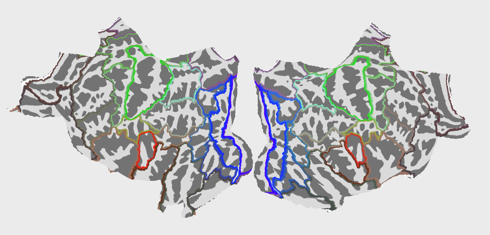
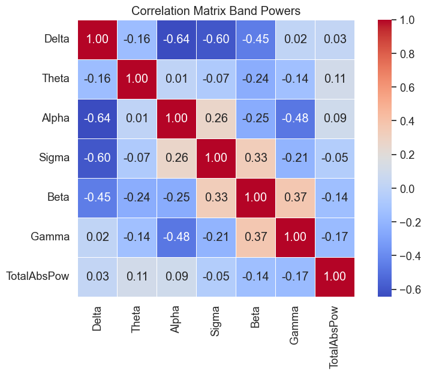
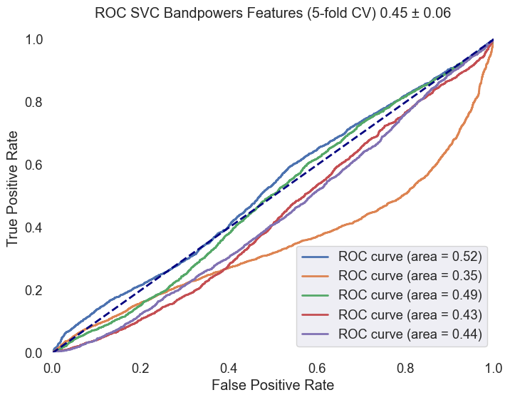

### Prediction of Mild Cognitive Impairment Severity Using EEG Data and Neuropsychological Scores in Source Space

### Introduction

This report delves into the predictive analysis of Mild Cognitive Impairment (MCI) severity, leveraging high-density EEG data combined with nuanced neuropsychological scoring. It extends previous research by incorporating advanced feature engineering techniques, including source analysis from the Human Connectome Project (HCP) combined atlas, and exploring the efficacy of machine learning models like Logistic Regression, Random Forest, SVMs, and XGBoost in distinguishing between MCI severity levels. 

Groups are based on the FRSSD total score, a functional scale indicating the severity of symptoms. The Functional Rating Scale for Symptoms of Dementia (FRSSD)[2] evaluate daily living skills affected by MCI across 14 dimensions, including eating, dressing, managing incontinence, communicating, sleeping, recognizing faces, maintaining personal hygiene, remembering names, recalling events, staying alert, understanding complex situations, knowing one's location, managing emotions, and interacting socially. The FRSSD assigns scores from 0 (no impairment) to 3 (severe impairment) for each activity, reflecting the individual's level of functional ability. It's important to note that this assessment is completed by caregivers, not the patients themselves, which means the scores might reflect the caregivers' perceptions and the impact of caregiving on their well-being. The scale uses a threshold score of 5 (authors recommendation) to distinguish between individuals who are likely healthy and those who may have dementia, providing a valuable tool for analysis of cognitive decline.

In this analysis the cutoff score of 5 was not used, instead the participants were divided into two groups based on the FRSSD total score: a lower-score group (0-3) and a higher-score group (4 or higher).

Fig.1 Functional Rating Scale for Symptoms of Dementia (FRSSD) and the distribution of scores in the dataset across the subjects. The scores are divided into two groups: lower-score group ($0-3$) and higher-score group ($4$ or higher). **No FRSSD tot score: $17$, FRSSD tot score $0<=3: 32$, FRSSD tot score $ >3: 28$.**

### Methodology

The methodology involved preprocessing EEG data, source space analysis, extracting features, and linking these features with neuropsychological scores to create a comprehensive dataset. The dataset was then used to train and evaluate several machine learning models, including Logistic Regression, Support Vector Machines (SVM), and XGBoost, to classify subjects into two groups. The detailed steps for preprocessing the EEG data can be found in the [previous report preproc02](web-MCI-preproc02.html) and [previous report model01](web-MCI-model01.html). 

The study utilized preprocessed EEG segments, with source analysis conducted for each multivariete timeseries segment to extract bandpower features from 42 ROIs using the HCP_combined atlas. Stratified sampling was ensured based on the groups and subject segments to avoid data leakage.

Utilized a custom function to compute source time courses (STCs), employing sLORETA `ico4`, `snr 0.5` with `fsaverage` brain temaplate for inverse modeling and focusing on meaningful regions within the `HCPMMP1_combined` atlas using `MNE-Python` library[3]. The relative band powers and their ratios were calculated using the `yasa` library[6]. The features were standardized using the `StandardScaler` from the `sklearn` library. The dataset was split into training and testing sets, ensuring stratified sampling based on the groups and subject segments defined by FRSSD total scores. The models were trained and evaluated using accuracy and ROC AUC scores, with a focus on understanding the performance of each model in distinguishing between the unbalanced groups.

#### ROIs:

- **Default Mode Network (DMN):**
  - PCCL-lh: Posterior Cingulate Cortex Left Hemisphere
  - PCCR-rh: Posterior Cingulate Cortex Right Hemisphere
  - ACAMPCR-rh: Anterior Cingulate And Medial Prefrontal Cortex Right Hemisphere
  - ACAMPCL-lh: Anterior Cingulate And Medial Prefrontal Cortex Left Hemisphere
  - POCL-lh: Parieto-Occipital Cortex Left Hemisphere
  - POCR-rh: Parieto-Occipital Cortex Right Hemisphere

- **Salience Network (SN):**
  - AACL-lh: Anterior Insula And Adjacent Frontal Cortex Left Hemisphere
  - AACR-rh: Anterior Insula And Adjacent Frontal Cortex Right Hemisphere
  - IAFOCL-lh: Inferior Anterior Frontal Cortex Left Hemisphere
  - IAFOCR-rh: Inferior Anterior Frontal Cortex Right Hemisphere

- **Central Executive Network (CEN):**
  - DPCL-lh: Dorsolateral Prefrontal Cortex Left Hemisphere
  - DPCR-rh: Dorsolateral Prefrontal Cortex Right Hemisphere
  - LTCL-lh: Lateral Temporal Cortex Left Hemisphere
  - LTCR-rh: Lateral Temporal Cortex Right Hemisphere

- **Sensorimotor Network:**
  - EVCL-lh: Primary Somatosensory And Motor Cortex Left Hemisphere
  - EVCR-rh: Primary Somatosensory And Motor Cortex Right Hemisphere
  - SPCL-lh: Superior Parietal Cortex Left Hemisphere
  - SPCR-rh: Superior Parietal Cortex Right Hemisphere

- **Visual Processing Network:**
  - VSVCL-lh: Ventral Stream Visual Cortex Left Hemisphere
  - VSVCR-rh: Ventral Stream Visual Cortex Right Hemisphere
  - PVCL-lh: Primary Visual Cortex (Left Hemisphere)
  - PVCR-rh: Primary Visual Cortex (Right Hemisphere)

- **Auditory and Language Network:**
  - TPOJL-lh: Temporo-Parieto-Occipital Junction Left Hemisphere
  - TPOJR-rh: Temporo-Parieto-Occipital Junction Right Hemisphere

- **Attention and Frontoparietal Network:**
  - IFCL-lh: Inferior Frontal Cortex Left Hemisphere
  - IFCR-rh: Inferior Frontal Cortex Right Hemisphere
  - SAMCL-lh: Supplementary Motor Area And Cingulate Motor Areas Left Hemisphere
  - SAMCR-rh: Supplementary Motor Area And Cingulate Motor Areas Right Hemisphere

- **Memory and Temporal Lobe Function:**
  - MTCL-lh: Medial Temporal Cortex Left Hemisphere
  - MTCR-rh: Medial Temporal Cortex Right Hemisphere

- **Emotion and Affective Processing:**
  - OAPFCL-lh: Orbito-Affective Prefrontal Cortex Left Hemisphere
  - OAPFCR-rh: Orbito-Affective Prefrontal Cortex Right Hemisphere

- **Executive Function and Decision Making:**
  - DSVCL-lh: Dorsal Stream Visual Cortex Left Hemisphere
  - DSVCR-rh: Dorsal Stream Visual Cortex Right Hemisphere

- **Parietal Lobe Function:**
  - PCL-lh: Parietal Cortex Left Hemisphere
  - PCR-rh: Parietal Cortex Right Hemisphere

- **Limbic System:**
  - EACL-lh: Entorhinal Area Cortex Left Hemisphere
  - EACR-rh: Entorhinal Area Cortex Right Hemisphere
  - PLAMCCL-lh: Paralimbic Cortex Left Hemisphere
  - PLAMCCR-rh: Paralimbic Cortex Right Hemisphere

Plots of ROIs are presented below:

Fig.2 42 Regions of Interest (ROIs) used in the analysis. The ROIs are based on the `HCPMMP1_combined` atlas.

    

The animated GIF showcases a dynamic 3D visualization of brain activity over time, rendered on the "fsaverage" template brain. It's presented from multiple perspectives: lateral, medial, dorsal, and ventral views, laid out horizontally for a comprehensive examination of the entire brain surface. This visualization is based on source-localized EEG data, capturing the intricate patterns of neural dynamics across different brain regions. The color intensity on the brain's surface corresponds to the magnitude of activity to highlight variations in neural engagement.  Time from 0.1 to 1.1 seconds at a slowed-down pace (time dilation factor of 100) for detailed analysis. Traveling waves can be observed across the brain's surface, ranging from 30 to 90 milliseconds.

#### Feature Extraction

The feature extraction process involved the following steps:

- Relative band powers were extracted from the EEG data using the `yasa` library[6]. Averge power was calculated for the $delta$ (1-4 Hz), $theta$ (4-8 Hz), $alpha$ (8-12 Hz), $sigma$ (12-16 Hz), $beta$ (16-30 Hz) and $gamma$ (30-45 Hz) frequency bands. 

Correlation matrix of the relative band powers for the ROIs was calculated to identify the relationships between different regions and frequency bands. The correlation matrix was visualized using a heatmap to provide a comprehensive overview of the interplay between ROIs and frequency bands.

Feature vector shape: ($n$ $segments$, $42$ $ROIs$, $6$ $bands$)

    

Fig.3 Correlation matrix of the relative band powers for the ROIs. 

#### Data Organization

- **Data Structure**: The dataset (`eeg_data_df`) was categorized based on unique identifiers for each participant (`EEGCode`,`Segment_id`) and their respective group classifications, indicating different levels of cognitive impairment.

- **Stratified Grouping**:
  - Data was transformed into a format suitable for stratified sampling, with each entry corresponding to a participant and their classification group. 
  - Using the `GroupKFold` function from the `sklearn` library, the dataset was stratified based on the `EEGCode` and subject `Segment_id` defined by FRSSD total scores.
  - Specific datasets for training (`train_df`) and testing (`test_df`) were constructed.

- **Training and Testing Sets**:
  - The training set included a wide range of EEG data and corresponding classifications for model training and validation.
  - The testing set was used for the final evaluation to provide an unbiased assessment of predictive capabilities.

Following dataset organization and stratification:

- **Data Preparation for Modeling**:
  - Feature sets (`X_train` and `X_test`) were curated by removing non-predictive columns, focusing on variables crucial for predictive accuracy.
  - Target variables (`y_train` and `y_test`) were determined by the group classifications, representing cognitive impairment levels.

- **Feature Scaling**:
  - Feature scaling was applied using `StandardScaler` from the `sklearn` library, to ensure all features contributed equally to model decision-making, eliminating bias from varied feature scales. This step is crucial for linear models and benefits other algorithms by enhancing accuracy and convergence speed.

#### Model Training and Evaluation Extension

Following the structured preparation of the dataset, several machine learning models were employed to discern patterns indicative of cognitive impairments:

- **Logistic Regression without Class Weights CV5**: A logistic regression model was initialized and trained, applying scaled features from the training set. Predictions were then made on the scaled test set, with accuracy serving as the primary evaluation metric. This model served as a baseline for comparison.

- **Logistic Regression with Class Weights CV5**: To address potential class imbalance, another logistic regression model was introduced, this time incorporating balanced class weights. After training, predictions were made on the test set, and the model's performance was evaluated based on accuracy and detailed through a classification report. ROC AUC curve was generated to visualize the model's ability to differentiate between classes.

- **Support Vector Machine (SVM) CV5**: An SVM classifier with an RBF & Linear kernel, balanced class weights were trained, leveraging the scaled feature sets. The model's predictive accuracy was assessed, and its performance was further detailed in a classification report. An ROC AUC curve was plotted.

- **XGBoost Classifier CV5**: The XGBoost model was employed next, using label-encoded class targets for training. This model's accuracy was evaluated, and its performance was summarized in a classification report.

- **Random Forest Classifier CV5**: A Random Forest model was trained and evaluated, leveraging the scaled feature sets. 

`Sklearn`'s `LogisticRegression`, `Random Forest` and `SVC` were used to train the models. The `XGBoost` model was trained using the `xgboost` library. The `GroupKFold` and `cross_val_score` functions from the `sklearn` library were used to perform cross-validation and calculate ROC AUC scores. The `classification_report` function from the `sklearn` library was used to generate detailed classification reports. The `roc_curve` and `roc_auc_score` functions from the `sklearn` library were used to plot ROC curves and calculate ROC AUC scores.

#### Interpretation of Model Performance

The performance of each model was assessed based on their ability to distinguish between two classes: 'MCI-high' and 'MCI-low'. The results indicate varying degrees of success across different metrics, including accuracy, precision, recall, f1-score, and ROC AUC scores. A summary table is provided below to encapsulate the performance metrics for each model evaluated:

| Model                              | Accuracy | Precision (MCI-high) | Recall (MCI-high) | F1-Score (MCI-high) | Precision (MCI-low) | Recall (MCI-low) | F1-Score (MCI-low) | ROC AUC     |
|------------------------------------|----------|----------------------|-------------------|---------------------|---------------------|------------------|--------------------|-------------|
| Logistic Regression (Unweighted)   | 0.69     | 0.28                 | 0.007             | 0.012               | 0.70                | 0.97             | 0.81               | 0.47 ± 0.13 |
| Logistic Regression (Weighted)     | 0.48     | 0.26                 | 0.47              | 0.33                | 0.68                | 0.48             | 0.56               | 0.47 ± 0.13 |
| SVM (rbf)                          | 0.68     | 0.19                 | 0.02              | 0.04                | 0.70                | 0.95             | 0.81               | 0.45 ± 0.06 |
| SVM (lin)                          | 0.71     | 0.0                  | 0.0               | 0.0                 | 0.71                | 1.0              | 0.82               | 0.51 ± 0.10 |
| XGBoost                            | 0.63     | 0.21                 | 0.09              | 0.13                | 0.69                | 0.86             | 0.77               | 0.43 ± 0.06 |
| Random Forest                      | 0.64     | 0.21                 | 0.08              | 0.12                | 0.69                | 0.87             | 0.77               | 0.44 ± 0.07 |

**Column Descriptions:**
- **Model**: The machine learning model used.
- **Accuracy**: The proportion of true results (both true positives and true negatives) among the total number of cases examined.
- **Precision (MCI-high)**: The ratio of correctly predicted positive observations to the total predicted positives for the 'MCI-high' class.
- **Recall (MCI-high)**: The ratio of correctly predicted positive observations to all observations in the actual 'MCI-high' class.
- **F1-Score (MCI-high)**: A weighted average of Precision and Recall for the 'MCI-high' class. It takes both false positives and false negatives into account.
- **Precision (MCI-low)**: The ratio of correctly predicted positive observations to the total predicted positives for the 'MCI-low' class.
- **Recall (MCI-low)**: The ratio of correctly predicted positive observations to all observations in the actual 'MCI-low' class.
- **F1-Score (MCI-low)**: A weighted average of Precision and Recall for the 'MCI-low' class. It takes both false positives and false negatives into account.
- **ROC AUC**: The area under the ROC curve, a graphical representation of a model's diagnostic ability.

    

Fig.4 ROC AUC curve for the Logistic Regression model with class weights. The curve illustrates the model's ability to distinguish between 'MCI-high' and 'MCI-low' classes, with an average ROC AUC score of 0.47 ± 0.13.

    

Fig.5 ROC AUC curve for the SVM model with an RBF kernel. The curve illustrates the model's ability to distinguish between 'MCI-high' and 'MCI-low' classes, with an average ROC AUC score of 0.45 ± 0.06.

    

Fig.6 ROC AUC curve for the XGBoost model. The curve illustrates the model's ability to distinguish between 'MCI-high' and 'MCI-low' classes, with an average ROC AUC score of 0.43 ± 0.06.

### Key Insights

Analysis has revealed significant insights into the classification of Mild Cognitive Impairment (MCI) severity using EEG data and neuropsychological scores. Key findings include:

- A pronounced imbalance in the dataset, with 'MCI-low' cases significantly outnumbering 'MCI-high' features (30912 to 12600). This imbalance presents a substantial challenge for machine learning models, potentially biasing them towards the majority class.
- Machine learning models, including Logistic Regression, SVM, and XGBoost, demonstrated variable effectiveness across different metrics. Notably, models tended to perform better in identifying 'MCI-low' cases compared to 'MCI-high' cases.
- The variability in model performance underscores the complexity of accurately classifying MCI severity levels, highlighting the need for advanced feature engineering and model optimization strategies.

### Discussion

The endeavor to predict MCI severity using advanced feature engineering and machine learning models has encountered notable challenges, chief among them being the dataset's imbalance. The predominance of 'MCI-low' cases over 'MCI-high' cases (30912 vs. 12600) underscores the necessity for careful consideration in model training and evaluation to mitigate potential biases. The importance of segments length and the number of segments per subject in the dataset was also observed.

The variability in model performance, particularly the models' propensity to better identify 'MCI-low' cases, suggests a need for a nuanced approach in model selection and optimization. While models like XGBoost and SVM showed potential, their effectiveness was inconsistent across classifications, necessitating a critical evaluation of both the modeling strategies employed and the inherent dataset characteristics.

Moreover, the challenge in accurately identifying 'MCI-high' cases calls for further investigation into feature engineering techniques and the incorporation of more sophisticated modeling approaches. This might include exploring multivariate analysis methods, which could offer more robust and balanced classification frameworks without the need for deep learning models at this stage.

### Conclusion

The analysis presented in this report highlights the nuanced potential of utilizing machine learning models to understand cognitive impairment through EEG data and neuropsychological assessments. The findings suggest a reevaluation of model selection and optimization strategies, particularly in addressing dataset imbalances and enhancing model sensitivity across varied impairment levels.

The challenges observed in distinguishing between 'MCI-high' and 'MCI-low' cases emphasize the need for more sophisticated approaches to feature engineering, model tuning, and the exploration of advanced analytical techniques. Moving forward, there is a clear avenue for further research and model refinement, with the ultimate goal of developing a balanced and effective classification framework capable of contributing to early detection and intervention strategies for cognitive impairments.

---
#### References

1. Ioulietta Lazarou, Kostas Georgiadis, Spiros Nikolopoulos, Vangelis Oikonomoui Ioannis Kompatsiaris, „Resting-State High-Density EEG using EGI GES 300 with 256 Channels of Healthy Elders, People with Subjective and Mild Cognitive Impairment and Alzheimer's Disease”, Brain Science MDPI, t. 10, nr 6. Zenodo, s. 392, grudz. 23, 2020. doi: 10.5281/zenodo.4316608.
2. Kounti, F., Tsolaki, M. & Kiosseoglou, G. Functional cognitive assessment scale (FUCAS): a new scale to assess executive cognitive function in daily life activities in patients with dementia and mild cognitive impairment. https://www.academia.edu/17238224/Functional_cognitive_assessment_scale_FUCAS_a_new_scale_to_assess_executive_cognitive_function_in_daily_life_activities_in_patients_with_dementia_and_mild_cognitive_impairment (2006).
3. Alexandre Gramfort, Martin Luessi, Eric Larson, Denis A. Engemann, Daniel Strohmeier, Christian Brodbeck, Roman Goj, Mainak Jas, Teon Brooks, Lauri Parkkonen, and Matti S. Hämäläinen. MEG and EEG data analysis with MNE-Python. Frontiers in Neuroscience, 7(267):1–13, 2013. doi:10.3389/fnins.2013.00267.
4. https://mne.tools/mne-icalabel/stable/index.html#
5. Vallat, Raphael, and Matthew P. Walker. "An open-source, high-performance tool for automated sleep staging." Elife 10 (2021). doi: https://doi.org/10.7554/eLife.70092 
6. https://github.com/raphaelvallat/yasa
7. Thomas A Caswell, „matplotlib/matplotlib: REL: v3.7.4”. Zenodo, lis. 18, 2023. doi: 10.5281/zenodo.10152802.
8. Waskom, M. L., (2021). seaborn: statistical data visualization. Journal of Open Source Software, 6(60), 3021, https://doi.org/10.21105/joss.03021.
9. The pandas development team, „pandas-dev/pandas: Pandas”. Zenodo, sty. 20, 2024. doi: 10.5281/zenodo.10537285.
---

<!-- Footer -->

###### Author: [Łukasz Furman](cracer.net@gmail.com)

