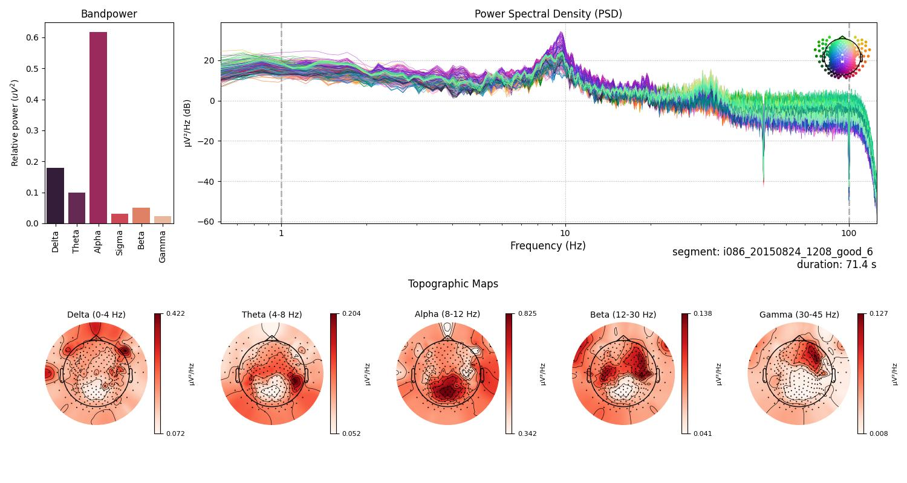

### Preprocessing of High-Density EEG Recordings in Mild Cognitive Impairment (Revision 2)

#### Introduction
This report presents a preprocessing steps of resting-state high-density EEG recordings from participants with Mild Cognitive Impairment (MCI), part of a larger dataset involving Healthy Elders, People with Subjective and Mild Cognitive Impairment, and Alzheimer's Disease. The dataset, provided by Lazarou et al.[1], consists of recordings from various groups, with this analysis focusing exclusively on the MCI group.

The dataset is not publicly available, but can be requested from the authors. 

#### Data Preprocessing
The dataset provided by Lazarou et al. [1] contains high-density EEG recordings from 83 participants with MCI. The recordings were obtained using the EGI GES 300 system with 256 channels. The dataset came with two types of files, raw data and preprocessed by authors. This report focues on the raw data, for report of insights from preprocessed data, see [here](web-MCI-preproc01.md).

From the total pool of 83 MCI participants, 72 subjects were meticulously chosen based on the quality and properties of their EEG recordings for further analysis. Subject that lack demographic data (n=11) and scoring from neuropsychological tests symptoms are not included in the model creation, although those whose signal is acceptable can be used for model inference for the purpose of prediction.

Each subject's recording was manually inspected, and segments were selected based on recording quality and the absence of artifacts. The selection process was rigorous, with only high-quality segments included in the analysis. The segments were chosen based on the following criteria:

- Absence of artifacts, such as eye blinks, muscle movements, and other non-cerebral activity.
- Absence of noise from electrical power lines and other environmental sources.
- Absence of bad channels, or successful interpolation of bad channels.
- Sufficient duration for analysis ( >4 seconds).

The selected segments were then used for further analysis, including spectral analysis, 1st order features and the calculation of relative band powers. The segments were also used to generate Power Spectral Density (PSD) plots and topographic maps, providing a detailed view of the spectral characteristics of the EEG recordings. The detailed report of model creation from 1st order features and band features can be found [here](web-MCI-model.md).

The distibutions of valid segments and subjects are presented below:

Fig.1: Distribution of valid segments across subjects. 

Total number of segments is 614, with 72 subjects. Mean duration of segments is 52.43 seconds, with a standard deviation of 35.41 seconds. The minimum duration is 4.13 seconds, while the maximum is 222.51 seconds. The distribution of segments across subjects is not uniform, with some subjects having more segments than others. This variability is due to differences in the quality and duration of the EEG recordings, as well as the presence of artifacts and other non-cerebral activity.

The distribution of time duration of segments across subjects is presented below:

Fig.2: Distribution of time duration of segments across subjects.

#### Experimental Design
The authors of the dataset provided a detailed description of the experimental design, that can be summarized as follows:
Subject were instructed to sit comfortably in a chair. They alternately open and close their eyes at the experimenter's request. The recording lasted for ~9 minutes. 

<!-- The detailed description can be downloaded [here](https://zenodo.org/record/4316608/files/EEG%20Dataset%20Description.pdf?download=1). -->

##### Preprocessing Steps
- Independent Component Analysis (ICA) was employed to remove eye blinks and other artifacts - using Infomax ICA[2] [3] (the same as ICA in EEGLab).
- Bad channels were identified, marked, and interpolated using the nearest neighbors.
- A bandpass filter of 1 - 100 Hz was applied, as recommended for Infomax ICA.

These preprocessing steps ensured the extraction of high-quality data segments for further analysis.

#### Spectral Analysis Methodology
Spectral analysis was conducted to investigate the distribution of power across different frequency bands. The following frequency bands were analyzed: Delta, Theta, Alpha, Sigma, Beta, and Gamma, similar to [here](web-MCI-model.md). The analysis included:

- Calculation of relative band powers for each EEG recording.
- Generation of Power Spectral Density (PSD) plots and topographic maps.
- Visualization of bandpower distribution across subjects.

##### Tools and Libraries
- MNE-Python [2] library was extensively used for data processing and visualization.
- mne-icalabel [2] [3] was used for ICA-based artifact removal.
- YASA [4] [5] (Yet Another Spindle Algorithm) was employed for bandpower calculation.
- Matplotlib [6] and Seaborn [7] were used for data visualization.
- Pandas [8] was used for data manipulation.

#### Results

##### Individual Subject Analysis
For each selected segment of the EEG recordings, detailed spectral profiles were generated. Below, a few figures are presented, one for subject and segment, to illustrate the quality of the spectral profiles obtained from the manually reviewed raw data. The figures are representative of the spectral profiles observed in the dataset in term of quality.

##### Subject 1

Fig.3 The figure is divided into several sections displaying different aspects of EEG spectral data for a 61.6-second segment from subject i052. On the left, a barplot illustrates the relative bandpower within standard EEG frequency bands, with the Alpha band (8-12 Hz) demonstrating the highest relative power, followed by Beta, Delta, Sigma, Theta and Gamma bands. Centered, a Power Spectral Density (PSD) plot shows the distribution of power across frequencies ranging from 1 to 100 Hz, with multiple traces likely indicating different channels. The PSD exhibits a characteristic decrease in power with increasing frequency, with a notable peak in the Alpha band. An inset spherical head model highlights the distribution of Gamma band activity. Below the PSD, topographic maps for each frequency band display the power distribution across the scalp, with red tones indicating higher power levels. Delta band activity is broadly distributed, Theta shows frontal prominence, Alpha is concentrated posteriorly, Beta and Gamma reveal more varied spatial distributions.

##### Subject 2

Fig.4 Segment for subject i054, 118.0-second. In the middle, the Power Spectral Density (PSD) with a sharp peak in the Alpha range and a declining trend as frequency increases. The bottom section of the figure displays topographic maps for each frequency band, where the power distribution on the scalp is depicted in varying shades of red, with darker colors indicating higher power levels. The Alpha band map shows widespread activity, Theta band activity is somewhat centrally concentrated, Beta activity is heavily distributed over the left and right hemisphere, and Gamma activity is modestly presented.

##### Subject 3

Fig.5 Segment from subject i074, 34.3-second. Three peaks can be spoted in the PSD plot, one in the Gamma band, one in the Beta band, and a sharp peak in the Alpha band. The topographic maps for each frequency band show the distribution of power across the scalp. Delta band activity is broadly distributed, Theta band activity is centrally concentrated, Alpha band activity is heavily present in the posterior regions, Beta band activity is distributed over the left and right hemisphere, and Gamma band activity is modestly presented.

##### Subject 4

Fig.6 Segment from subject i086, 71.4-second. The lower section of the figure, composed of topographic maps for each frequency band, shows the distribution of electrical activity over the scalp. Delta band showing widespread cortical engagement, Theta band centered around mid-scalp, Alpha heavily present in the posterior regions, Beta with a central distribution, and Gamma focused in the frontal regions. 

---

### Discussion

By eschewing the preprocessed data provided by dataset authors and instead manually reviewing and selecting raw data segments, we observed a marked improvement in the quality of the spectral profiles. This not only enhances our understanding of the neurophysiological changes associated with MCI but also sets a new benchmark for data integrity and quality in EEG analysis.

The enhanced clarity and quality of the spectral profiles obtained from manually reviewed raw data is pivotal for advancing our understanding of MCI's progression and its distinction from other cognitive impairments, potentially leading to improved diagnostic criteria.

### Conclusion

This report highlights the significant advantages of manual review and selection of raw EEG data over reliance on preprocessed datasets for spectral analysis of EEG recordings in Mild Cognitive Impairment (MCI). The study demonstrates that manual intervention in the preprocessing of EEG data, although labor-intensive, results in spectral profiles of markedly higher quality. These profiles offer a more accurate and nuanced view of the neurophysiological aspects of MCI, which is essential for both clinical and research applications.

The process of manually reviewing raw EEG data to select segments free from artifacts and noise underscores the critical role of human oversight in EEG analysis. Despite advances in automated preprocessing techniques, this study confirms that manual review remains indispensable for ensuring the highest data quality. The findings advocate for a combined approach where automated methods are complemented by manual review, especially in studies involving complex conditions like MCI.

In summary, the adoption of manual review techniques for preprocessing raw EEG data has allowed us to achieve spectral profile quality that is accepted as a standard in neurophysiological research.

---
#### References

1. Ioulietta Lazarou, Kostas Georgiadis, Spiros Nikolopoulos, Vangelis Oikonomoui Ioannis Kompatsiaris, „Resting-State High-Density EEG using EGI GES 300 with 256 Channels of Healthy Elders, People with Subjective and Mild Cognitive Impairment and Alzheimer's Disease”, Brain Science MDPI, t. 10, nr 6. Zenodo, s. 392, grudz. 23, 2020. doi: 10.5281/zenodo.4316608.
2. Alexandre Gramfort, Martin Luessi, Eric Larson, Denis A. Engemann, Daniel Strohmeier, Christian Brodbeck, Roman Goj, Mainak Jas, Teon Brooks, Lauri Parkkonen, and Matti S. Hämäläinen. MEG and EEG data analysis with MNE-Python. Frontiers in Neuroscience, 7(267):1–13, 2013. doi:10.3389/fnins.2013.00267.
3. https://mne.tools/mne-icalabel/stable/index.html#
4. Vallat, Raphael, and Matthew P. Walker. "An open-source, high-performance tool for automated sleep staging." Elife 10 (2021). doi: https://doi.org/10.7554/eLife.70092 
5. https://github.com/raphaelvallat/yasa
6. Thomas A Caswell, „matplotlib/matplotlib: REL: v3.7.4”. Zenodo, lis. 18, 2023. doi: 10.5281/zenodo.10152802.
7. Waskom, M. L., (2021). seaborn: statistical data visualization. Journal of Open Source Software, 6(60), 3021, https://doi.org/10.21105/joss.03021.
8. The pandas development team, „pandas-dev/pandas: Pandas”. Zenodo, sty. 20, 2024. doi: 10.5281/zenodo.10537285.
---

<!-- Footer -->

###### Author: [Łukasz Furman](cracer.net@gmail.com)

