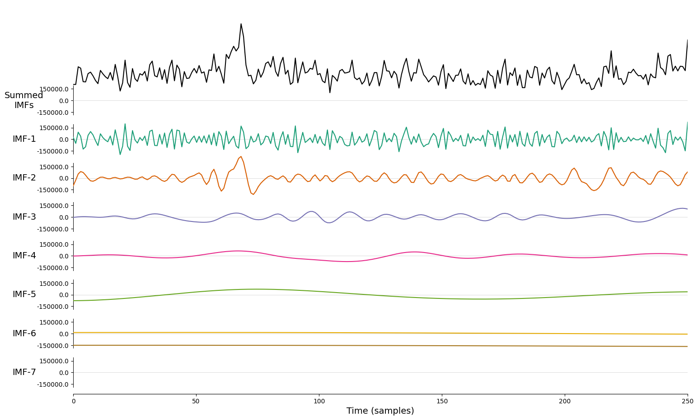
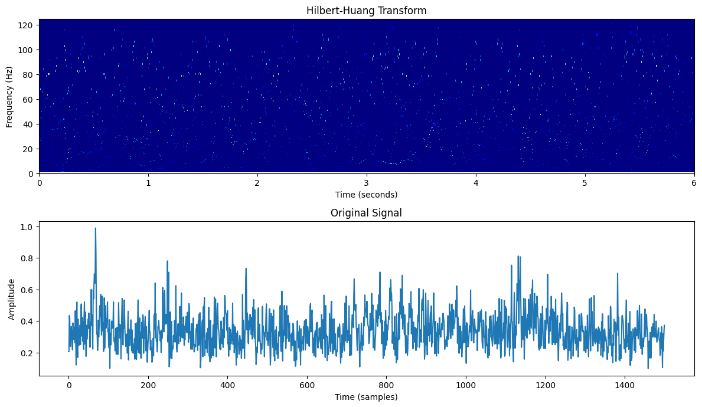
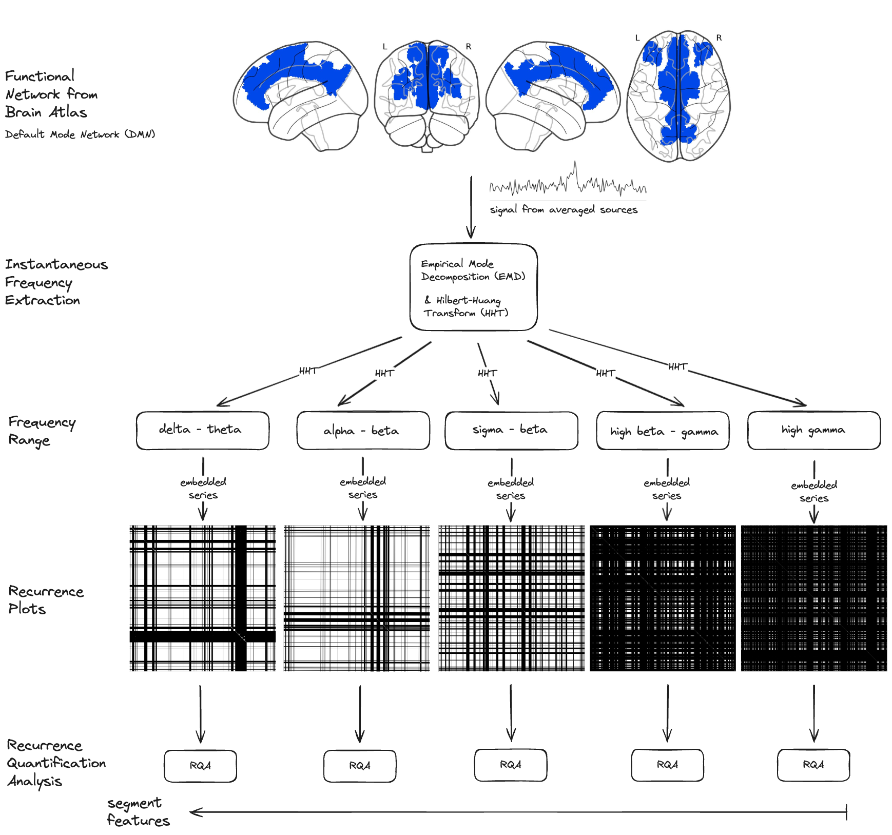
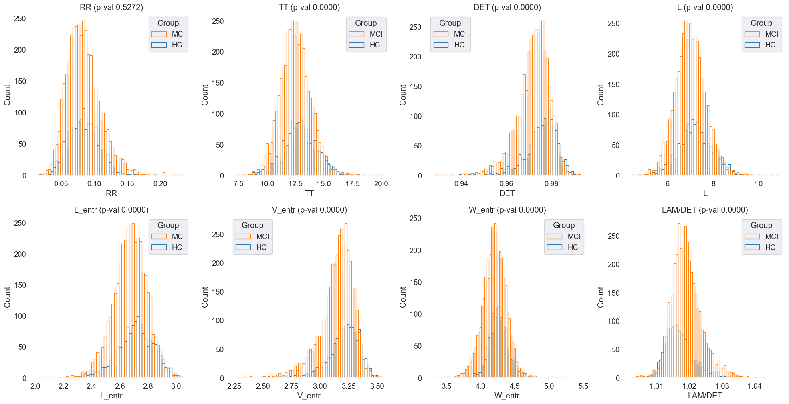
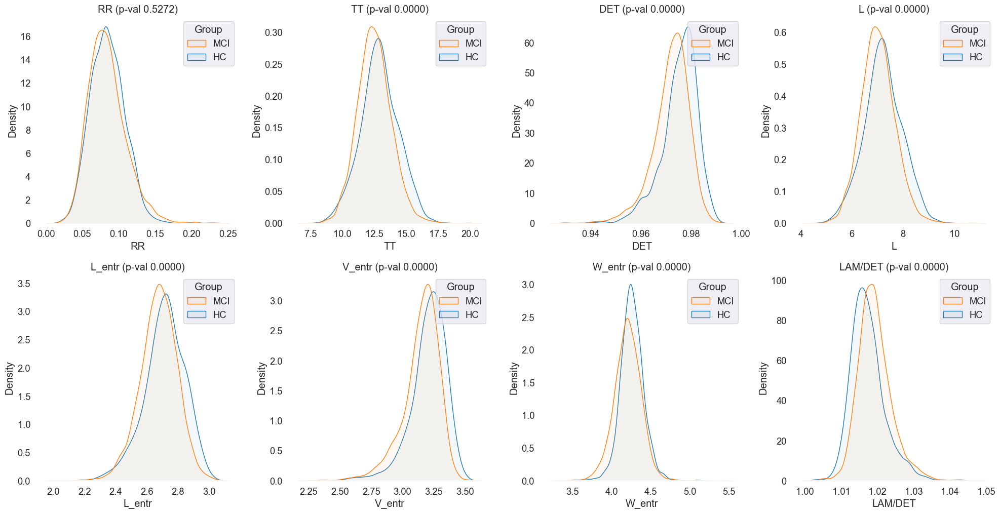
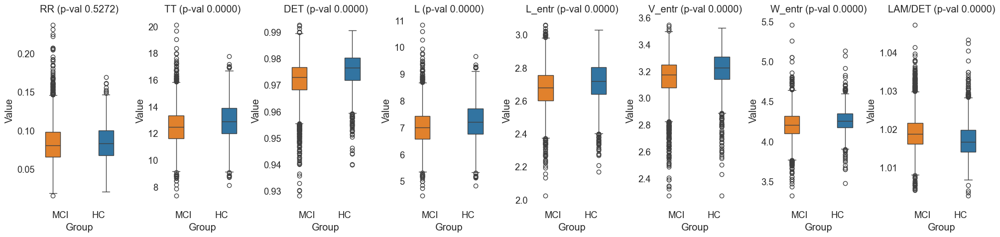
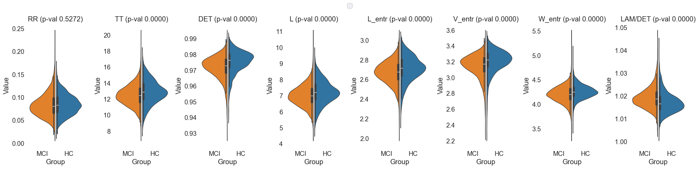
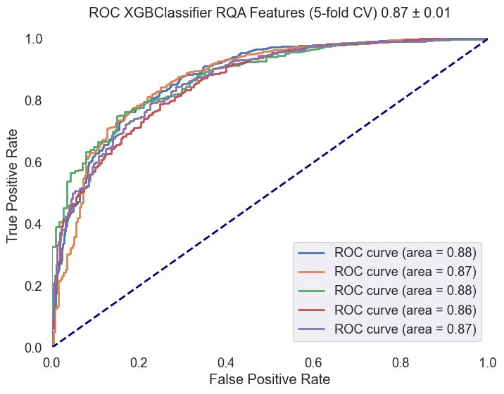

### Recurrence Quantitative Analysis of EEG Data in Mild Cognitive Impairment: A Focus on Default Mode and Executive Networks

#### Abstract
This study explores the application of Recurrence Quantitative Analysis (RQA) to EEG data in subjects with Mild Cognitive Impairment (MCI) and Healthy Controls (HC). By focusing on the Default Mode Network (DMN) and Central Executive Network (CEN), this research aims to uncover distinct recurrence patterns in neural activity. The EEG recordings were processed to extract source time courses, followed by the computation of the Hilbert-Huang Transform (HHT) and subsequent RQA. Significant differences in recurrence metrics between MCI and HC groups were observed, including significantly higher LAM/DET, lower TT, lower DET, lower L, lower L_entr, and lower V_entr in MCI. These findings suggest that RQA metrics could serve as potential biomarkers for early detection and monitoring of cognitive impairment. The grid search results revealed the highest classification performance using a combination of DMN, CEN, and Executive Function networks with the HighGamma frequency range, achieving a mean AUC of 0.878.

### Introduction
Mild Cognitive Impairment (MCI) is a transitional stage between the cognitive decline associated with normal aging and the more severe decline of dementia, particularly Alzheimer's Disease (AD). Characterized by cognitive deficits that exceed normal age-related expectations but do not significantly interfere with daily activities, MCI represents a critical period for potential intervention and treatment. Understanding the neural mechanisms underlying MCI is crucial for developing early diagnostic tools and therapeutic strategies.

One promising avenue for investigating these mechanisms is through the analysis of neural oscillatory dynamics using EEG. Traditional EEG analysis techniques have provided valuable insights into brain function; however, they often fall short in capturing the complexity of neural interactions. Recent advances in signal processing, such as Recurrence Quantitative Analysis (RQA) [Zbilut and Webber Jr.](https://www.sciencedirect.com/science/article/abs/pii/037596019290426M) (1992), offer new opportunities to delve deeper into the temporal and spatial dynamics of neural activity.

RQA [Marwan et al.](https://www.sciencedirect.com/science/article/abs/pii/S0370157306004066) (2007) is particularly well-suited for analyzing nonlinear and non-stationary time series data, making it an ideal tool for studying the brain's complex neural networks. This study focuses on two key networks: the Default Mode Network (DMN) and the Central Executive Network (CEN). The DMN is associated with self-referential thinking and memory, while the CEN is involved in cognitive control and executive functions. Disruptions in these networks have been linked to various cognitive disorders, including MCI and AD.

Previous research has highlighted changes in cortical thickness, glucose metabolism, and functional connectivity in MCI patients. [Chand et al.](https://dx.doi.org/10.1089/brain.2017.0509) (2017) discussed the disrupted control of the Salience Network over the DMN and CEN, suggesting it could serve as a neuroimaging biomarker for cognitive impairment in MCI individuals. [Miraglia et al.](https://dx.doi.org/10.1142/s0129065720500045) (2020) pointed out that the Small World Index in the DMN predicts the progression from MCI to dementia, indicating significant alterations in gamma band activity. Furthermore, [Caravaglios et al.](https://dx.doi.org/10.1177/15500594221110036) (2022) analyzed EEG data to compare resting-state networks between amnestic MCI and healthy elderly individuals, revealing differences in brain region activities between the two groups.

[Wu et al.](https://dx.doi.org/10.3389/fnins.2022.876568) (2022) found specific functional alterations in the dorsal attention network (DAN) in MCI through an activation likelihood estimation meta-analysis. Disrupted interactions among the hippocampal, dorsal attention, and central-executive networks in amnestic MCI were reported by [Chand et al.](https://dx.doi.org/10.1002/hbm.24339) (2018), affecting the modulation of activity between the hippocampal network and CEN. [Li et al.](https://dx.doi.org/10.3389/fneur.2020.554032) (2020) explored changes in brain function networks in amnestic MCI using resting-state fMRI and independent component analysis, uncovering decreased functional connectivity in the DMN.

[Song et al.](https://dx.doi.org/10.3389/fnagi.2021.695210) (2021) identified specific functional alterations in the Salience Network (SN) and its interactions with other networks in MCI through a meta-analysis of 30 neuroimaging studies. Additionally, [Pagen et al.](https://dx.doi.org/10.3233/JAD-191127) (2020) discussed the negative correlation between the cerebral and cerebellar default mode networks' interaction during rest in older individuals, impacting cognitive functioning.

In recent our research [Furman et al.](https://link.springer.com/article/10.1140/epjs/s11734-022-00683-7) (2022), a similar approach involving Short-Time Fourier Transform (STFT) and RQA was tested across comparable frequency ranges. This methodology provided initial insights into the neural dynamics. However, this study presents an updated version of the methodology by replacing STFT with the Hilbert-Huang Transform (HHT). The HHT, derived from Empirical Mode Decomposition (EMD) [Huang et al.](https://doi.org/10.1098/rspa.1998.0193) (1998), provides instantaneous frequencies without the need for predefined windows, resulting in clearer and sharper recurrence patterns. This enhancement allows for the detection of high-frequency components and more precise recurrence structures, improving the analysis of the complex oscillatory dynamics associated with MCI.

### Hypothesis
> *MCI subjects exhibit distinct recurrence patterns in the Default Mode Network (DMN) and Central Executive Network (CEN) compared to Healthy Controls (HC), reflecting underlying neural alterations associated with cognitive impairment.*

This hypothesis is grounded in the understanding that MCI involves changes in neural oscillatory dynamics, which can be effectively captured and analyzed using RQA. By focusing on the specific networks, this study seeks to uncover specific recurrence patterns that differentiate MCI subjects from HC.

## Methods

#### Participants

Participants for this study were meticulously selected from a larger dataset encompassing individuals in various cognitive states, including Healthy Elders (HC) and those with Mild Cognitive Impairment (MCI). This dataset was provided by [Lazarou et al.](https://zenodo.org/records/4316608) (2020).

**Group Selection Criteria:**
- **MCI Group**: Initially included 83 participants aged 60+ years, of which 78 were selected based on the quality and properties of their EEG recordings.
- **HC Group**: Consisted of 31 participants aged 60+ years with no history of cognitive impairment or neurological disorders.

To ensure high-quality EEG data, segments with artifacts such as eye blinks, muscle movements, and non-cerebral activities were excluded. Additionally, segments affected by noise from electrical power lines or with unacceptable channels that could not be interpolated were also excluded. Each segment included in the analysis was required to be free of artifacts, noise, and bad channels, with a minimum duration of 30 seconds to ensure sufficient data for robust analysis.

From this selection process, 78 MCI participants' and 31 HC participants' EEG recordings were deemed suitable for the study, resulting in 2758 segments for the MCI group and 1250 segments for the HC group that passed the quality thresholds.

### EEG Data Collection

EEG data collection was conducted using the EGI GES 300 system with 256 channels, capturing high-density EEG recordings from participants. The recordings were part of an experimental setup designed to capture resting-state EEG activity, where subjects alternated between opening and closing their eyes upon the experimenter's request during a ~9-minute session.

**EEG Recording Criteria and Preprocessing:**
- **Raw Data Inspection**: Recordings were manually inspected for quality control, ensuring removal of artifacts, noise, and bad channels using Independent Component Analysis (ICA) with the Infomax algorithm.
- **Channel Interpolation**: Bad channels identified during inspection were interpolated using the nearest neighbors method.
- **Bandpass Filtering**: A bandpass filter of 1-100 Hz was applied to the segments before further analysis, following the recommended processing parameters for Infomax ICA.
- **Spectral Analysis**: Each preprocessed segment underwent detailed spectral analysis to investigate the power distribution across various frequency bands: Delta, Theta, Alpha, Sigma, Beta, and Gamma. This included calculating relative band powers, generating Power Spectral Density (PSD) plots, and creating topographic maps to visualize and analyze the EEG data's spectral characteristics comprehensively.

*Fig.1 Quality check plot for MCI Subject 1. The figure is divided into several sections displaying different aspects of EEG spectral data for a 61.6-second segment from subject i052. On the left, a barplot illustrates the relative bandpower within standard EEG frequency bands, with the Alpha band (8-12 Hz) demonstrating the highest relative power, followed by

 Beta, Delta, Sigma, Theta and Gamma bands. Centered, a Power Spectral Density (PSD) plot shows the distribution of power across frequencies ranging from 1 to 100 Hz, with multiple traces likely indicating different channels. The PSD exhibits a characteristic decrease in power with increasing frequency, with a notable peak in the Alpha band. An inset spherical head model highlights the distribution of Gamma band activity. Below the PSD, topographic maps for each frequency band display the power distribution across the scalp, with red tones indicating higher power levels. Delta band activity is broadly distributed, Theta shows frontal prominence, Alpha is concentrated posteriorly, Beta and Gamma reveal more varied spatial distributions.*

### Source Localization

Preprocessed EEG segments were used for source localization analysis to extract source time courses (STCs) from predefined Regions of Interest (ROIs) within the brain. These ROIs were derived from the Human Connectome Project (HCP) combined atlas, providing a comprehensive framework for detailed brain mapping and connectomics research. The selected ROIs encompassed key networks involved in cognitive functioning.

#### Selected ROIs:
- **Default Mode Network (DMN)**: PCCL-lh, PCCR-rh, ACAMPCR-rh, ACAMPCL-lh, POCL-lh, POCR-rh
- **Central Executive Network (CEN)**: DPCL-lh, DPCR-rh, LTCL-lh, LTCR-rh
- **Sensorimotor Network**: EVCL-lh, EVCR-rh, SPCL-lh, SPCR-rh
- **Memory and Temporal Lobe Function**: MTCL-lh, MTCR-rh
- **Executive Function and Decision Making**: DSVCL-lh, DSVCR-rh

*Fig.2 Selected Regions of Interest (ROIs) for source localization analysis. The figure displays the 42 ROIs defined by the Human Connectome Project (HCP) combined atlas. Deep brain structures such as the thalamus are not present in this figure.*

A set of [mne](https://mne.tools/stable/auto_tutorials/inverse/30_mne_dspm_loreta.html) functions was used to compute STCs, employing sLORETA with the `ico4` setting, `snr` of 0.5, and `pos` of 5.0, using the `fsaverage` brain template for inverse modeling. The focus was on meaningful regions within the `HCPMMP1_combined` atlas using the `MNE-Python` library.

### Empirical Mode Decomposition (EMD)

Empirical Mode Decomposition (EMD) [Huang et al.](https://doi.org/10.1098/rspa.1998.0193) (1998) is a data-driven approach that decomposes a signal into a set of Intrinsic Mode Functions (IMFs). This method is particularly effective for analyzing nonlinear and non-stationary time series, making it suitable for EEG data which often exhibit such characteristics.

**Computation Methodology:**

1. **Intrinsic Mode Functions (IMFs):**
   - EMD decomposes the EEG signal into a finite number of IMFs. Each IMF represents a simple oscillatory mode, allowing for the separation of different frequency components present in the original signal. This decomposition is adaptive and does not require any predefined basis functions, making it highly versatile for complex signals.

2. **Data Preparation:**
   - The EEG segments were processed to extract source time courses (STCs) using precomputed inverse operators. These STCs were then averaged for each predefined network, ensuring that the data accurately represented the underlying neural activity.

3. **IMF Extraction:**
   - For each averaged STC, EMD [PyEMD](https://emd.readthedocs.io/en/stable/index.html) was applied to obtain the IMFs. This step facilitates the separation of the signal into its constituent oscillatory components, each of which can be analyzed individually.

*Fig.3 Example of an Intrinsic Mode Function (IMF) obtained through Empirical Mode Decomposition (EMD). The IMF represents a simple oscillatory mode extracted from the EEG signal, highlighting the decomposition of the signal into distinct frequency components.*

<!-- 
**Justification for Using EMD:**

- **Adaptability:** EMD is highly adaptable to the characteristics of the data, making it suitable for the complex, non-stationary nature of EEG signals.
- **Data-Driven Approach:** Unlike traditional methods that rely on predefined basis functions, EMD is data-driven, allowing for more accurate decomposition of the signal.
- **Frequency Separation:** By decomposing the signal into IMFs, EMD enables the analysis of different frequency components separately, providing a detailed understanding of the neural dynamics. -->

### Hilbert-Huang Transform (HHT)

The Hilbert-Huang Transform (HHT) is applied to the IMFs obtained from EMD to derive instantaneous frequency information. This method provides a detailed time-frequency representation of the signal, which is crucial for analyzing the complex oscillatory behavior of neural activity.

**Computation Methodology:**

1. **Hilbert-Huang Transform Application:**
   - After decomposing the signal into IMFs using EMD, the [Hilbert-Huang Transform](https://emd.readthedocs.io/en/stable/emd_tutorials/02_spectrum_analysis/emd_tutorial_02_spectrum_01_hilberthuang.html) is applied to each IMF. This step computes the instantaneous frequency and amplitude of each oscillatory component.

2. **Instantaneous Frequency Calculation:**
   - The Hilbert Transform provides instantaneous frequency information for each IMF, allowing for a precise analysis of the signal’s frequency content over time. This avoids the need for predefined time windows or delays, resulting in a clearer and more accurate representation of the data.

3. **Time-Frequency Representation:**
   - The combination of EMD and the Hilbert Transform yields a detailed time-frequency representation of the signal. This representation is used to analyze the dynamics of different neural networks, focusing on specific frequency ranges relevant to cognitive functions.

*Fig.4 Original signal and its Hilbert-Huang Transform (HHT) representation. The HHT provides instantaneous frequency information, enabling a detailed time-frequency analysis of the signal's oscillatory dynamics.*

<!-- 
**Justification for Using HHT:**

- **Instantaneous Analysis:** HHT provides instantaneous frequency and amplitude information, enabling a detailed analysis of the signal’s time-frequency characteristics.
- **Enhanced Clarity:** Without the need for predefined windows or delays, HHT avoids the blurring effect seen in traditional time-frequency analysis methods, resulting in sharper and more detailed recurrence patterns.
- **High-Frequency Detection:** The detailed representation obtained through HHT allows for the detection of high-frequency components that are often overlooked by other methods. -->

### Recurrence Quantitative Analysis (RQA)

Understanding the neural dynamics in Mild Cognitive Impairment (MCI) was achieved through the application of Recurrence Quantitative Analysis (RQA) to EEG data. RQA is known for its efficacy in analyzing nonlinear and non-stationary time series, making it well-suited for exploring the complex oscillatory dynamics in the brain's neural networks.

**Computation Methodology:**

1. **Data Preparation:**
   - Data points were extracted from the Hilbert-Huang Transform (HHT) results within specific frequency ranges. These ranges included Delta-Theta (1-8 Hz), Alpha-Beta (8-16 Hz), Sigma-Beta (16-30 Hz), Highbeta-Gamma (30-70 Hz), and HighGamma (70-110 Hz). This targeted approach ensured a detailed examination of the neural activities pertinent to the study.

2. **Recurrence Plot (RP) Matrix Creation:**
   - An unthresholded recurrence matrix was computed using the Euclidean distance between data points. For this study, the neighborhood radius (`nbr`) was set to `0.0001`. This fine-grained resolution is critical for capturing subtle recurrence patterns, which are essential for distinguishing between MCI and Healthy Controls (HC).

3. **RQA Metric Extraction:**
   - Various RQA metrics were computed, including Recurrence Rate (RR), Determinism (DET), Average Diagonal Line Length (L), Longest Diagonal Line Length (L_max), Divergence (DIV), and Entropy of Diagonal Lines (L_entr). These metrics offer insights into the recurrence structures within the EEG data, revealing the underlying neural dynamics.

*Fig.5 Recurrence Quantitative Analysis (RQA) pipeline for EEG data processing. The methodology involves extracting data points from the Hilbert-Huang Transform (HHT) results, creating a Recurrence Plot (RP) matrix, and computing various RQA metrics to analyze the neural dynamics within specific frequency ranges. Segment of Default Mode Network (DMN) is used as an example network for this illustration.*

**Justification for Using a Fixed Radius of 0.0001:**

In previous RQA methodologies, especially those involving traditional embedding techniques like time-delayed embedding or Short-Time Fourier Transform (STFT),

 it was necessary to specify a time delay or window size. These specifications often led to blurred recurrence plots due to the averaging effects inherent in these methods during discretization. Blurriness in the RP matrix can obscure fine details, making it challenging to discern precise recurrence patterns.

However, with the Hilbert-Huang Transform (HHT) derived from Empirical Mode Decomposition (EMD), the situation improves significantly ([Why use EMD?](https://emd.readthedocs.io/en/stable/emd_tutorials/00_quick_start/emd_tutorial_00_start_02_whyemd.html#time-resolution)). HHT provides instantaneous frequencies without the need for predefined windows or time delays, resulting in much clearer and sharper recurrence patterns. This enhanced clarity allows for the detection of high-frequency components and more precise recurrence structures.

Given this context, the choice of a fixed radius (`nbr`) of 0.0001 becomes crucial. Here’s why:

- **Enhanced Clarity and Sharpness:** Without the need for windowing, the HHT method produces instantaneous responses, eliminating the blur typically seen in RPs created using traditional methods. The small radius ensures that even minor recurrences are captured, providing a high-resolution view of the data.
  
- **Detection of Subtle Patterns:** The fine resolution (0.0001) is particularly effective in capturing subtle recurrence patterns, which are essential for distinguishing the nuanced neural dynamics between MCI and HC subjects. This granularity is vital for identifying potential biomarkers for cognitive impairment.

- **Visibility of High Frequencies:** The HHT approach allows for the inclusion of high-frequency components in the analysis. The small fixed radius is sensitive enough to detect recurrences in these higher frequencies, which are often missed with larger thresholds.

### Data Analysis and Feature Extraction

To analyze the EEG data and extract relevant features for distinguishing between Mild Cognitive Impairment (MCI) and Healthy Controls (HC), several steps were undertaken involving data selection, preprocessing, and classification.

#### Data Preparation

The features were initially loaded and concatenated from two CSV files, one for MCI subjects and one for HC subjects, using the `pd.read_csv` and `pd.concat` functions. The columns of the concatenated dataframe were then printed to verify the structure.

The data were filtered to include only specific Regions of Interest (ROIs) and frequency ranges. The selected ROIs were 'Default Mode Network (DMN)', 'Central Executive Network (CEN)', and 'Executive Function and Decision Making'. The selected frequency range was 'HighGamma'.

The specific features for analysis were then selected, including various RQA ([Quantification of Recurrence Plots](http://www.recurrence-plot.tk/rqa.php)) metrics:
- Recurrence Rate (RR)
- Determinism (DET)
- Average Diagonal Line Length (L)
- Longest Diagonal Line Length (L_max)
- Divergence (DIV)
- Entropy of Diagonal Lines (L_entr)
- Laminarity (LAM)
- Trapping Time (TT)
- Longest Vertical Line Length (V_max)
- Entropy of Vertical Lines (V_entr)
- Average White Vertical Line Length (W)
- Longest White Vertical Line Length (W_max)
- Longest White Vertical Line Length Inverse (W_div)
- Entropy of White Vertical Lines (W_entr)
- Ratio of Determinism to Recurrence Rate (DET/RR)
- Ratio of Laminarity to Determinism (LAM/DET)

#### Feature Visualization

##### Histograms
The features were visualized using histograms to explore their distributions and identify potential differences between MCI and HC groups. Imbalanced classes from this dataset affected the visualization, making it challenging to discern clear patterns. However, the histograms provided a preliminary overview of the feature distributions.

*Fig.6 Histograms of 'RR', 'TT', 'DET', 'L', 'L_entr', 'V_entr', 'W_entr', 'LAM/DET' features for MCI and HC groups. The histograms provide an overview of the feature distributions, highlighting potential differences between the two groups.*

##### Density Plots
Density plots were generated to visualize the feature distributions more clearly and identify any overlapping regions between MCI and HC groups. The density plots provided a more nuanced view of the feature distributions, allowing for a detailed comparison between the two groups.

*Fig.7 Density plots of 'RR', 'TT', 'DET', 'L', 'L_entr', 'V_entr', 'W_entr', 'LAM/DET' features for MCI and HC groups. The plots offer a detailed comparison of the feature distributions, highlighting any overlapping regions between the two groups.*

##### Box Plots
Box plots were used to visualize the distribution of features across MCI and HC groups, providing insights into the median, quartiles, and outliers. 

*Fig.8 Box plots of 'RR', 'TT', 'DET', 'L', 'L_entr', 'V_entr', 'W_entr', 'LAM/DET' features for MCI and HC groups. The plots illustrate the distribution of features, including the median, quartiles, and outliers, allowing for a detailed comparison between the two groups.*

##### Violin Plots
Violin plots were generated to combine the benefits of box plots and density plots, providing a comprehensive view of the feature distributions across MCI and HC groups. 

*Fig.9 Violin plots of 'RR', 'TT', 'DET', 'L', 'L_entr', 'V_entr', 'W_entr', 'LAM/DET' features for MCI and HC groups.*

The selected ROIs were 'Default Mode Network (DMN)', 'Central Executive Network (CEN)', and 'Executive Function and Decision Making'. The selected frequency range was 'HighGamma'.

### Statistical Analysis and Machine Learning

#### Classification and Cross-Validation

The classification was performed using an `XGBClassifier` ([XGBoost](https://xgboost.readthedocs.io/en/stable/index.html)) with `GroupKFold` ([GroupKFold](https://scikit-learn.org/stable/modules/generated/sklearn.model_selection.GroupKFold.html)) cross-validation. This approach ensured that segments from the same EEG recording were kept together in the train/test splits.

1. **Label Encoding:** String labels for the groups were converted to integers using `LabelEncoder`.

2. **Feature Scaling:** The features were standardized using `StandardScaler`.

3. **Model Training and Evaluation:** The `XGBClassifier` was trained and evaluated using ROC AUC scores, along with generating classification reports for each fold.

**Detailed Steps:**

- **Convert String Labels to Integers:** `LabelEncoder` was used to transform the string labels for 'Group' into integer values suitable for the classification algorithm.
- **Prepare Features and Labels:** The feature matrix `X` was prepared by selecting relevant RQA metrics and excluding non-essential columns. The target labels `y` were set using the encoded group labels. The EEG segments were grouped using the 'EEGCode' to ensure segments from the same recording stayed together during cross-validation.
- **Define Group K-Fold Cross-Validator:** `GroupKFold` was defined with 5 splits to maintain data integrity within the train/test splits.
- **Initialize the Classifier:** `XGBClassifier` was initialized with specific parameters, including `use_label_encoder=False`, `eval_metric='logloss'`, and `random_state=42`.
- **Collect Scores and Metrics:** Lists were prepared to collect ROC AUC scores and classification metrics for each fold.
- **Cross-Validation Procedure:** The cross-validation was performed as follows:
  - The data was split into training and testing sets using `cv.split`.
  - Features were standardized using `StandardScaler` for both training and testing sets.
  - The classifier was trained on the scaled training data.
  - Predictions were made on the scaled testing data.
  - ROC AUC scores were calculated using `roc_curve` and `auc`.
  - Classification reports were generated using `classification_report`.
  - The ROC curve was plotted for each fold.

#### ROC Visualization

An ROC curve was plotted to visualize the classifier's performance across the cross-validation folds. The mean ROC AUC score and standard deviation were calculated and displayed in the plot title.

*Fig.10 ROC curve for the XGBClassifier across the cross-validation folds. The plot displays the true positive rate (sensitivity) against the false positive rate (1-specificity) for each fold, providing insights into the classifier's performance. The mean ROC AUC score and standard deviation are included in the plot title. The selected ROIs were 'Default Mode Network (DMN)', 'Central Executive Network (CEN)', and 'Executive Function and Decision Making'. The selected frequency range was 'HighGamma'.*

#### Grid Search Summary

A comprehensive grid search was conducted to

 explore the classification performance across all possible combinations of networks and frequency ranges. The combinations included single ROIs, pairs of ROIs, and single and paired frequency ranges. The following table highlights the top, random mid, and bottom results based on the mean AUC score.

ROI                                     | FreqRange                             |   Mean AUC |    STD AUC |   Mean Precision (MCI) |   Mean Recall (MCI) |   Mean F1-Score (MCI) |   Mean Precision (HC) |   Mean Recall (HC) |   Mean F1-Score (HC) |   Accuracy |   Mean Precision (Macro) |   Mean Recall (Macro) |   Mean F1-Score (Macro) |   Mean Precision (Weighted) |   Mean Recall (Weighted) |   Mean F1-Score (Weighted) |
|:---------------------------------------------------------------------------------------------------------------------------------------------------------|:--------------------------------------|-----------:|-----------:|-----------------------:|--------------------:|----------------------:|----------------------:|-------------------:|---------------------:|-----------:|-------------------------:|----------------------:|------------------------:|----------------------------:|-------------------------:|---------------------------:|
| Default Mode Network (DMN),Central Executive Network (CEN),Sensorimotor Network,Executive Function and Decision Making                                   | HighGamma                             |   0.878295 | 0.00421374 |               0.844315 |            0.926245 |              0.878518 |              0.702926 |           0.585382 |             0.624736 |   0.825317 |                 0.77362  |              0.755814 |                0.751627 |                    0.839571 |                 0.825317 |                   0.821408 |
| Default Mode Network (DMN),Central Executive Network (CEN),Sensorimotor Network,Memory and Temporal Lobe Function,Executive Function and Decision Making | HighGamma                             |   0.876041 | 0.0078628  |               0.844346 |            0.928317 |              0.8797   |              0.70266  |           0.57489  |             0.620971 |   0.826676 |                 0.773503 |              0.751603 |                0.750335 |                    0.839852 |                 0.826676 |                   0.822568 |
| Default Mode Network (DMN),Central Executive Network (CEN),Sensorimotor Network                                                                          | HighGamma                             |   0.874764 | 0.00956032 |               0.845972 |            0.930636 |              0.881527 |              0.713695 |           0.584604 |             0.630537 |   0.829667 |                 0.779833 |              0.75762  |                0.756032 |                    0.843428 |                 0.829667 |                   0.825496 |
| Default Mode Network (DMN),Central Executive Network (CEN),Memory and Temporal Lobe Function,Executive Function and Decision Making                      | HighGamma                             |   0.870781 | 0.00720156 |               0.844246 |            0.923164 |              0.876843 |              0.697125 |           0.587317 |             0.624279 |   0.823469 |                 0.770685 |              0.755241 |                0.750561 |                    0.837457 |                 0.823469 |                   0.819398 |
| Default Mode Network (DMN),Central Executive Network (CEN)                                                                                               | HighGamma                             |   0.870417 | 0.0135892  |               0.84819  |            0.924812 |              0.880118 |              0.700757 |           0.592752 |             0.630177 |   0.828151 |                 0.774474 |              0.758782 |                0.755147 |                    0.841739 |                 0.828151 |                   0.824832 |
| Default Mode Network (DMN),Central Executive Network (CEN),Sensorimotor Network,Memory and Temporal Lobe Function                                        | HighGamma                             |   0.870388 | 0.00781509 |               0.843314 |            0.928589 |              0.878847 |              0.706162 |           0.577245 |             0.622896 |   0.825741 |                 0.774738 |              0.752917 |                0.750872 |                    0.839523 |                 0.825741 |                   0.820991 |
| Default Mode Network (DMN),Central Executive Network (CEN),Memory and Temporal Lobe Function                                                             | HighGamma                             |   0.870285 | 0.0168339  |               0.844573 |            0.932203 |              0.880666 |              0.712112 |           0.571522 |             0.62234  |   0.827961 |                 0.778343 |              0.751863 |                0.751503 |                    0.842953 |                 0.827961 |                   0.822511 |
| Default Mode Network (DMN),Central Executive Network (CEN),Executive Function and Decision Making                                                        | HighGamma                             |   0.870196 | 0.00650334 |               0.845417 |            0.926362 |              0.878571 |              0.700767 |           0.586477 |             0.624065 |   0.824935 |                 0.773092 |              0.756419 |                0.751318 |                    0.841542 |                 0.824935 |                   0.821204 |
| Central Executive Network (CEN)                                                                                                                          | HighGamma                             |   0.86969  | 0.0188211  |               0.843486 |            0.917503 |              0.873249 |              0.683792 |           0.584594 |             0.614866 |   0.817929 |                 0.763639 |              0.751049 |                0.744057 |                    0.835579 |                 0.817929 |                   0.814896 |
| Central Executive Network (CEN),Sensorimotor Network,Executive Function and Decision Making                                                              | HighGamma                             |   0.868184 | 0.0119166  |               0.840178 |            0.921295 |              0.873093 |              0.686923 |           0.572792 |             0.607855 |   0.816821 |                 0.763551 |              0.747044 |                0.740474 |                    0.834396 |                 0.816821 |                   0.812787 |
| Default Mode Network (DMN),Central Executive Network (CEN),Sensorimotor Network                                                                          | Delta-Theta,Alpha-Beta,Sigma-Beta     |   0.652418 | 0.0107011  |               0.753747 |            0.899727 |              0.811166 |              0.441416 |           0.22535  |             0.277715 |   0.708227 |                 0.597582 |              0.562538 |                0.544441 |                    0.71114  |                 0.708227 |                   0.676681 |
| Default Mode Network (DMN),Central Executive Network (CEN),Sensorimotor Network,Executive Function and Decision Making                                   | Alpha-Beta,Sigma-Beta                 |   0.666774 | 0.0123778  |               0.758416 |            0.898809 |              0.81341  |              0.462242 |           0.253063 |             0.30226  |   0.712798 |                 0.610329 |              0.575936 |                0.557835 |                    0.720274 |                 0.712798 |                   0.684138 |
| Default Mode Network (DMN),Central Executive Network (CEN),Memory and Temporal Lobe Function,Executive Function and Decision Making                      | Delta-Theta,Sigma-Beta,Highbeta-Gamma |   0.698863 | 0.0116893  |               0.766809 |            0.911555 |              0.82416  |              0.515851 |           0.279645 |             0.3404   |   0.729986 |                 0.64133  |              0.5956   |                0.58228  |                    0.740368 |                 0.729986 |                   0.702511 |
| Default Mode Network (DMN),Sensorimotor Network,Executive Function and Decision Making                                                                   | Alpha-Beta,Highbeta-Gamma             |   0.726337 | 0.0109829  |               0.782536 |            0.896945 |              0.827927 |              0.536788 |           0.360048 |             0.409138 |   0.74166  |                 0.659662 |              0.628496 |                0.618533 |                    0.75598  |                 0.74166  |                   0.726021 |
| Sensorimotor Network,Memory and Temporal Lobe Function,Executive Function and Decision Making                                                            | Delta-Theta,HighGamma                 |   0.743708 | 0.0108806  |               0.782136 |            0.900511 |              0.829225 |              0.542206 |           0.35666  |             0.409823 |   0.743372 |                 0.662171 |              0.628585 |                0.619524 |                    0.756519 |                 0.743372 |                   0.726277 |
| Default Mode Network (DMN),Memory and Temporal Lobe Function,Executive Function and Decision Making                                                      | Alpha-Beta                            |   0.652856 | 0.00553202 |               0.758163 |            0.87491  |              0.802609 |              0.430315 |           0.268427 |             0.304639 |   0.699215 |                 0.594239 |              0.571668 |                0.553624 |                    0.710921 |                 0.699215 |                   0.677355 |
| Sensorimotor Network,Executive Function and Decision Making                                                                                              | Delta-Theta,Alpha-Beta                |   0.634564 | 0.0118265  |               0.754866 |            0.888467 |              0.807315 |              0.430892 |           0.249175 |             0.291808 |   0.704652 |                 0.592879 |              0.568821 |                0.549561 |                    0.705816 |                 0.704652 |                   0.677164 |
| Default Mode Network (DMN),Central Executive Network (CEN),Memory and Temporal Lobe Function                                                             | Delta-Theta,Highbeta-Gamma            |   0.711625 | 0.0127884  |               0.772453 |            0.893423 |              0.820307 |              0.500815 |           0.316648 |             0.366898 |   0.728144 |                 0.636634 |              0.605035 |                0.593602 |                    0.740214 |                 0.728144 |                   0.709225 |
| Sensorimotor Network,Memory and Temporal Lobe Function                                                                                                   | Highbeta-Gamma,HighGamma              |   0.807321 | 0.00831679 |               0.809113 |            0.905968 |              0.847938 |              0.610346 |           0.464272 |             0.509832 |   0.776689 |                 0.70973  |              0.68512  |                0.678885 |                    0.792474 |                 0.776689 |                   0.767377 |
| Default Mode Network (DMN),Central Executive Network (CEN),Memory and Temporal Lobe Function,Executive Function and Decision Making                      | Highbeta-Gamma                        |   0.799111 | 0.0115697  |               0.8097   |            0.897075 |              0.844471 |              0.59263  |           0.47047  |             0.505613 |   0.772004 |                 0.701165 |              0.683772 |                0.675042 |                    0.789347 |                 0.772004 |                   0.765141 |
| Memory and Temporal Lobe Function                                                                                                                        | Delta-Theta,Sigma-Beta                |   0.608513 | 0.0206794  |               0.745665 |            0.878621 |              0.796818 |              0.382707 |           0.20655  |             0.243505 |   0.686356 |                 0.564186 |              0.542586 |                0.520162 |                    0.69041  |                 0.686356 |                   0.657293 |
| Memory and Temporal Lobe Function                                                                                                                        | Alpha-Beta                            |   0.608361 | 0.0201587  |               0.745038 |            0.857057 |              0.787181 |              0.362986 |           0.215475 |             0.248101 |   0.675018 |                 0.554012 |              0.536266 |                0.517641 |                    0.683334 |                 0.675018 |                   0.653483 |
| Central Executive Network (CEN)                                                                                                                          | Delta-Theta                           |   0.607571 | 0.0223961  |               0.755744 |            0.887775 |              0.806949 |              0.436851 |           0.251102 |             0.29421  |   0.703937 |                 0.596298 |              0.569438 |                0.550579 |                    0.7095   |                 0.703937 |                   0.676424 |
| Default Mode Network (DMN)                                                                                                                               | Delta-Theta                           |   0.607087 | 0.0178055  |               0.741002 |            0.864092 |              0.787354 |              0.352019 |           0.204519 |             0.230097 |   0.672755 |                 0.546511 |              0.534305 |                0.508725 |                    0.676361 |                 0.672755 |                   0.644925 |
| Executive Function and Decision Making                                                                                                                   | Delta-Theta                           |   0.607066 | 0.0439745  |               0.74744  |            0.860237 |              0.792321 |              0.368659 |           0.236443 |             0.274667 |   0.686919 |                 0.558049 |              0.54834  |                0.533494 |                    0.677631 |                 0.686919 |                   0.663999 |
| Memory and Temporal Lobe Function                                                                                                                        | Delta-Theta,Alpha-Beta,Sigma-Beta     |   0.6057   | 0.0164001  |               0.745878 |            0.880846 |              0.797511 |              0.385549 |           0.204867 |             0.241683 |   0.686747 |                 0.565713 |              0.542857 |                0.519597 |                    0.689839 |                 0.686747 |                   0.656536 |
| Sensorimotor Network,Memory and Temporal Lobe Function                                                                                                   | Delta-Theta                           |   0.603509 | 0.0326558  |               0.746829 |            0.874546 |              0.797521 |              0.376893 |           0.202848 |             0.250847 |   0.690333 |                 0.561861 |              0.538697 |                0.524184 |                    0.68845  |                 0.690333 |                   0.665101 |
| Memory and Temporal Lobe Function                                                                                                                        | Delta-Theta                           |   0.594775 | 0.0316022  |               0.750363 |            0.870155 |              0.797112 |              0.391803 |           0.226263 |             0.268751 |   0.690322 |                 0.571083 |              0.548209 |                0.532931 |                    0.697299 |                 0.690322 |                   0.668677 |
| Sensorimotor Network                                                                                                                                     | Delta-Theta                           |   0.589615 | 0.0146764  |               0.7462   |            0.870242 |              0.794589 |              0.37519  |           0.209716 |             0.251174 |   0.685776 |                 0.560695 |              0.539979 |                0.522881 |                    0.689476 |                 0.685776 |                   0.660966 |
| Memory and Temporal Lobe Function                                                                                                                        | Delta-Theta,Alpha-Beta                |   0.584352 | 0.0165539  |               0.741964 |            0.870893 |              0.791697 |              0.359705 |           0.187661 |             0.227153 |   0.678986 |                 0.550835 |              0.529277 |                0.509425 |                    0.682017 |                 0.678986 |                   0.651852 |

### Results and Discussion

The results of this study provide significant insights into the differences in recurrence patterns between MCI and HC groups. The selected ROIs were 'Default Mode Network (DMN)', 'Central Executive Network (CEN)', and 'Executive Function and Decision Making'. The selected frequency range was 'HighGamma'. 

**Key Findings:**

1. **Significantly Higher LAM/DET in MCI vs HC:**
   - Laminarity (LAM) and the ratio of Laminarity to Determinism (LAM/DET) were significantly higher in the MCI group compared to the HC group. This suggests that MCI subjects exhibit more laminar states, indicating more structured and predictable neural dynamics.

2. **Significantly Lower TT in MCI vs HC:**
   - Trapping Time (TT) was significantly lower in the MCI group, suggesting that MCI subjects have shorter periods of neural state persistence. This could indicate less stable neural dynamics compared to the HC group.

3. **Significantly Lower DET in MCI vs HC:**
   - Determinism (DET) was significantly lower in the MCI group, reflecting less predictable and more chaotic neural dynamics in MCI subjects compared to healthy controls.

4. **Significantly Lower L in MCI vs HC:**
   - Average Diagonal Line Length (L) was significantly lower in the MCI group, indicating shorter recurrent states and less stability in neural activity patterns.

5. **Significantly Lower L_entr in MCI vs HC:**
   - Entropy of Diagonal Lines (L_entr) was significantly lower in the MCI group, suggesting reduced complexity in the recurrent structures of MCI subjects' neural activity.

6. **Significantly Lower V_entr in MCI vs HC:**
   - Entropy of Vertical Lines (V_entr) was significantly lower in the MCI group, indicating less complex and more predictable vertical recurrent structures in the MCI subjects' neural dynamics.

7. **No Significant Differences in RR in MCI vs HC:**
   - Recurrence Rate (RR) did not show significant differences between MCI and HC groups, suggesting that the overall density of recurrent states is similar in both groups.

**Interpretation of Significantly Higher LAM/DET in MCI vs HC**

The LAM/DET metric, representing the ratio of laminarity to determinism, is a crucial indicator in Recurrence Quantitative Analysis (RQA) used to understand the underlying dynamics of time series data, such as EEG recordings. Here’s what a significantly higher LAM/DET ratio in MCI compared to HC might imply:

1. **Increased Temporal Stability:**
   - **Laminarity (LAM):** This metric measures the proportion of recurrent points forming vertical lines in the recurrence plot. Higher laminarity indicates more prolonged periods where the system remains in a particular state.
   - **Determinism (DET):** This metric measures the predictability of the system by looking at the proportion of recurrent points forming diagonal lines. Higher determinism indicates more predictable and regular patterns in the data.

2. **Higher LAM/DET Ratio:**
   - A significantly higher LAM/DET ratio suggests that, while the overall predictability of the system (as indicated by DET) might not be exceptionally high, the system tends to remain in specific states for longer periods (as indicated by LAM). This could imply that the EEG dynamics of MCI patients are characterized by prolonged stable periods interspersed with less predictable transitions.

3. **Potential Implications for Cognitive Function:**
   - **Reduced Cognitive Flexibility:** Prolonged stable periods might indicate reduced cognitive flexibility, where the brain's neural networks are less capable of transitioning between different states or responding dynamically to new stimuli.
   - **Neural Rigidity:** The higher LAM/DET ratio could reflect neural rigidity or a tendency towards repetitive neural activity patterns. This might be associated with cognitive impairment where the brain becomes less adaptable.
   - **Compensatory Mechanisms:** It’s also possible that the brain in MCI patients adopts longer stable periods as a compensatory mechanism to maintain certain cognitive functions despite underlying impairments.

### Conclusion

The application of Recurrence Quantitative Analysis (RQA) to EEG data has revealed significant differences in the recurrence patterns between MCI and HC subjects, particularly in the Default Mode Network (DMN), Central Executive Network (CEN), and Executive Function networks within the HighGamma frequency range. Key findings include significantly higher LAM/DET, and lower TT, DET, L, L_entr, and V_entr in MCI subjects, suggesting more structured but less stable and less complex neural dynamics compared to healthy controls.

The higher LAM/DET ratio in MCI indicates increased temporal stability and potentially reduced cognitive flexibility, reflecting underlying neural rigidity. 

Further research should explore the application of these findings in clinical settings and investigate the longitudinal changes in recurrence patterns to better understand the progression of MCI to more severe cognitive impairments, such as Alzheimer's Disease.