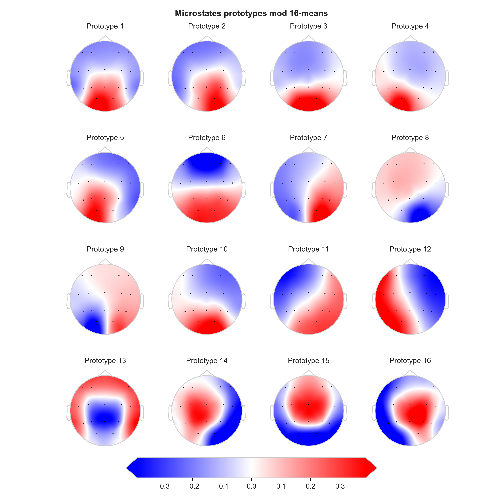
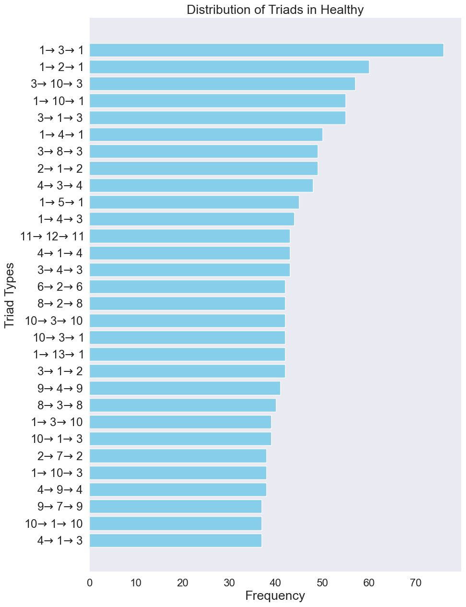

### EEG Microstate Sequences: Triads Analysis

#### Introduction
This report delves into the statistical distributions and visualizations of EEG microstate sequences, comparing healthy and schizophrenia subjects. Especially, we focus on the triads analysis, which is a method of analyzing the state transitions in a sequence. 

The foundation of this analysis lies in the set of sequences \( S \), where each sequence \( s \in S \) is a chronologically ordered list of microstates. These sequences are categorized into two subsets: \( S_{\text{healthy}} \) for healthy individuals and \( S_{\text{schizo}} \) for individuals with schizophrenia. Each subset contains sequences that depict the progression of brain states over time. EEG microstate sequences offer a window into the brief periods where the brain's electrical activity is quasi-stable. 

Fig.1: EEG Microstate Sequences for Healthy and Schizophrenia Subjects (Source: Krzysztof Tołpa and Ewa Ratajczak)

#### Clarification of Terminology

In the analysis of EEG microstate sequences, understanding the nature of triads is crucial. A triad, a sequence of three states $(s_1, s_2, s_3)$, offers insight into the dynamic transitions between brain states. For instance:

- A *closed* triad, where $s_1 = s_3$, indicates a return to an initial state, potentially signifying a recurring brain activity pattern.
- A *self-looping* triad, defined as $s_1 = s_2 = s_3$, suggests a period of stable brain activity.
- In contrast, a *self-transitioning* triad, where $s_1 = s_3 \neq s_2$, implies a brief deviation from a state before returning, which might be indicative of a momentary shift in brain activity.
- A *non-self-transitioning* triad, characterized by $s_1 \neq s_3$, represents a progression from one state to another without returning.
- Lastly, a *non-self-looping* triad, where $s_1 \neq s_3 \neq s_2$, reflects a sequence of distinct states, highlighting the dynamic nature of brain activity.

These classifications help in quantifying and comparing the brain's electrical patterns in healthy and schizophrenia subjects, offering deeper insights into the nature of these conditions.

#### Graph Theory Distinction

While this report focuses on triad analysis in EEG microstate sequences, it's important to distinguish this from triad (motif) analysis in graph theory. In graph theory, a triad refers to a specific arrangement of three vertices and the edges connecting them. The emphasis here is on the structural configuration within a graph, independent of the sequence or order of occurrence.

In contrast, our EEG microstate triad analysis concentrates on the sequential and temporal aspects of state transitions. The key interest lies in understanding how one brain state leads to another and the patterns emerging from these successions. This approach is particularly relevant in the context of EEG analysis, where temporal sequences play a critical role in interpreting brain activity.

By analyzing successive triads in EEG microstates, we gain insights into the temporal dynamics of brain activity, which is fundamentally different from the static structural analysis offered by graph-theoretic motifs.

For more information about EEG microstate sequences - motifs analysis, see [Microstates Dynamics in Schizophrenia - Motifs](motifs.html).

#### Data

We begin by loading the EEG microstate sequences for both healthy and schizophrenia subjects. 

#### Sequence Transformation

The initial step involves transforming a sequence of EEG microstates to retain only unique, consecutive elements. Given a sequence of microstates \( S = [s_1, s_2, ..., s_n] \), where \( s_i \) represents a microstate and \( n \) is the total number of microstates, the transformation can be mathematically defined as follows:

1. **Unique Consecutive Elements Extraction:**  
   Define a new sequence \( U = [u_1, u_2, ..., u_m] \), where \( m \leq n \). Each element \( u_j \) in \( U \) is derived by iterating over \( S \) and including \( s_i \) in \( U \) if \( s_i \neq s_{i+1} \) or if \( i = n \) (the last element of \( S \)).  
   Mathematically, \( u_j = s_i \) if \( s_i \neq s_{i+1} \) or \( i = n \).

#### Triad Formation and Counting

Once the unique sequences are obtained, the next phase is the formation and counting of triads.

2. **Triad Formation:**  
   From the unique sequence \( U \), form triads \( T \) as ordered tuples of three consecutive elements. A triad \( t_k \) is defined as \( t_k = (u_i, u_{i+1}, u_{i+2}) \) for \( i = 1, 2, ..., m-2 \), where \( m \) is the length of \( U \).
3. **Frequency Calculation:**  
   Count the frequency of each unique triad in the set of all triads \( T \). Let \( f(t) \) represent the frequency of triad \( t \) in \( T \).

#### Visualization of Triads

The final stage involves visualizing these triads.

4. **Graphical Representation:**  
   Represent each triad as a directed graph with three nodes corresponding to the microstates in the triad. For a given triad \( t_k = (u_i, u_{i+1}, u_{i+2}) \), construct a directed graph \( G_k \) with nodes \( N = \{u_i, u_{i+1}, u_{i+2}\} \) and edges \( E = \{(u_i, u_{i+1}), (u_{i+1}, u_{i+2})\} \).
5. **Integration with Topographical Maps:**  
   Each node in \( G_k \) is associated with a topographical map representing the brain activity for that microstate. The maps are displayed as images at the corresponding nodes in the graph.
6. **Frequency Display:**  
   For each graph \( G_k \), display the frequency \( f(t_k) \) of the corresponding triad \( t_k \) to indicate its prevalence in the dataset.

This approach systematically transforms the sequences of EEG microstates, categorizes them into unique triads, calculates their frequencies, and visualizes them in a meaningful way to facilitate analysis and comparison between healthy individuals and those with schizophrenia.

For visualizations purposes we will select the __top 30__ most frequent triads for each group.

#### Triads for Healthy Subjects

Fig.2: Triads for Healthy Subjects

--- 

#### Triads for Schizophrenia Subjects

Fig.3: Triads for Schizophrenia Subjects

#### Triads Comparison

The triads for healthy and schizophrenia subjects are visually distinct. A Chi-Square statistic of 1984.27 with a p-value of 0.0 indicates a highly significant result (usually means a value very close to zero, but smaller than the floating-point precision limit of the software). This suggests that there is a statistically significant difference in the frequency distributions of triads between the healthy and schizophrenia groups. In other words, the way triads occur is not the same for both groups, and this difference is unlikely to be due to random chance. However, the Chi-Square test does not indicate the nature of this difference. To understand the nature of this difference, we need to look at the individual triads. Some of the triads seems to be redundant due to the simplicity of this analysis, some more sophisticated analysis is required to understand the nature of this difference - for example triads like: (11, 12, 11) and (12, 11, 12) are the same triad, but in different order. They could indicate a self-looping triad, but it is not clear if this is the case. That is why we need to look at the individual triads and their frequencies for practical significance of this analysis, considering the interpretation of every microstate (topographical map) and the nature of the triad.

#### Frequency Distribution of Triads

The frequency distribution of triads for healthy and schizophrenia subjects is shown below. The triads are sorted by their frequency in descending order. The top 30 most frequent triads are shown for each group.

Fig.4: Frequency Distribution of Triads for Healthy Subjects

Fig.5: Frequency Distribution of Triads for Schizophrenia Subjects

---

#### Conclusion

The meticulous analysis of EEG microstate sequences through the lens of triad frequencies has unveiled significant differences between healthy individuals and those diagnosed with schizophrenia. This statistical significance, underscored by a Chi-Square statistic of 1984.27 and a near-zero p-value, highlights distinct patterns in brain activity between these two groups. While the nature of these differences warrants further detailed investigation, particularly focusing on the interpretation of individual triads in conjunction with their topographical representations, our findings lay a crucial foundation. EEG microstate triad analysis can be a used as a tool in neurological research, offering potential insights into the complex dynamics of brain activity associated with mental health conditions.

###### Author: [Łukasz Furman](cracer.net@gmail.com)

